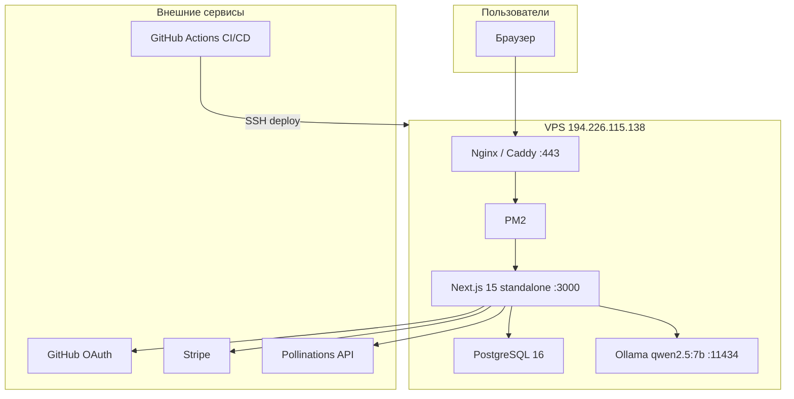
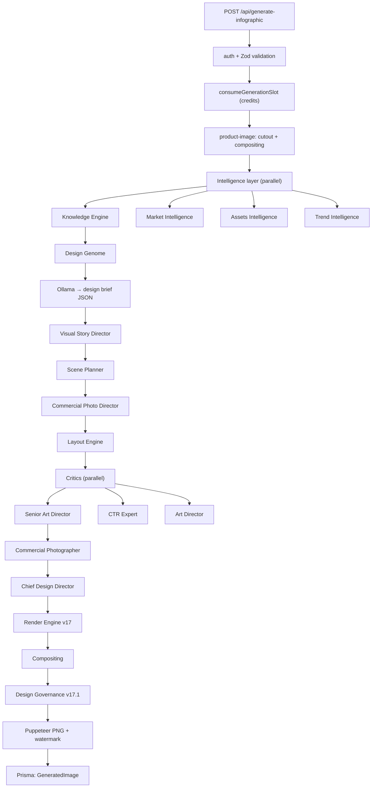

# DESIGN AI OPERATING SYSTEM

> Architecture Bible

Version: 1.0 (Complete — Volume I)

Продакшен: **https://design-ai.shop**  
Обновлено: 2026-07-05

---

# TABLE OF CONTENTS

- [Part 1 — Canonical Specification](#part-1--canonical-specification)
  - [Preface](#preface)
  - [Design AI Manifesto](#design-ai-manifesto)
  - [Architecture Laws](#architecture-laws)
  - [System Overview](#system-overview)
  - [Core Design Goals](#core-design-goals)
  - [Non Goals](#non-goals)
  - [Design Philosophy](#design-philosophy)
  - [High Level Architecture](#high-level-architecture)
- [Part 2 — Current Architecture Audit](#part-2--current-architecture-audit)
  - [2.1 Purpose](#21-purpose)
  - [2.2 Executive Summary](#22-executive-summary)
  - [2.3 Root Cause](#23-root-cause)
  - [2.4 Main Architectural Problems](#24-main-architectural-problems)
  - [Category A — Information Loss](#category-a--information-loss)
  - [Category B — Legacy Architecture](#category-b--legacy-architecture)
  - [Category C — Platform Isolation](#category-c--platform-isolation)
  - [Category D — System Infrastructure](#category-d--system-infrastructure)
  - [Category E — Rendering](#category-e--rendering)
  - [Category F — Governance](#category-f--governance)
  - [Category G — Knowledge Platform](#category-g--knowledge-platform)
  - [Category H — Commercial Platform](#category-h--commercial-platform)
  - [Category I — Creative Platform](#category-i--creative-platform)
  - [Category J — Visual Intelligence Platform](#category-j--visual-intelligence-platform)
  - [Category K — Rendering Platform](#category-k--rendering-platform)
  - [Category L — Project State](#category-l--project-state)
  - [Category M — Specification Chain](#category-m--specification-chain)
- [Part 3 — Production Pipeline](#part-3--production-pipeline)
  - [3.1 Purpose](#31-purpose)
  - [3.2 Responsibilities](#32-responsibilities)
  - [3.3 Production Lifecycle](#33-production-lifecycle)
  - [3.4–3.17 Pipeline Stages](#34-stage-1--project-creation)
  - [3.18 Pipeline Rules](#318-pipeline-rules)
- [Part 4 — Platform Specification](#part-4--platform-specification)
  - [4.1–4.9 Platform Architecture Contract](#41-platform-architecture)
  - [Project Intelligence Platform](#project-intelligence-platform)
  - [Research Platform](#research-platform)
  - [Knowledge Platform](#knowledge-platform)
  - [Commercial Platform](#commercial-platform)
  - [Creative Intelligence Platform](#creative-intelligence-platform)
  - [Visual Intelligence Platform (spec)](#visual-intelligence-platform-spec)
  - [Rendering Platform (spec)](#rendering-platform-spec)
  - [Vision Platform (spec)](#vision-platform-spec)
  - [Learning Platform (spec)](#learning-platform-spec)
  - [Implementation Wave 1](#implementation-wave-1)
- [Part 5 — Runtime Architecture](#part-5--runtime-architecture)
  - [5.1–5.9 Runtime Engine](#51-runtime-engine)
  - [Design Graph](#design-graph)
  - [Version Control](#version-control)
  - [Implementation Directives RT-001–RT-003](#implementation-directive-rt-001)
- [Part 6 — Design DNA & Knowledge](#part-6--design-dna--knowledge)
  - [6.1–6.3 Design DNA Platform](#61-purpose)
  - [Design Genome Platform](#design-genome-platform)
  - [Research Intelligence Platform](#research-intelligence-platform)
  - [Knowledge Runtime](#knowledge-runtime)
  - [Knowledge Graph](#new-idea--knowledge-graph)
  - [Implementation Directive KD-001](#implementation-directive-kd-001)
- [Part 7 — Reasoning Engine](#part-7--reasoning-engine)
  - [7.1 Reasoning Engine](#71-purpose)
  - [Platform Councils](#platform-councils)
  - [Decision Graph](#decision-graph)
  - [Spec Compiler](#spec-compiler)
  - [Implementation Directives RS-001–RS-002](#implementation-directive-rs-001)
- [Part 8 — File-by-File Migration](#part-8--file-by-file-migration)
  - [Wave 1–5 Platform Core](#wave-1--platform-core)
  - [Existing Files Migration](#existing-files)
  - [Global Acceptance](#global-acceptance)
- [Part 9 — AI CEO Platform](#part-9--ai-ceo-platform)
  - [AI CEO Platform](#ai-ceo-platform)
  - [Provider Orchestrator](#provider-orchestrator)
  - [Feature Flags & A/B Testing](#feature-flags)
  - [System Health & Cost Engine](#system-health)
  - [Architecture Versioning](#architecture-versioning)
  - [LAW-011–LAW-015](#new-architecture-law)
  - [Implementation Directives CEO-001–CEO-002](#implementation-directive-ceo-001)
- [Part 10 — Platform SDK](#part-10--platform-sdk)
  - [Platform Interface & Registry](#platform-interface)
  - [Plugin SDK](#plugin-sdk)
  - [Skill SDK](#skill-sdk)
  - [LAW-016–LAW-020](#new-architecture-law-1)
  - [Implementation Directives SDK-001–SDK-002](#implementation-directive-sdk-001)
- [Part 11 — Migration of Existing Platforms](#part-11--migration-of-existing-platforms)
  - [Platform 01 — Design Governance](#platform-01--design-governance)
  - [Platform 02 — Design Process](#platform-02--design-process)
  - [Platform 03 — Design Knowledge](#platform-03--design-knowledge)
  - [Platform 04 — Render Engine](#platform-04--render-engine)
  - [Platform 05 — Prompt System](#platform-05--prompt-system)
  - [LAW-021–LAW-022](#new-law)
- [Part 12 — Runtime & Orchestration Migration](#part-12--runtime--orchestration-migration)
  - [Current State & Target](#current-state)
  - [RUN-001–RUN-004](#implementation-directive-run-001)
  - [Project Graph & Failure Recovery](#project-graph)
  - [Success Criteria](#success-criteria)
- [Part 13 — Data Contracts & Project State](#part-13--data-contracts--project-state)
  - [Contract Hierarchy](#contract-hierarchy)
  - [Base Contract & Specifications](#base-contract)
  - [Contract Rules RULE-001–007](#contract-rules)
  - [DTO-001–DTO-002](#implementation-directive-dto-001)
- [Part 14 — Asset Platform](#part-14--asset-platform)
  - [Asset Types & Object](#asset-types)
  - [Asset Graph & Manager](#asset-graph)
  - [AST-001–AST-002](#implementation-directive-ast-001)
  - [Success Criteria](#success-criteria-1)
- [Part 15 — Engineering Standards](#part-15--engineering-standards)
  - [Directory & Naming Standards](#directory-standards)
  - [Import & Dependency Rules](#import-rules)
  - [Logging, Errors, Events](#logging-standard)
  - [STD-001–STD-002](#implementation-directive-std-001)
  - [LAW-023–LAW-025](#new-law-1)
- [Part 16 — Architecture Validation & CI](#part-16--architecture-validation--ci)
  - [Architecture Validator](#architecture-validator)
  - [Validation Levels & Checks](#validation-levels)
  - [CI Pipeline](#ci-pipeline)
  - [CI-001–CI-003](#implementation-directive-ci-001)
  - [LAW-026–LAW-030](#new-law-2)
  - [LAW-031–LAW-035](#law-031)
  - [LAW-036–LAW-050](#law-036)
- [Part 17 — Design Knowledge Engine](#part-17--design-knowledge-engine)
  - [Current Audit & Target](#current-audit-1)
  - [Knowledge Graph & API](#knowledge-graph-1)
  - [KNG-001–KNG-002](#implementation-directive-kng-001)
  - [Success Criteria](#success-criteria-2)
- [Part 18 — File Rewrite Specification](#part-18--file-rewrite-specification)
  - [Module Migrations](#module-design-process)
  - [Global Migration Rules](#global-migration-rules)
  - [Migration Priorities & Stop Conditions](#migration-priorities)
- [Part 19 — Implementation Playbook](#part-19--implementation-playbook)
  - [Global Execution Strategy](#global-execution-strategy)
  - [Wave 01–10](#wave-01--platform-core)
  - [Implementation Order](#implementation-order)
  - [Refactor Strategy & Code Review](#refactor-strategy)
  - [Stop Conditions & Success Metrics](#stop-conditions-1)
- [Part 20 — Architecture Decision Records (ADR)](#part-20--architecture-decision-records-adr)
  - [ADR Template & Directory](#directory)
  - [ADR-001–005](#adr-001--prompt-driven-architecture)
  - [ADR Rules & Directive ADR-001](#adr-rules)
- [Part 21 — Request for Comments (RFC)](#part-21--request-for-comments-rfc)
  - [RFC Lifecycle & Template](#rfc-lifecycle)
  - [RFC-001–006](#rfc-001--projectstate)
  - [RFC Rules & Directive RFC-001](#rfc-rules)
- [Part 22 — Implementation Directives](#part-22--implementation-directives)
  - [Directive Template & Relations](#directive-template)
  - [Directive Registry (DIR-001)](#implementation-directive-dir-001)
  - [Success Criteria](#success-criteria-3)
- [Part 23 — Design AI Architecture DSL](#part-23--design-ai-architecture-dsl)
  - [Design Principles & Root Document](#design-principles)
  - [Platform & Directive Schema](#platform-description)
  - [Validation, State & Events](#architecture-validation)
- [Part 24 — Cursor Execution Protocol](#part-24--cursor-execution-protocol)
  - [Execution Steps 1–10](#execution-steps)
  - [Forbidden & Required Actions](#cursor-must-never)
  - [Migration Report](#migration-report)
- [Part 25 — Implementation Plan](#part-25--implementation-plan)
  - [Phase 1–8](#phase-1--platform-core)
  - [Final Acceptance](#final-acceptance)
- [Part 26 — Repository Specification](#part-26--repository-specification)
  - [Root & Application Layers](#root)
  - [lib/ Platforms & Providers](#lib)
  - [Legacy, Generated & docs/](#legacy)
  - [Directive REP-001](#implementation-directive-rep-001)
- [Part 27 — Repository Specification (v2)](#part-27--repository-specification-v2)
  - [Root Structure & src/ Layers](#root-structure)
  - [Platform Core through Legacy](#platform-core)
  - [Tests, Docs & Configuration](#tests)
  - [REP-002 & Repository Laws](#implementation-directive-rep-002)
- **Volume II — Code Specification**
- [Part 28 — Platform Core Specification](#part-28--platform-core-specification)
  - [Responsibilities & Directory](#responsibilities)
  - [ProjectState & Registry](#project-state)
  - [Directives PC-001–005](#implementation-directive-pc-001)
  - [Tests & Success Criteria](#unit-tests)
- [Part 29 — File Specification (Design Process, Governance, Render Engine)](#part-29--file-specification-design-process)
  - [Design Process (DSP-001–004)](#module-design-process)
  - [Design Governance (GOV-002–003)](#module-design-governance)
  - [Render Engine (REN-002–003)](#module-render-engine)
- [Part 30 — Evolution Strategy](#part-30--evolution-strategy)
  - [Evolution Principles](#evolution-principles)
  - [Maturity Model & Current Position](#maturity-model)
  - [Feature Introduction & Deprecation](#feature-introduction)
- [Part 31 — Release Strategy](#part-31--release-strategy)
  - [Release Lifecycle](#release-lifecycle)
  - [Release Types & Architecture Release](#release-types)
  - [Artifacts & Rollback](#release-artifacts)
- [Part 32 — Observability](#part-32--observability)
  - [Platform Emissions & Project Storage](#every-platform-emits)
  - [Debug Bundle](#debug-bundle)
- [Part 33 — Final Architecture Laws](#part-33--final-architecture-laws)
  - [LAW-036–LAW-050](#law-036)
- **Volume II — Code Rewrite**
- [Part 34 — Code Rewrite Bible Generator](#part-34--code-rewrite-bible-generator)
  - [Generator Pipeline](#generator-pipeline)
  - [Directives CRB-001–003](#implementation-directive-crb-001)
- [Part 35 — Cursor Task Generator](#part-35--cursor-task-generator)
  - [Task Format & Waves](#task-format)
  - [Directives CTG-001–003](#implementation-directive-ctg-001)
- [Part 36 — Architecture Analyzer](#part-36--architecture-analyzer)
  - [Analyzer Pipeline & Reports](#architecture-analyzer)
  - [Directive ANA-001](#implementation-directive-ana-001)
- [Part 37 — DAOS Kernel](#part-37--daos-kernel)
  - [Kernel Architecture & Services](#kernel-architecture)
  - [Kernel API & Lifecycle](#kernel-api)
  - [Directive KNL-001](#implementation-directive-knl-001)
- [Appendix A — Glossary](#appendix-a--glossary)
- [Appendix B — Architecture Index](#appendix-b--architecture-index)
- [Appendix C — Implementation Index](#appendix-c--implementation-index)
- [Appendix D — Volume I Completion](#appendix-d--volume-i-completion)
- [Appendix E — Repository Implementation Reference](#appendix-e--repository-implementation-reference)
  - [Current Architecture (codebase)](#current-architecture-codebase)
  - [Laws Compliance Matrix](#laws-compliance-matrix)
  - [Future Architecture (code map)](#future-architecture-code-map)
  - [Project State](#project-state)
  - [Production Pipeline](#production-pipeline)
  - [Platform Specifications](#platform-specifications)
  - [Governance](#governance)
  - [Rendering (modules)](#rendering-modules)
  - [Testing](#testing)
  - [Roadmap](#roadmap)

---

# PART 1 — CANONICAL SPECIFICATION

---

# PREFACE

## Purpose

This document is the canonical architecture specification of Design AI Operating System.

It defines:

- architecture
- platform responsibilities
- DTO contracts
- production pipeline
- rendering pipeline
- governance
- migration strategy
- implementation requirements

Any code must follow this document.

If implementation contradicts this document, implementation must be changed.

---

# DESIGN AI MANIFESTO

Modern image generators learned how to draw.

They still do not know how to design.

They do not understand:

- products
- buyers
- marketplaces
- psychology
- marketing
- commercial strategy
- information hierarchy
- visual communication

They convert text into pixels.

Design AI OS converts knowledge into decisions.

The generated image is not the goal.

The generated image is the consequence.

The goal is making the best possible commercial design decision.

Design AI OS is therefore not an AI Image Generator.

It is an Operating System for Commercial Design.

---

# ARCHITECTURE LAWS

## LAW-001

Prompt is NOT Source Of Truth.

Prompt is Provider Adapter output only.

---

## LAW-002

Every platform returns structured data.

Never Prompt.

Never HTML.

Never CSS.

---

## LAW-003

Every specification is immutable.

Platforms create new specifications.

Platforms never modify previous specifications.

---

## LAW-004

ProjectState is the only shared state.

Platforms never communicate directly.

---

## LAW-005

Every decision must be explainable.

Every decision stores:

- reason
- confidence
- evidence
- rejected alternatives

---

## LAW-006

Every generation creates Decision Trace.

Nothing is anonymous.

---

## LAW-007

Legacy modules are forbidden inside Production Pipeline.

Legacy is compatibility layer only.

---

## LAW-008

Rendering starts only after all mandatory specifications exist.

---

## LAW-009

Every PNG must pass Vision Platform.

Without Vision approval image is invalid.

---

## LAW-010

Provider models are interchangeable.

Changing Flux to GPT Image must require changing Provider Adapter only.

No other platform may depend on rendering provider.

---

## LAW-011

Platforms never know which rendering provider is used.

Only Provider Adapter knows.

---

## LAW-012

Execution strategy is determined before the first platform starts.

Execution strategy never changes during execution.

---

## LAW-013

Every architectural decision is versioned.

---

## LAW-014

Every platform must be replaceable without changing neighboring platforms.

---

## LAW-015

Every provider must implement the same interface.

---

## LAW-016

No Runtime imports Platform implementation directly.

---

## LAW-017

Every Platform is replaceable.

---

## LAW-018

Every Skill is reusable.

---

## LAW-019

Plugins cannot break Runtime.

---

## LAW-020

SDK compatibility is mandatory.

---

## LAW-021

Reuse before Rewrite.

---

## LAW-022

Architecture migration must preserve working code whenever possible.

---

## LAW-023

Every new file must follow Engineering Standards.

---

## LAW-024

Architecture violations fail CI.

---

## LAW-025

Every merge request must pass Architecture Validation.

---

## LAW-026

Architecture validation is mandatory.

---

## LAW-027

No Pull Request may bypass Architecture Validation.

---

## LAW-028

Every Release stores Architecture Report.

---

## LAW-029

Every architectural violation receives unique identifier.

---

## LAW-030

Architecture Score below target blocks production deployment.

---

## LAW-031

Every folder has one responsibility.

---

## LAW-032

No business logic outside Platforms.

---

## LAW-033

No platform code inside Providers.

---

## LAW-034

No Runtime code inside Platforms.

---

## LAW-035

Repository structure is architecture.

---

## LAW-036

ProjectState is immutable.

---

## LAW-037

Every platform owns exactly one responsibility.

---

## LAW-038

No platform communicates directly with another platform.

---

## LAW-039

Only Runtime orchestrates execution.

---

## LAW-040

Only Provider Adapter generates prompts.

---

## LAW-041

Only Asset Platform accesses filesystem.

---

## LAW-042

Knowledge is queried only through Knowledge Engine.

---

## LAW-043

Rendering executes blueprints only.

---

## LAW-044

Vision is mandatory.

---

## LAW-045

Learning executes after every completed generation.

---

## LAW-046

Every architectural change requires ADR.

---

## LAW-047

Every breaking change requires RFC.

---

## LAW-048

Every implementation requires Directive.

---

## LAW-049

Architecture validation blocks invalid releases.

---

## LAW-050

Architecture Bible is the single source of truth.

---

# SYSTEM OVERVIEW

## Current generation pipeline

```
User
  ↓
Prompt
  ↓
LLM
  ↓
Image
  ↓
PNG
```

Problems:

- no memory
- no reasoning
- no explainability
- no replay
- no commercial thinking
- no structured knowledge

---

## Target pipeline

```
User
  ↓
Product Brief
  ↓
Research
  ↓
Knowledge
  ↓
Commercial
  ↓
Creative
  ↓
Visual
  ↓
Rendering
  ↓
Vision
  ↓
Final PNG
```

Each stage adds information.

No stage destroys information.

---

# CORE DESIGN GOALS

The system must:

- understand product
- understand category
- understand marketplace
- understand buyer
- understand competitors
- understand psychology
- understand design
- understand commercial value

Only after that may it render an image.

---

# NON GOALS

Design AI OS is NOT:

- Prompt collection
- Image generator wrapper
- HTML template engine
- Photoshop replacement
- Canva clone
- Flux wrapper

---

# DESIGN PHILOSOPHY

Images do not sell.

Commercial decisions sell.

Images communicate decisions.

Therefore Design AI OS optimizes decisions instead of prompts.

---

# HIGH LEVEL ARCHITECTURE

```
Project Intelligence
  ↓
Research Platform
  ↓
Knowledge Platform
  ↓
Commercial Platform
  ↓
Creative Platform
  ↓
Visual Platform
  ↓
Rendering Platform
  ↓
Vision Platform
  ↓
Learning Platform
  ↓
Final PNG
```

---

*END OF PART 1*

---

# PART 2 — CURRENT ARCHITECTURE AUDIT

# ============================================================================
# PART 2
# CURRENT ARCHITECTURE AUDIT
# ============================================================================

## 2.1 Purpose

The purpose of this chapter is to document every architectural limitation found during the complete audit of Design AI OS.

The goal of this audit is not to criticize the current implementation.

The goal is to identify architectural bottlenecks that prevent the system from reaching professional marketplace-quality generation.

All findings in this chapter are mandatory inputs for future migration.

---

## 2.2 Executive Summary

Current project already contains an unusually high amount of intelligence.

The project already has:

- Research
- Knowledge Engine
- Design Genome
- Market Intelligence
- Commercial Intelligence
- Creative Pipeline
- Visual Pipeline
- Layout Specification
- Constitution
- Governance
- Render Engine
- Critics
- Memory
- Registry
- Decision Trace

This means the project is NOT lacking intelligence.

Instead, the intelligence is fragmented.

The audit discovered that most quality losses happen while transferring information between modules.

The problem is therefore architectural.

Not algorithmic.

---

## 2.3 Root Cause

Current architecture can be simplified as:

```
Knowledge
  ↓
Decision
  ↓
Prompt
  ↓
Image
```

The Prompt becomes the carrier of all knowledge.

This is the fundamental architectural mistake.

A prompt is a lossy representation.

It cannot preserve:

- hierarchy
- reasoning
- relationships
- confidence
- alternatives
- constraints

Therefore every platform loses information before rendering starts.

---

## 2.4 Main Architectural Problems

The audit grouped every discovered issue into major categories.

| Category | Name |
|----------|------|
| **A** | Information Loss |
| **B** | Legacy Architecture |
| **C** | Platform Isolation |
| **D** | Weak Runtime / System Infrastructure |
| **E** | Rendering Bottlenecks |
| **F** | Governance Limitations |
| **G** | Knowledge Fragmentation |
| **H** | Commercial Intelligence Loss |
| **I** | Creative Compression |
| **J** | Missing System Infrastructure |

Every detailed issue belongs to one of these categories.

---

# CATEGORY A — INFORMATION LOSS

## A-001

Structured knowledge becomes plain text.

```
Knowledge Engine
  ↓
Prompt
  ↓
Flux
```

Knowledge should become Specification instead.

---

## A-002

Creative decisions become DesignBrief.

DesignBrief cannot preserve all commercial decisions.

---

## A-003

Commercial strategy disappears before rendering.

Rendering receives descriptions.

It does not receive business intent.

---

## A-004

Layout becomes Prompt instead of Layout Contract.

Coordinates become recommendations.

Not requirements.

---

## A-005

Visual hierarchy is recreated multiple times.

Every recreation introduces errors.

---

## A-006

Provider Prompt becomes the primary architecture.

Instead of being only Provider Adapter.

---

# CATEGORY B — LEGACY ARCHITECTURE

## B-001

Legacy Prompt Pipeline still participates in production.

---

## B-002

Legacy HTML Templates still influence layout.

---

## B-003

Old InfographicData model cannot represent modern platform decisions.

---

## B-004

Legacy modules are mixed with Production modules.

No clear separation exists.

---

## B-005

Backward compatibility influences architecture.

Instead of architecture defining compatibility.

---

# CATEGORY C — PLATFORM ISOLATION

## C-001

Knowledge Platform is not the mandatory source of knowledge.

Some agents bypass it.

---

## C-002

Commercial Platform is optional.

It should be mandatory.

---

## C-003

Creative Platform outputs DesignBrief instead of CreativeSpec.

---

## C-004

Visual Platform mixes planning and rendering.

Responsibilities overlap.

---

## C-005

Rendering Platform still performs architectural decisions.

Rendering should execute.

Not decide.

---

# CATEGORY D — SYSTEM INFRASTRUCTURE

## D-001

No unified ProjectState.

---

## D-002

No immutable DTO chain.

---

## D-003

No Platform API.

---

## D-004

No Event Bus.

---

## D-005

No Runtime Engine.

---

## D-006

No Dependency Injection layer.

---

## D-007

No Schema Registry.

---

## D-008

No Decision History.

---

## D-009

No Versioned Specifications.

---

## D-010

No Digital Twin.

---

# CATEGORY E — RENDERING

## E-001

Prompt Compiler is still Prompt Compiler.

It should become Specification Compiler.

---

## E-002

Render Blueprint loses information.

---

## E-003

Overlay generation is disconnected from Rendering Blueprint.

---

## E-004

Provider Adapter receives text instead of structured Render Instructions.

---

## E-005

Provider implementation affects architecture.

Architecture should affect Provider.

---

## E-006

Rendering does not consume immutable specifications.

---

# CATEGORY F — GOVERNANCE

## Overview

Governance is responsible for ensuring that every platform decision is consistent with the global project strategy.

Current implementation already contains:

- Constitution
- Resolver
- Decision Trace
- Validators
- Professional Score
- Blueprint Lock

This is a very strong foundation.

However Governance currently validates mostly local design decisions.

It does not govern the complete lifecycle of the project.

---

## F-001

Governance validates scenes.

It should validate projects.

Current:

```
Scene
  ↓
Composition
  ↓
Layout
```

Target:

```
Project Strategy
  ↓
Commercial Strategy
  ↓
Creative Strategy
  ↓
Visual Strategy
  ↓
Rendering Strategy
```

---

## F-002

Governance starts too late.

Today Governance begins after several architectural decisions have already been made.

Target:

Governance starts immediately after ProductBrief creation.

---

## F-003

Governance cannot reject business strategy.

It validates layout.

It does not validate commercial reasoning.

Future Governance must validate:

- buyer psychology
- commercial hierarchy
- category consistency
- marketplace strategy
- visual communication

---

## F-004

Professional Score is heuristic.

Professional Score must become composite.

Target score:

```
Commercial Score
  +
Creative Score
  +
Visual Score
  +
Vision Score
  +
Marketplace Score
  ↓
Final Score
```

---

## F-005

Current Constitution validates Blueprint.

Future Constitution validates:

```
Blueprint
  ↓
Rendering
  ↓
Overlay
  ↓
Final PNG
```

---

## F-006

Governance has no rollback.

Every rejected strategy should be restorable.

---

## Target Architecture

Governance becomes central authority.

Every platform reports into Governance.

No platform bypasses Governance.

---

# CATEGORY G — KNOWLEDGE PLATFORM

## Overview

Knowledge Platform already contains:

- Design Genome
- Knowledge Engine
- Market Intelligence
- Trend Intelligence
- Reference Analyzer

The audit confirmed that the problem is not lack of knowledge.

The problem is fragmentation.

---

## G-001

Knowledge exists in multiple isolated modules.

Target:

Single Design Knowledge Platform.

---

## G-002

Knowledge becomes Prompt.

Target:

Knowledge becomes KnowledgeSpec.

---

## G-003

Research is optional.

Research must become mandatory.

No rendering starts before research completion.

---

## G-004

Knowledge has no confidence propagation.

Every knowledge item must contain:

- confidence
- source
- freshness
- evidence

---

## G-005

Knowledge has no lifecycle.

Knowledge should evolve through:

```
Research
  ↓
Validation
  ↓
Commercial Evaluation
  ↓
Production
  ↓
Learning
```

---

## G-006

Knowledge retrieval is synchronous.

Future platform should support:

- cache
- priority
- background refresh
- monthly updates
- category snapshots

---

# CATEGORY H — COMMERCIAL PLATFORM

## Overview

Commercial Intelligence currently exists.

However it influences only a small part of the rendering pipeline.

Commercial Strategy should become one of the main architectural drivers of the project.

---

## H-001

Commercial Platform must produce CommercialSpec.

Never Prompt.

---

## H-002

Commercial Platform must know:

- Buyer
- Marketplace
- Category
- Competitors
- Price Segment
- Offer
- Brand
- USP
- Objections
- Trust Drivers

---

## H-003

Commercial decisions must survive until Final PNG.

---

## H-004

Rendering must never reinterpret commercial decisions.

It only executes them.

---

## H-005

Commercial hierarchy should define visual hierarchy.

Not vice versa.

---

## H-006

CTR prediction should become one module.

Not architecture.

---

## H-007

Commercial Platform becomes mandatory.

Every project must pass through it.

---

# CATEGORY I — CREATIVE PLATFORM

## Overview

Creative Platform already exists as Design Process.

Future architecture renames it to:

**Creative Intelligence Platform**

---

## I-001

Creative Platform returns CreativeSpec.

Not DesignBrief.

---

## I-002

Concept generation becomes deterministic pipeline.

```
Concept
  ↓
Evaluation
  ↓
Selection
  ↓
CreativeSpec
```

---

## I-003

Creative Platform stores rejected concepts.

Reasoning is preserved.

---

## I-004

Creative Platform never writes prompts.

---

## I-005

Creative Platform defines emotional direction.

Visual Platform executes it.

---

## I-006

Creative decisions remain immutable.

No downstream platform may modify them.

---

# CATEGORY J — VISUAL INTELLIGENCE PLATFORM

## Overview

Visual Intelligence Platform is responsible for transforming business decisions into visual decisions.

Visual Platform does NOT generate images.

Visual Platform generates visual specifications.

Rendering executes those specifications.

---

## Responsibilities

Visual Platform owns:

- Scene
- Composition
- Camera
- Lighting
- Materials
- Color System
- Product Position
- Visual Hierarchy
- Attention Flow
- Negative Space
- Safe Zones

Nothing else.

---

## Inputs

Visual Platform consumes:

- ProductBrief
- KnowledgeSpec
- CommercialSpec
- CreativeSpec

---

## Output

**VisualBlueprint** — only.

---

## J-001

Visual Platform never creates prompts.

---

## J-002

Visual Platform never creates HTML.

---

## J-003

Visual Platform never communicates with Flux.

---

## J-004

Visual Platform never renders.

---

## J-005

Visual Platform defines.

Rendering executes.

---

## Internal Pipeline

```
CommercialSpec
  ↓
CreativeSpec
  ↓
Scene Planner
  ↓
Composition Planner
  ↓
Lighting Planner
  ↓
Camera Planner
  ↓
Material Planner
  ↓
Visual Hierarchy Planner
  ↓
VisualBlueprint
```

---

## Required DTO

**VisualBlueprint** contains:

- Scene
- Composition
- Lighting
- Camera
- Materials
- Product Placement
- Overlay Safe Zones
- Attention Path
- Rendering Constraints
- Decision Trace

---

## Success Criteria

Visual Platform must be deterministic.

Given identical input specifications, VisualBlueprint should always be identical.

---

# CATEGORY K — RENDERING PLATFORM

## Overview

Rendering Platform is NOT responsible for design.

Rendering Platform executes RenderBlueprint.

Nothing else.

---

## Responsibilities

Rendering owns:

- Canvas
- Background Generation
- Provider Selection
- Shadow Integration
- Product Composition
- Overlay Rendering
- PNG Export

---

## Rendering Flow

```
RenderBlueprint
  ↓
Provider Adapter
  ↓
Generated Background
  ↓
Product Composer
  ↓
Overlay Renderer
  ↓
Vision Platform
  ↓
PNG
```

---

## K-001

Rendering never analyses products.

---

## K-002

Rendering never changes composition.

---

## K-003

Rendering never changes typography.

---

## K-004

Rendering never changes commercial hierarchy.

---

## K-005

Rendering never creates business decisions.

---

## Provider Independence

Rendering must support:

- Flux
- GPT Image
- Imagen
- Stable Diffusion
- Future Providers

without changing architecture.

---

## Provider Adapter

Every provider receives identical RenderBlueprint.

Provider Adapter converts RenderBlueprint into provider specific request.

Only Provider Adapter may generate Prompt.

---

## Provider Interface

```typescript
interface ProviderAdapter {
  supports(): boolean;
  compile(): RenderInstructions;
  render(): RenderResult;
  validate(): ValidationReport;
}
```

---

## Render Blueprint

RenderBlueprint becomes mandatory.

Rendering without RenderBlueprint is forbidden.

---

## Success Criteria

Changing provider must require changing one module only.

**Provider Adapter.**

---

# CATEGORY L — PROJECT STATE

## Overview

ProjectState becomes the central nervous system.

Every platform reads ProjectState.

Every platform writes new immutable specifications.

No platform communicates directly.

---

## Contains

- ProductBrief
- ResearchSpec
- KnowledgeSpec
- CommercialSpec
- CreativeSpec
- VisualBlueprint
- RenderBlueprint
- OverlayBlueprint
- VisionReport
- LearningReport
- DecisionTrace
- Events
- Metrics
- DebugArtifacts

---

## State Flow

```
Created
  ↓
Research
  ↓
Knowledge
  ↓
Commercial
  ↓
Creative
  ↓
Visual
  ↓
Render
  ↓
Vision
  ↓
Completed
```

---

## Rules

ProjectState cannot be partially mutated.

Every update creates a new immutable snapshot.

---

## Snapshot Example

```
ProjectState_v12
  ↓
ProjectState_v13
  ↓
ProjectState_v14
```

---

## Benefits

- Replay
- Rollback
- Debug
- Learning
- Analytics
- Reproducibility

---

# CATEGORY M — SPECIFICATION CHAIN

## Purpose

Specifications replace prompts.

Specifications preserve information.

Specifications explain decisions.

Specifications are immutable.

---

## Complete Chain

```
ProductBrief
  ↓
ResearchSpec
  ↓
KnowledgeSpec
  ↓
CommercialSpec
  ↓
CreativeSpec
  ↓
VisualBlueprint
  ↓
RenderBlueprint
  ↓
OverlayBlueprint
  ↓
VisionReport
  ↓
LearningReport
```

---

## Rules

Every specification:

- has unique id
- has version
- has author platform
- has timestamp
- has confidence
- has decision trace
- has evidence

---

## Forbidden

```
Prompt
  ↓
Prompt
  ↓
Prompt
```

architecture.

Only:

```
Specification
  ↓
Specification
  ↓
Specification
  ↓
Provider Adapter
  ↓
Prompt
```

---

*END OF PART 2 (Sections 2.1–2.6; Categories A–M)*

---

# PART 3 — PRODUCTION PIPELINE

# ============================================================================
# PART 3
# PRODUCTION PIPELINE
# ============================================================================

## 3.1 Purpose

Production Pipeline is the heart of Design AI Operating System.

Every project.

Every image.

Every render.

Every decision.

Must pass through Production Pipeline.

There are no alternative production paths.

No Legacy Pipeline.

No Debug Pipeline.

No Fast Pipeline.

Every production run starts here.

---

## 3.2 Responsibilities

Production Pipeline orchestrates all platforms.

Production Pipeline never makes business decisions.

Production Pipeline never generates prompts.

Production Pipeline coordinates execution.

Responsibilities include:

- lifecycle management
- state transitions
- dependency validation
- platform execution
- retry strategy
- error recovery
- logging
- metrics
- final artifact creation

---

## 3.3 Production Lifecycle

```
Project Created
  ↓
Product Brief
  ↓
Research Platform
  ↓
Knowledge Platform
  ↓
Commercial Platform
  ↓
Creative Platform
  ↓
Visual Platform
  ↓
Governance Validation
  ↓
Render Blueprint
  ↓
Provider Adapter
  ↓
Rendering
  ↓
Vision Platform
  ↓
Learning Platform
  ↓
Completed
```

No stage may be skipped.

---

## 3.4 Stage 1 — Project Creation

| | |
|---|---|
| **Input** | User Request |
| **Output** | ProjectState |

**Responsibilities:**

- create Project ID
- initialize Decision Trace
- initialize Events
- initialize Metrics
- initialize Debug

Nothing else.

---

## 3.5 Stage 2 — Product Brief

| | |
|---|---|
| **Input** | User Request |
| **Output** | ProductBrief |

**Responsibilities:** Understand Product, Marketplace, Audience, Goal, Restrictions, Brand, Expected Result.

ProductBrief becomes immutable.

---

## 3.6 Stage 3 — Research Platform

| | |
|---|---|
| **Input** | ProductBrief |
| **Output** | ResearchSpec |

**Responsibilities:**

- Research category
- Research competitors
- Research marketplace
- Research buyer
- Research trends
- Research references
- Research psychology
- Research pricing
- Research objections
- Research evidence

Nothing else.

---

## 3.7 Stage 4 — Knowledge Platform

| | |
|---|---|
| **Input** | ResearchSpec |
| **Output** | KnowledgeSpec |

**Responsibilities:**

- Merge Design Genome
- Merge Historical Knowledge
- Merge Category Knowledge
- Merge Marketplace Rules
- Merge References
- Merge Trends
- Assign confidence
- Store evidence
- Produce structured knowledge

---

## 3.8 Stage 5 — Commercial Platform

| | |
|---|---|
| **Input** | KnowledgeSpec |
| **Output** | CommercialSpec |

**Responsibilities:**

- Choose commercial strategy
- Determine buyer psychology
- Determine information hierarchy
- Determine trust strategy
- Determine emotional strategy
- Determine visual priorities

Commercial Platform defines **WHAT** should sell.

Never **HOW**.

---

## 3.9 Stage 6 — Creative Platform

| | |
|---|---|
| **Input** | CommercialSpec |
| **Output** | CreativeSpec |

**Responsibilities:**

- Generate concepts
- Evaluate concepts
- Reject concepts
- Select concept
- Generate emotional direction
- Generate visual hook
- Generate narrative

Creative Platform answers: **How should people FEEL?**

---

## 3.10 Stage 7 — Visual Platform

| | |
|---|---|
| **Input** | CreativeSpec |
| **Output** | VisualBlueprint |

**Responsibilities:**

- Scene
- Composition
- Camera
- Lighting
- Materials
- Negative Space
- Attention Flow
- Visual Hierarchy
- Safe Zones

Visual Platform answers: **How should people SEE?**

---

## 3.11 Stage 8 — Governance

| | |
|---|---|
| **Input** | VisualBlueprint |
| **Output** | Approved Blueprint |

**Responsibilities:**

- Validate consistency
- Validate Constitution
- Validate conflicts
- Validate commercial goals
- Validate design rules
- Validate architecture laws
- Approve
- Reject
- Retry

Nothing else.

---

## 3.12 Stage 9 — Rendering

| | |
|---|---|
| **Input** | Approved Blueprint |
| **Output** | RenderBlueprint |

**Responsibilities:**

- Prepare rendering
- Prepare provider
- Prepare composition
- Prepare assets
- Prepare shadows
- Prepare overlays

No rendering starts without approved blueprint.

---

## 3.13 Stage 10 — Provider Adapter

| | |
|---|---|
| **Input** | RenderBlueprint |
| **Output** | Provider Request |

**Responsibilities:**

- Compile provider request
- Compile Prompt
- Compile negative prompt
- Compile provider options
- Compile rendering parameters

**Provider Adapter is the ONLY place where Prompt exists.**

---

## 3.14 Stage 11 — Rendering Engine

| | |
|---|---|
| **Input** | Provider Request |
| **Output** | Rendered Background |

**Responsibilities:**

- Call provider
- Retry
- Cache
- Validate
- Return image

No business logic.

---

## 3.15 Stage 12 — Composition Engine

| | |
|---|---|
| **Input** | Rendered Background, Product Cutout, OverlayBlueprint |
| **Output** | Candidate PNG |

**Responsibilities:**

- Compose background
- Compose product
- Compose shadows
- Compose overlays
- Export candidate

Nothing else.

---

## 3.16 Stage 13 — Vision Platform

| | |
|---|---|
| **Input** | Candidate PNG |
| **Output** | Vision Report |

**Responsibilities:**

- Commercial Critic
- Typography Critic
- Composition Critic
- Marketplace Critic
- Product Integration Critic
- Quality Critic

Vision Platform determines whether image may exist.

---

## 3.17 Stage 14 — Learning Platform

| | |
|---|---|
| **Input** | Vision Report |
| **Output** | Learning Report |

**Responsibilities:**

- Store success
- Store failure
- Update knowledge
- Update confidence
- Update genome
- Update commercial memory
- Prepare future improvements

---

## 3.18 Pipeline Rules

Every stage has:

```
Input DTO
  ↓
Output DTO
  ↓
Validation
  ↓
Decision Trace
  ↓
Metrics
  ↓
Events
  ↓
Logs
  ↓
Debug Artifacts
```

No exceptions.

---

*END OF PART 3*

---

# PART 4 — PLATFORM SPECIFICATION

# ============================================================================
# PART 4
# PLATFORM SPECIFICATION
# ============================================================================

## 4.1 Platform Architecture

Design AI Operating System consists of independent intelligent platforms.

Each platform has exactly one responsibility.

Platforms never communicate directly.

Platforms exchange immutable specifications through ProjectState.

Every platform implements the same architecture contract.

---

## 4.2 Universal Platform Interface

Every platform MUST implement the following interface.

```typescript
export interface Platform<TInput, TOutput> {
  initialize(context: PlatformContext): Promise<void>;

  validateInput(input: TInput): ValidationResult;

  execute(input: TInput): Promise<TOutput>;

  validateOutput(output: TOutput): ValidationResult;

  explain(output: TOutput): Explanation;

  metrics(): PlatformMetrics;
}
```

No exceptions.

---

## 4.3 Platform Lifecycle

Every platform executes identical lifecycle.

```
Input Validation
  ↓
Load Context
  ↓
Read Project State
  ↓
Execute
  ↓
Validate
  ↓
Store Decision Trace
  ↓
Store Metrics
  ↓
Return Immutable Specification
```

No platform skips lifecycle stages.

---

## 4.4 Platform Categories

The system consists of three types of platforms.

### Intelligence Platforms

Responsible for making decisions.

- Research Platform
- Knowledge Platform
- Commercial Platform
- Creative Platform
- Visual Platform
- Vision Platform
- Learning Platform

### Infrastructure Platforms

Responsible for system execution.

- Project State
- Runtime
- Governance
- Provider Adapter
- Compiler Layer
- Metrics
- Logging
- Debug
- Events

### Utility Platforms

Responsible for supporting execution.

- Cache
- Configuration
- Assets
- Storage
- Reference Library
- Template Registry
- Analytics

---

## 4.5 Platform Independence

Platforms MUST NOT import each other.

**Forbidden:**

```
Commercial
  ↓
Visual
  ↓
Prompt
```

**Allowed:**

```
Commercial
  ↓
CommercialSpec
  ↓
ProjectState
  ↓
Visual
```

Platforms communicate through specifications only.

---

## 4.6 Platform Context

Every platform receives identical execution context.

```typescript
interface PlatformContext {
  projectId: string;
  runId: string;
  projectState: ProjectState;
  configuration: SystemConfiguration;
  runtime: RuntimeContext;
  logger: Logger;
  metrics: MetricsCollector;
  cache: PlatformCache;
}
```

---

## 4.7 Platform Output

Every platform returns immutable specification.

Never Prompt.

Never HTML.

Never PNG.

Only Specification.

---

## 4.8 Platform Validation

Every platform validates:

```
Input
  ↓
Business Rules
  ↓
Architecture Laws
  ↓
Output
  ↓
Acceptance Rules
```

Failure stops pipeline.

---

## 4.9 Platform Metrics

Every platform records:

- Execution Time
- Memory
- Confidence
- Retries
- Warnings
- Errors
- Decision Count
- Specification Size

No hidden execution.

---

# PROJECT INTELLIGENCE PLATFORM

## Purpose

Project Intelligence is the entry point of the whole operating system.

No other platform may start first.

**Responsibilities:**

- create project
- assign identifiers
- initialize runtime
- initialize project state
- initialize event bus
- initialize trace
- initialize debug

**Output:** ProjectBrief

---

## API

```
execute()
  ↓
ProjectBrief
```

| | |
|---|---|
| **Consumes** | User Request |
| **Returns** | ProjectBrief |

---

## Implementation Directive PI-001

| | |
|---|---|
| **Priority** | CRITICAL |
| **Create** | `src/lib/platforms/project-intelligence/` |

**Files:**

- `ProjectIntelligencePlatform.ts`
- `ProjectBootstrap.ts`
- `ProjectInitializer.ts`
- `ProjectIdentity.ts`

**Acceptance:** ProjectState successfully created.

---

# RESEARCH PLATFORM

## Purpose

Research everything before making any decision.

Never design.

Never render.

Research only.

---

## Research includes

- Category
- Marketplace
- Competitors
- Buyer
- Psychology
- References
- Visual Trends
- Commercial Trends
- Product Class
- Brand Position
- Price Segment

---

## Output

**ResearchSpec**

---

## Implementation Directive RP-001

| | |
|---|---|
| **Priority** | CRITICAL |
| **Create** | `src/lib/platforms/research/` |

**Files:**

- `ResearchPlatform.ts`
- `CategoryResearch.ts`
- `CompetitorResearch.ts`
- `MarketplaceResearch.ts`
- `BuyerResearch.ts`
- `TrendResearch.ts`
- `ReferenceResearch.ts`
- `PsychologyResearch.ts`
- `ResearchAggregator.ts`
- `ResearchSpec.ts`

**Acceptance:** Rendering cannot start without ResearchSpec.

---

# KNOWLEDGE PLATFORM

## Purpose

Convert Research into reusable structured knowledge.

Knowledge Platform owns:

- Design Genome
- Reference Library
- Marketplace Knowledge
- Commercial Patterns
- Visual Patterns
- Historical Memory
- Trend Knowledge
- Category Knowledge

---

## Output

**KnowledgeSpec**

---

## Implementation Directive KP-001

| | |
|---|---|
| **Priority** | CRITICAL |
| **Create** | `src/lib/platforms/knowledge/` |

**Files:**

- `KnowledgePlatform.ts`
- `GenomeResolver.ts`
- `PatternResolver.ts`
- `ReferenceResolver.ts`
- `KnowledgeAggregator.ts`
- `KnowledgeConfidence.ts`
- `KnowledgeSpec.ts`

**Acceptance:** Knowledge Platform becomes mandatory.

---

# COMMERCIAL PLATFORM

## Purpose

Determine how the product should sell.

Commercial Platform owns:

- Buyer Psychology
- Commercial Hierarchy
- USP
- Trust
- Objections
- Marketing
- Attention Strategy
- Information Priority

Nothing else.

---

## Output

**CommercialSpec**

---

## Implementation Directive CP-001

| | |
|---|---|
| **Priority** | CRITICAL |
| **Create** | `src/lib/platforms/commercial/` |

**Files:**

- `CommercialPlatform.ts`
- `CommercialStrategy.ts`
- `BuyerPsychology.ts`
- `AttentionStrategy.ts`
- `USPSelector.ts`
- `CommercialHierarchy.ts`
- `CommercialSpec.ts`

**Acceptance:** Commercial decisions reach Final PNG unchanged.

---

# CREATIVE INTELLIGENCE PLATFORM

## Purpose

Convert CommercialSpec into a single creative direction.

Creative Platform owns:

- Big Idea
- Concept
- Story
- Emotion
- Visual Hook
- Metaphor
- Style Direction

**Output:** CreativeSpec

---

## Internal Pipeline

```
CommercialSpec
  ↓
Concept Generator
  ↓
Concept Evaluator
  ↓
Concept Critic
  ↓
Creative Director
  ↓
CreativeSpec
```

---

## Internal Agents

**Concept Generator** — creates 10–30 concepts.

**Concept Critic** — scores concepts. Metrics:

- originality
- marketplace fit
- emotional impact
- simplicity
- memorability

**Creative Director** — chooses ONE concept. Stores rejection reasons.

---

## Output DTO

**CreativeSpec** contains:

- selectedConcept
- rejectedConcepts
- visualHook
- emotionalPromise
- narrative
- styleDirection
- confidence
- decisionTrace

---

## Files

Create `src/lib/platforms/creative/`:

- `CreativePlatform.ts`
- `ConceptGenerator.ts`
- `ConceptEvaluator.ts`
- `CreativeDirector.ts`
- `CreativeCritic.ts`
- `CreativeSpec.ts`

---

## Files To Modify

`src/lib/design-process/` → Replace DesignBrief with CreativeSpec.

---

## Acceptance

- No prompts
- No rendering
- No HTML
- Creative decisions survive until Final PNG

---

# VISUAL INTELLIGENCE PLATFORM (spec)

## Purpose

Transform CreativeSpec into VisualBlueprint.

Never render.

Never call providers.

---

## Internal Modules

- Scene Planner
- Composition Planner
- Camera Planner
- Lighting Planner
- Material Planner
- Color Planner
- Whitespace Planner
- Attention Planner
- Overlay Planner

---

## Output

**VisualBlueprint** contains:

- Scene
- Composition
- Camera
- Lighting
- Materials
- Product Position
- Overlay Safe Zones
- Whitespace
- Attention Path
- Color Tokens
- Typography Tokens
- Decision Trace

---

## New Idea — Design Tokens

Introduce Design Tokens.

Every visual decision becomes reusable token.

Example tokens:

- TypographyToken
- SpacingToken
- BadgeToken
- ShadowToken
- RadiusToken
- ColorToken
- OverlayToken

Instead of HTML choosing styles, Overlay Engine consumes DesignTokens.

---

## Files

Create `src/lib/platforms/visual/`:

- `ScenePlanner.ts`
- `CompositionPlanner.ts`
- `LightingPlanner.ts`
- `CameraPlanner.ts`
- `WhitespacePlanner.ts`
- `ColorPlanner.ts`
- `AttentionPlanner.ts`
- `VisualPlatform.ts`
- `VisualBlueprint.ts`
- `DesignTokens.ts`

---

## Acceptance

Visual layer produces only blueprint.

No provider logic.

---

# RENDERING PLATFORM (spec)

## Purpose

Execute RenderBlueprint.

Nothing more.

---

## Internal Modules

- Render Planner
- Provider Adapter
- Background Generator
- Product Integrator
- Shadow Generator
- Overlay Renderer
- Exporter

---

## Rendering Modes

| Mode | Behavior |
|------|----------|
| `draft` | Fast, minimal retries |
| `balanced` | Default |
| `premium` | Higher quality |
| `enterprise` | Never skips retries |

---

## New Idea — RenderGraph

Rendering becomes graph execution.

```
Background
  ↓
Shadow
  ↓
Product
  ↓
Reflection
  ↓
Overlay
  ↓
Export
```

Each node may retry independently.

Instead of restarting full render.

---

## Files

Create `src/lib/platforms/rendering/`:

- `RenderGraph.ts`
- `RenderExecutor.ts`
- `RenderPlanner.ts`
- `ProviderManager.ts`
- `CompositionEngine.ts`
- `Exporter.ts`

---

## Files To Modify

`render-engine/` → Convert to RenderGraph architecture.

---

## Acceptance

RenderGraph retries individual nodes.

No full restart.

---

# VISION PLATFORM (spec)

## Purpose

Judge image quality.

Never improve image.

Only evaluate.

---

## Critics

- Marketplace Critic
- Commercial Critic
- Typography Critic
- Composition Critic
- Readability Critic
- Brand Critic
- Product Critic
- Background Critic
- Emotion Critic
- Professional Critic

---

## New Idea — Weighted Voting

Each critic votes.

Example weights:

| Critic | Weight |
|--------|--------|
| Marketplace | 30% |
| Commercial | 25% |
| Typography | 10% |
| Composition | 10% |
| Product | 15% |
| Brand | 10% |
| → | **Final Score** |

---

## Vision Rules

If Marketplace Critic fails → PNG rejected.

No exceptions.

---

## Files

Create `src/lib/platforms/vision/`:

- `VisionPlatform.ts`
- `MarketplaceCritic.ts`
- `CommercialCritic.ts`
- `TypographyCritic.ts`
- `CompositionCritic.ts`
- `ProfessionalCritic.ts`
- `VisionReport.ts`

---

## Acceptance

No PNG without VisionReport.

---

# LEARNING PLATFORM (spec)

## Purpose

Every generation improves future generations.

---

## Inputs

- VisionReport
- User Feedback
- Marketplace Statistics
- CTR
- Conversion
- Manual Rating

---

## Output

- LearningReport
- Genome Update
- Confidence Update
- Memory Update

---

## New Idea — Evolution ID

Every project receives Evolution ID.

```
Project v1
  ↓
Project v2
  ↓
Project v3
```

System remembers **WHY** quality improved.

Not only **THAT** it improved.

---

## Files

Create `src/lib/platforms/learning/`:

- `LearningPlatform.ts`
- `FeedbackEngine.ts`
- `GenomeTrainer.ts`
- `ConfidenceUpdater.ts`
- `EvolutionTracker.ts`
- `LearningReport.ts`

---

## Acceptance

Every completed project updates knowledge base.

---

# IMPLEMENTATION WAVE 1

**Priority:** CRITICAL

## Tasks

- [ ] Create `platform-core`
- [ ] Create contracts
- [ ] Create ProjectState
- [ ] Create EventBus
- [ ] Create Platform API
- [ ] Create Runtime
- [ ] Remove DesignBrief dependency
- [ ] Introduce CreativeSpec
- [ ] Introduce VisualBlueprint
- [ ] Introduce RenderBlueprint
- [ ] Introduce VisionReport

## Acceptance

- System compiles
- Legacy untouched
- New architecture isolated

---

*END OF PART 4 (Platforms 1–10 + Implementation Wave 1)*

---

# PART 5 — RUNTIME ARCHITECTURE

# ============================================================================
# PART 5
# RUNTIME ARCHITECTURE
# ============================================================================

## 5.1 Runtime Engine

### Purpose

Runtime coordinates execution.

Runtime never makes business decisions.

Runtime never generates images.

Runtime manages execution.

**Responsibilities:**

- platform scheduling
- dependency resolution
- retries
- caching
- events
- metrics
- logging
- execution graph

---

### Runtime Flow

```
Project
  ↓
Runtime
  ↓
Task Graph
  ↓
Platform Execution
  ↓
Validation
  ↓
Commit
  ↓
Next Stage
```

---

## 5.2 Execution Graph

Every project becomes DAG (Directed Acyclic Graph).

Example:

```
ProductBrief
  ↓
ResearchSpec
  ↓
KnowledgeSpec
  ↓
CommercialSpec
  ↓
CreativeSpec
  ↓
VisualBlueprint
  ↓
RenderBlueprint
  ↓
VisionReport
```

Nodes execute independently.

---

## 5.3 Runtime Scheduler

Scheduler determines:

- execution order
- parallel tasks
- retry strategy
- timeout
- cache reuse

**Parallel execution example:**

```
Research
  ↓
├── Competitors
├── References
├── Marketplace
├── Buyer
└── Trends
  ↓
ResearchSpec
```

Instead of sequential execution.

---

## 5.4 Dependency Resolver

Every node declares `dependsOn`.

Example:

```
CommercialSpec     dependsOn     KnowledgeSpec
CreativeSpec       dependsOn     CommercialSpec
VisualBlueprint    dependsOn     CreativeSpec
```

Runtime automatically resolves execution order.

---

## 5.5 Event Bus

Every action creates event.

**Events:**

- ProjectCreated
- ResearchStarted
- ResearchCompleted
- KnowledgeCompleted
- CommercialCompleted
- CreativeCompleted
- VisualCompleted
- RenderingStarted
- RenderingCompleted
- VisionPassed
- VisionRejected
- LearningCompleted
- ProjectFinished

---

### Event DTO

**Event** fields:

- id
- timestamp
- projectId
- platform
- eventType
- payload
- duration
- metadata

---

## 5.6 Cache Engine

Every specification cached.

**Cache Key:**

```
Platform
  ↓
Input Hash
  ↓
Version
  ↓
Output DTO
```

Allows instant regeneration.

---

## 5.7 Retry Engine

Retries become node based.

| | |
|---|---|
| **Current** | Entire render retry |
| **Future** | Retry Lighting only, Background only, Overlay only, Vision only |

Huge performance improvement.

---

## 5.8 Runtime Metrics

Every node stores:

- Execution Time
- Memory
- CPU
- LLM Tokens
- Retries
- Confidence
- Warnings
- Errors
- Output Size

---

## 5.9 Runtime Debug

Every execution produces:

- Timeline
- Decision Graph
- Execution Graph
- Memory Usage
- Prompt
- DTOs
- Events
- Metrics
- Artifacts

Nothing hidden.

---

# DESIGN GRAPH

## New Core Architecture

Replace linear pipeline with Design Graph.

Every decision becomes node.

Example:

```
Project
├── Product
├── Research
│   ├── Buyer
│   ├── Competitors
│   ├── References
│   └── Trends
├── Knowledge
├── Commercial
├── Creative
├── Visual
├── Rendering
└── Vision
```

**Benefits:**

- partial recompute
- rollback
- version diff
- cache
- explainability
- future collaboration

---

# VERSION CONTROL

Every specification has version.

Example:

```
CommercialSpec v1 → v2 → v3
```

History never deleted.

Allows:

- Diff
- Rollback
- Analytics
- Learning

---

# IMPLEMENTATION DIRECTIVE RT-001

| | |
|---|---|
| **Priority** | CRITICAL |
| **Create** | `src/lib/runtime/` |

**Files:**

- `Runtime.ts`
- `Scheduler.ts`
- `ExecutionGraph.ts`
- `DependencyResolver.ts`
- `RetryEngine.ts`
- `EventBus.ts`
- `RuntimeMetrics.ts`
- `RuntimeLogger.ts`
- `RuntimeCache.ts`

**Acceptance:** Runtime executes complete DAG.

---

# IMPLEMENTATION DIRECTIVE RT-002

| | |
|---|---|
| **Create** | `src/lib/runtime/events/` |

**Files:**

- `ProjectEvents.ts`
- `ResearchEvents.ts`
- `CommercialEvents.ts`
- `CreativeEvents.ts`
- `VisualEvents.ts`
- `RenderEvents.ts`
- `VisionEvents.ts`
- `LearningEvents.ts`

**Acceptance:** Every action emits event.

---

# IMPLEMENTATION DIRECTIVE RT-003

| | |
|---|---|
| **Create** | `src/lib/runtime/debug/` |

**Files:**

- `ExecutionTimeline.ts`
- `DecisionTraceViewer.ts`
- `GraphExporter.ts`
- `MetricsExporter.ts`

**Acceptance:** Every project fully replayable.

---

*END OF PART 5*

---

# PART 6 — DESIGN DNA & KNOWLEDGE

# ============================================================================
# PART 6
# DESIGN DNA PLATFORM
# ============================================================================

## 6.1 Purpose

Design DNA stores universal design principles.

Unlike Design Genome, Design DNA never depends on category.

Design DNA represents permanent knowledge.

---

### Design DNA includes

- Visual Hierarchy
- Contrast
- Alignment
- Whitespace
- Gestalt
- Color Theory
- Typography
- Eye Tracking
- Reading Patterns
- Cognitive Load
- Information Density
- Attention Management
- Accessibility
- Perception
- Composition

Design DNA never changes per category.

Garden tools. Electronics. Furniture. Cosmetics.

All use identical Design DNA.

---

## 6.2 DNA Rules

Every rule contains:

- Rule ID
- Description
- Reason
- Evidence
- Priority
- Examples
- Counter Examples
- Validation Rules
- Metrics

**Examples:**

| ID | Rule | Validation |
|----|------|------------|
| **DNA-001** | Headline must be dominant | Headline Area > Badge Area |
| **DNA-002** | Product always dominates background | — |
| **DNA-003** | Typography never competes with product | — |
| **DNA-004** | Whitespace is mandatory | — |
| **DNA-005** | Maximum information density | 45% Canvas |

---

## 6.3 DNA Validator

```
VisualBlueprint
  ↓
DNA Validator
  ↓
Validation Report
  ↓
Passed | Rejected | Suggestions
```

---

### Files

Create `src/lib/platforms/design-dna/`:

- `DesignDNAPlatform.ts`
- `DNARules.ts`
- `DNAValidator.ts`
- `DNARegistry.ts`
- `DNAMetrics.ts`
- `DNAReport.ts`

**Acceptance:** Every VisualBlueprint passes DNA validation.

---

# DESIGN GENOME PLATFORM

## Purpose

Store category specific knowledge.

---

### Genome Examples

- Garden Equipment
- Electronics
- Kitchen
- Furniture
- Automotive
- Beauty
- Pets
- Fashion
- Construction

---

### Genome contains

- Successful Layouts
- Commercial Patterns
- Marketplace Statistics
- Scene Library
- Lighting Library
- Composition Library
- Badge Library
- Typography Library

---

### Output

**GenomeSpec**

---

### Relationship

```
Design DNA
  ↓
Design Genome
  ↓
Project Decisions
```

---

# RESEARCH INTELLIGENCE PLATFORM

## Purpose

Research before thinking.

Never make decisions.

Collect evidence only.

---

### Sources

- Marketplace
- Competitors
- Reviews
- Questions
- Manual
- Manufacturer
- Brand
- Statistics
- Historical Projects
- Knowledge Base

---

### Research Graph

```
Category
├── Competitors
├── Reviews
├── Questions
├── References
├── Trends
└── Marketplace
  ↓
ResearchSpec
```

---

### Research Confidence

Every fact stores:

- confidence
- source
- freshness
- quality
- verification

---

### Implementation

`src/lib/platforms/research/`:

- `Crawler.ts`
- `SourceManager.ts`
- `EvidenceCollector.ts`
- `ConfidenceEngine.ts`
- `ResearchGraph.ts`
- `ResearchSpec.ts`

**Acceptance:** No platform receives raw internet data. Only ResearchSpec.

---

# KNOWLEDGE RUNTIME

## Purpose

Merge all knowledge into one specification.

---

### Inputs

- ResearchSpec
- GenomeSpec
- DesignDNA
- Marketplace Rules
- Historical Knowledge

---

### Output

**KnowledgeSpec**

---

### Knowledge Layers

```
Layer 1 — DNA
  ↓
Layer 2 — Genome
  ↓
Layer 3 — Research
  ↓
Layer 4 — Historical Memory
  ↓
KnowledgeSpec
```

Knowledge never writes Prompt.

Knowledge produces facts only.

---

# NEW IDEA — KNOWLEDGE GRAPH

Instead of storing isolated objects, store graph.

Example:

```
Battery
  ↓
Power
  ↓
Garden Tools
  ↓
Outdoor
  ↓
Green
  ↓
Nature
  ↓
Warm Lighting
  ↓
Golden Hour
  ↓
Commercial Emotion
```

The graph allows reasoning instead of keyword search.

---

### Future

```
Knowledge Graph
  ↓
LLM
  ↓
Reasoning
  ↓
KnowledgeSpec
```

Instead of:

```
LLM
  ↓
Prompt
  ↓
Guessing
```

---

# IMPLEMENTATION DIRECTIVE KD-001

| | |
|---|---|
| **Priority** | CRITICAL |
| **Create** | |
| | `src/lib/platforms/design-dna/` |
| | `src/lib/platforms/genome/` |
| | `src/lib/platforms/knowledge-runtime/` |

**Acceptance:** KnowledgeSpec contains DNA, Genome, Research, Historical Knowledge, Confidence, Evidence, Decision Trace — without duplication.

---

*END OF PART 6*

---

# PART 7 — REASONING ENGINE

# ============================================================================
# PART 7
# REASONING ENGINE
# ============================================================================

## 7.1 Purpose

Reasoning Engine is the brain of Design AI OS.

Platforms produce knowledge.

Reasoning produces decisions.

Without Reasoning Platform the system is only a collection of independent agents.

---

### Responsibilities

Reasoning Engine:

- collects specifications
- detects conflicts
- evaluates alternatives
- builds hypotheses
- selects optimal solution
- explains decisions

---

### Inputs

- ResearchSpec
- KnowledgeSpec
- CommercialSpec
- CreativeSpec
- VisualBlueprint

---

### Output

- DecisionPackage
- DecisionGraph
- DecisionTrace

---

### Internal Pipeline

```
Collect
  ↓
Analyze
  ↓
Conflict Detection
  ↓
Hypothesis Generation
  ↓
Evaluation
  ↓
Voting
  ↓
Decision
  ↓
Decision Package
```

---

### Conflict Detection

Example:

```
Commercial  → Luxury
Creative    → Minimalism
Visual      → Crowded Layout
  ↓
Conflict
```

Reasoning Engine detects conflict before rendering.

---

### Decision Package

**DecisionPackage** contains:

- selectedDecision
- rejectedAlternatives
- confidence
- evidence
- reasoning
- dependencies
- affectedPlatforms
- rollbackPoint

---

# PLATFORM COUNCILS

Every important decision is made by Council.

Never single agent.

---

### Commercial Council

Buyer Expert · Marketplace Expert · Pricing Expert · Marketing Expert · Psychology Expert

↓ **CommercialSpec**

---

### Creative Council

Creative Director · Art Director · Brand Expert · Photographer · Storytelling Expert

↓ **CreativeSpec**

---

### Visual Council

Composition Expert · Lighting Expert · Typography Expert · Color Expert · UX Expert

↓ **VisualBlueprint**

---

### Vision Council

Marketplace Critic · Typography Critic · Composition Critic · Commercial Critic · Professional Critic

↓ **VisionReport**

---

### Voting Model

Each member returns: decision, confidence, reason, evidence

↓ **Consensus Engine** ↓ **Final Decision**

---

### Consensus Rules

| Mode | Use case |
|------|----------|
| Simple Majority | — |
| Weighted Majority | Commercial Strategy |
| Unanimous | Vision Approval |

Architecture decides which mode is required.

---

# DECISION GRAPH

Every decision becomes graph node.

```
Project
├── Commercial Decision
├── Creative Decision
├── Visual Decision
├── Render Decision
└── Vision Decision
```

Every node stores:

- who decided
- why
- confidence
- alternatives
- dependencies
- future impact

---

# SPEC COMPILER

### Purpose

Compile specifications.

Never compile prompts.

```
CommercialSpec
  ↓
CreativeSpec
  ↓
VisualBlueprint
  ↓
RenderBlueprint
  ↓
Provider Adapter
```

Compiler preserves information.

No data loss.

---

# IMPLEMENTATION DIRECTIVE RS-001

| | |
|---|---|
| **Priority** | CRITICAL |
| **Create** | `src/lib/platforms/reasoning/` |

**Files:**

- `ReasoningPlatform.ts`
- `ConsensusEngine.ts`
- `ConflictDetector.ts`
- `DecisionGraph.ts`
- `DecisionPackage.ts`
- `DecisionTrace.ts`
- `CouncilManager.ts`

**Acceptance:** Every important platform decision passes through Reasoning Engine.

---

# IMPLEMENTATION DIRECTIVE RS-002

| | |
|---|---|
| **Create** | `src/lib/platforms/councils/` |

**Files:**

- `CommercialCouncil.ts`
- `CreativeCouncil.ts`
- `VisualCouncil.ts`
- `VisionCouncil.ts`
- `KnowledgeCouncil.ts`

**Acceptance:** Single-agent decisions are forbidden for strategic decisions.

---

# NEW ARCHITECTURAL RULE

No platform may directly overwrite another platform's output.

Changes are made only by creating a new specification version approved by the Reasoning Engine.

---

*END OF PART 7*

---

# PART 8 — FILE-BY-FILE MIGRATION

# ============================================================================
# PART 8
# FILE-BY-FILE MIGRATION
# ============================================================================

## Purpose

This chapter defines migration of the existing codebase.

Every migration must be deterministic.

No implementation decisions may be invented by the coding agent.

The architecture defined in this document has priority.

---

# WAVE 1 — PLATFORM CORE

| | |
|---|---|
| **Priority** | CRITICAL |
| **Goal** | Introduce new architecture without breaking existing production |

Legacy remains operational until Wave 8.

---

## Platform Core

**Create** `src/lib/platform-core/`

**Structure:**

```
platform-core/
├── ProjectState/
├── Contracts/
├── Runtime/
├── Events/
├── Registry/
├── Validation/
├── Metrics/
├── Debug/
├── Cache/
└── Versioning/
```

**Implementation:** Nothing inside legacy imports `platform-core`. Only new pipeline uses `platform-core`.

**Acceptance:** ProjectState compiles. No production changes yet.

---

# WAVE 2 — PROJECT STATE

**Create:**

- `ProjectState.ts`
- `ProjectSnapshot.ts`
- `ProjectVersion.ts`
- `ProjectMetadata.ts`
- `ExecutionContext.ts`
- `ProjectConfiguration.ts`
- `DecisionHistory.ts`
- `ProjectArtifacts.ts`

**Delete:** Nothing.

**Modify:** Every future platform receives ProjectState. Never receives Prompt.

**Acceptance:** Project recreated entirely from ProjectState.

---

# WAVE 3 — CONTRACTS

**Create** `Contracts/`:

- `ProductBrief.ts`
- `ResearchSpec.ts`
- `KnowledgeSpec.ts`
- `CommercialSpec.ts`
- `CreativeSpec.ts`
- `VisualBlueprint.ts`
- `RenderBlueprint.ts`
- `OverlayBlueprint.ts`
- `VisionReport.ts`
- `LearningReport.ts`
- `DecisionPackage.ts`

**Acceptance:** Every platform exchanges DTO only.

---

# WAVE 4 — RUNTIME

**Create:**

- `Runtime.ts`
- `ExecutionGraph.ts`
- `Scheduler.ts`
- `DependencyResolver.ts`
- `RetryManager.ts`
- `NodeExecutor.ts`
- `PipelineExecutor.ts`

**New Rule:** No platform calls another platform directly. Runtime executes graph.

**Acceptance:** Entire pipeline controlled by Runtime.

---

# WAVE 5 — DESIGN GRAPH

**Create:**

- `DecisionNode.ts`
- `DecisionEdge.ts`
- `DecisionGraph.ts`
- `DecisionVersion.ts`
- `DecisionReplay.ts`

**Purpose:** Replace linear pipeline.

**Acceptance:** Any node recomputed independently.

---

# EXISTING FILES

## `src/lib/design-process/`

| | |
|---|---|
| **Status** | Refactor |
| **Current** | Creates DesignBrief |
| **Future** | Produces CreativeSpec |

**Tasks:**

- Remove DesignBrief
- Introduce CreativeSpec
- Introduce DecisionTrace
- Introduce Confidence
- Introduce Alternatives

**Acceptance:** No DesignBrief left.

---

## `src/lib/design-governance/`

| | |
|---|---|
| **Status** | Keep + Refactor |

**Tasks — split into:**

- Governance Platform
- Constitution
- Validation
- Decision Approval
- Blueprint Lock
- Professional Evaluation

**Move:** Scores → Vision Platform

**Acceptance:** Governance validates architecture. Vision validates image.

---

## `src/lib/render-engine/`

| | |
|---|---|
| **Status** | Refactor |
| **Priority** | Critical |

**Split:**

```
Planner
  ↓
Provider Adapter
  ↓
Composition Engine
  ↓
RenderGraph
  ↓
Exporter
```

**Forbidden:** Business logic. Commercial decisions. Creative decisions.

**Acceptance:** Render Engine executes RenderBlueprint only.

---

## `src/lib/design/`

| | |
|---|---|
| **Status** | Split completely |

**Move:**

| From | To |
|------|-----|
| Knowledge | Knowledge Platform |
| Genome | Genome Platform |
| Prompt | Legacy |
| Visual | Visual Platform |
| Rules | Design DNA |

**Acceptance:** `src/lib/design/` contains no business logic.

---

## `src/lib/example-engine/`

**Rename:** Reference Intelligence

**New Responsibilities:**

- Reference ranking
- Layout extraction
- Typography extraction
- Commercial analysis
- Pattern clustering

**Acceptance:** Produces ReferenceSpec.

---

## `src/lib/feedback/`

**Rename:** Learning Platform

**Add:**

- CTR Learning
- Marketplace Learning
- Genome Update
- Confidence Update
- Preference Learning

**Acceptance:** Every completed project improves future projects.

---

## `src/lib/prompt/`

| | |
|---|---|
| **Status** | Legacy |

**Forbidden:** Direct imports.

**Only** Provider Adapter may access prompt generation.

**Acceptance:** Prompt generated in one place only.

---

## `src/lib/templates/`

| | |
|---|---|
| **Status** | Legacy |

**Replace with:** Overlay Renderer.

**Acceptance:** HTML templates no longer define layout. Layout comes from OverlayBlueprint.

---

## `src/lib/pipeline-config.ts`

**Replace:**

```
FAST_GENERATION → GenerationMode
```

Modes: `draft` | `balanced` | `premium` | `enterprise`

**Acceptance:** Enterprise never disables quality.

---

# GLOBAL ACCEPTANCE

- [ ] Prompt exists only once
- [ ] ProjectState exists
- [ ] Runtime exists
- [ ] DecisionGraph exists
- [ ] RenderGraph exists
- [ ] All platforms isolated
- [ ] All DTO immutable
- [ ] Legacy isolated
- [ ] Vision mandatory
- [ ] Learning mandatory
- [ ] No architecture violations

---

*END OF PART 8*

---

# PART 9 — AI CEO PLATFORM

# ============================================================================
# PART 9
# AI CEO PLATFORM
# ============================================================================

## Purpose

AI CEO Platform is the highest decision-making layer.

It never designs.

It never renders.

It never researches.

Its responsibility is managing the entire operating system.

AI CEO is responsible for **strategy**.

Runtime is responsible for **execution**.

---

### Responsibilities

- generation strategy
- provider selection
- budget management
- quality policy
- execution policy
- feature flags
- experiment routing
- architecture version
- rollback policy
- platform enable/disable
- SLA
- monitoring
- optimization

---

### Input

- ProjectBrief
- User Preferences
- System Configuration
- Business Configuration
- Current System Load
- Provider Availability
- Project Budget

---

### Output

**ExecutionPlan**

**ExecutionPlan** contains:

- Generation Mode
- Execution Graph
- Providers
- Retry Policy
- Budget
- Timeouts
- Enabled Platforms
- Disabled Platforms
- Priority

---

### Example — Premium Product

```
Premium Product
  ↓
ExecutionPlan
  Generation Mode = Enterprise
  Provider = GPT Image
  Vision = Enabled
  Commercial = Enabled
  Learning = Enabled
  Budget = Unlimited
  Retries = 12
```

---

### Example — Budget Product

```
Budget Product
  ↓
ExecutionPlan
  Mode = Balanced
  Provider = Flux
  Retries = 3
  Learning = Enabled
  Vision = Enabled
  Commercial = Enabled
```

---

# PROVIDER ORCHESTRATOR

## Purpose

Manage all rendering providers.

Never render directly.

Only orchestrate.

---

### Supported Providers

- GPT Image
- Flux
- Imagen
- Stable Diffusion
- ComfyUI
- Future Providers

---

### Provider Registry

Every provider registers:

- Capabilities
- Pricing
- Speed
- Quality
- Resolution
- Features
- Availability
- Limits

---

### Provider Selection

Selection based on:

- Quality
- Budget
- Latency
- Marketplace
- Category
- Generation Mode

---

### Provider Score

```
FinalScore = Quality + Availability + Latency + Cost + MarketplaceFit
```

---

### Provider Fallback

```
If Provider fails
  ↓
Automatic switch
  ↓
Retry
  ↓
Continue execution
```

No project fails because one provider failed.

---

# FEATURE FLAGS

Every platform can be enabled independently.

Examples: Research ON · Knowledge ON · Creative ON · Vision ON · Learning OFF · Genome ON

Allows safe rollout.

---

# AB TESTING

Architecture supports experiments.

```
50% Old Visual Platform
50% New Visual Platform
  ↓
CTR Comparison
  ↓
Winner
  ↓
Automatic Promotion
```

---

# SYSTEM HEALTH

Every execution reports:

- CPU
- RAM
- GPU
- VRAM
- API Errors
- Queue
- Provider Status
- Average Latency
- Average Cost
- Quality Score
- CTR Prediction

**Health Dashboard:** Green · Yellow · Red

---

# COST ENGINE

Every generation estimates cost before execution.

```
Estimate: LLM + Provider + GPU + Storage + Network → Total
```

AI CEO decides: Continue · Simplify · Upgrade · Abort

---

# ARCHITECTURE VERSIONING

Every project stores:

- Architecture Version
- Genome Version
- DNA Version
- Platform Version
- Provider Version
- Prompt Compiler Version
- Vision Version

Allows: Replay · Comparison · Rollback · Migration

---

# IMPLEMENTATION DIRECTIVE CEO-001

| | |
|---|---|
| **Priority** | HIGH |
| **Create** | `src/lib/platforms/ceo/` |

**Files:**

- `CEOPlatform.ts`
- `ExecutionPlanner.ts`
- `ProviderSelector.ts`
- `BudgetManager.ts`
- `FeatureFlags.ts`
- `ArchitectureVersion.ts`
- `HealthMonitor.ts`
- `CostEngine.ts`
- `ExecutionPlan.ts`

**Acceptance:** Every project starts with ExecutionPlan. Runtime executes ExecutionPlan only.

---

# IMPLEMENTATION DIRECTIVE CEO-002

**Create:**

- `ProviderRegistry.ts`
- `ProviderHealth.ts`
- `ProviderCapabilities.ts`
- `ProviderMetrics.ts`

**Acceptance:** Providers become plugins. No provider-specific logic exists outside Provider Adapter.

---

# NEW ARCHITECTURE LAW

## LAW-011

Platforms never know which rendering provider is used.

Only Provider Adapter knows.

---

## LAW-012

Execution strategy is determined before the first platform starts.

Execution strategy never changes during execution.

---

## LAW-013

Every architectural decision is versioned.

---

## LAW-014

Every platform must be replaceable without changing neighboring platforms.

---

## LAW-015

Every provider must implement the same interface.

---

*END OF PART 9*

---

# PART 10 — PLATFORM SDK

# ============================================================================
# PART 10
# PLATFORM SDK
# ============================================================================

## Purpose

Platform SDK defines how every platform is created.

The Runtime knows nothing about platform implementation.

Runtime only knows Platform API.

---

# PLATFORM INTERFACE

Every platform MUST implement:

```typescript
interface Platform {
  id(): string;
  version(): string;
  initialize(): Promise<void>;
  execute(): Promise<unknown>;
  validate(): ValidationResult;
  explain(): Explanation;
  metrics(): PlatformMetrics;
  shutdown(): Promise<void>;
}
```

No additional mandatory methods allowed.

---

# PLATFORM MANIFEST

Every platform contains manifest.

**Example:**

| Field | Value |
|-------|-------|
| Platform ID | Commercial |
| Version | 2.0 |
| Author | Design AI |
| Capabilities | Commercial Strategy, Buyer Psychology, USP |
| Priority | Required |
| Dependencies | Knowledge Platform |
| Runtime Version | >=2.0 |

---

# PLATFORM REGISTRY

```
PlatformRegistry
  ↓ register()
  ↓ Commercial → Creative → Visual → Vision → Learning → Research → Knowledge
```

Runtime never imports platforms.

Runtime requests them from Registry.

---

# DYNAMIC LOADING

Platforms loaded dynamically.

```
PlatformRegistry.load()
  ↓ Commercial → Creative → Vision → Execute
```

Allows plugin architecture.

---

# DEPENDENCY INJECTION

Platforms receive:

- Logger
- Cache
- Runtime
- Configuration
- ProjectState
- Metrics
- Feature Flags

Never create dependencies manually.

---

# PLATFORM CONFIGURATION

Every platform has `platform.yaml`:

- Name
- Version
- Dependencies
- Feature Flags
- Memory Limits
- Timeouts
- Priority
- Capabilities

---

# PLATFORM CAPABILITIES

**Commercial Platform:** Buyer · Marketplace · Psychology · USP · Pricing · Trust · Emotion

**Visual Platform:** Lighting · Composition · Scene · Typography · Camera · Materials

---

# PLATFORM LIFECYCLE

```
Install → Validate → Initialize → Execute → Shutdown → Unload
```

---

# PLATFORM ISOLATION

```
Platform crash → Runtime survives → Other platforms continue
```

No global failure.

---

# PLUGIN SDK

Plugins are first-class citizens.

Plugins never modify Runtime.

Plugins extend Runtime.

---

### Plugin Types

- Commercial Plugin
- Creative Plugin
- Visual Plugin
- Vision Plugin
- Knowledge Plugin
- Provider Plugin
- Learning Plugin
- Analytics Plugin
- DNA Plugin
- Genome Plugin

---

### Plugin Manifest

- Plugin ID
- Plugin Version
- Compatible Runtime
- Compatible SDK
- Capabilities
- Dependencies
- Permissions

---

### Plugin Permissions

- Read ProjectState
- Write Specification
- Read Cache
- Read Assets
- Access Internet
- Access Providers

Permissions explicitly granted.

---

### Plugin Sandbox

Plugins execute inside sandbox.

No plugin may modify Runtime.

No plugin may modify another plugin.

---

### Plugin Registry

```
Discover → Validate → Install → Enable → Disable → Update → Remove
```

---

### Plugin Marketplace

Future: Community plugins · Commercial plugins · Internal plugins · Enterprise plugins

---

# SKILL SDK

Platforms consist of Skills.

**Commercial Platform:**

```
Buyer Skill → Pricing Skill → Trust Skill → Marketplace Skill → USP Skill → FOMO Skill
```

**Visual Platform:**

```
Lighting Skill → Composition Skill → Color Skill → Camera Skill → Typography Skill → Whitespace Skill
```

---

### Skill API

```
Skill → Input → Decision → Confidence → Trace → Output
```

Skills reusable.

**Example:** Typography Skill → Marketplace · Presentation · Banner · Email

One implementation. Multiple products.

---

# IMPLEMENTATION DIRECTIVE SDK-001

| | |
|---|---|
| **Priority** | HIGH |
| **Create** | `src/lib/sdk/` |

**Files:**

- `Platform.ts`
- `PlatformManifest.ts`
- `PlatformRegistry.ts`
- `Plugin.ts`
- `PluginRegistry.ts`
- `Skill.ts`
- `SkillRegistry.ts`
- `SDKVersion.ts`

**Acceptance:** Every platform loaded through SDK.

---

# IMPLEMENTATION DIRECTIVE SDK-002

**Create** `plugins/`:

- `commercial/`
- `creative/`
- `visual/`
- `vision/`
- `provider/`
- `learning/`

**Acceptance:** Runtime discovers plugins automatically.

---

# NEW ARCHITECTURE LAW

## LAW-016

No Runtime imports Platform implementation directly.

---

## LAW-017

Every Platform is replaceable.

---

## LAW-018

Every Skill is reusable.

---

## LAW-019

Plugins cannot break Runtime.

---

## LAW-020

SDK compatibility is mandatory.

---

*END OF PART 10*

---

# PART 11 — MIGRATION OF EXISTING PLATFORMS

# ============================================================================
# PART 11
# MIGRATION OF EXISTING PLATFORMS
# ============================================================================

This chapter does not describe ideal architecture.

It describes migration of the **CURRENT** implementation.

Every migration is based on the architecture audit.

- No duplicate functionality should be created.
- Existing implementations must be reused whenever possible.
- New code is added only where architectural gaps exist.

---

# PLATFORM 01 — DESIGN GOVERNANCE

## Current Status

**Implemented.**

### Current Modules

`src/lib/design-governance/`

### Current Responsibilities

- Constitution
- Blueprint Validation
- Resolver
- Validators
- Trace
- Professional Score
- Conflict Resolution

---

## Architecture Assessment

Strong implementation.

Governance already contains enough logic to become one of the core platforms.

---

## Problems Found

1. Governance validates blueprint — should validate the whole project
2. Professional Score is heuristic — needs Vision integration
3. Governance starts too late — should start immediately after ProductBrief
4. Business validation is missing
5. No ProjectState integration

---

## Migration

**Keep** existing implementation. **Split** responsibilities.

| Move | To |
|------|-----|
| Image validation | Vision Platform |
| Execution control | Runtime |

**Integrate** ProjectState.

### New Responsibilities

- Architecture validation
- DTO validation
- Constitution validation
- Platform validation
- Decision approval
- Runtime approval

**Do NOT** add rendering logic.

---

## Implementation Directive GOV-001

| | |
|---|---|
| **Status** | REFACTOR — Do NOT rewrite module. Reuse existing implementation. |

**Tasks:**

- [ ] integrate ProjectState
- [ ] remove image evaluation
- [ ] introduce Runtime hooks
- [ ] introduce Specification validation
- [ ] introduce EventBus

**Acceptance:** Governance becomes architecture authority.

---

# PLATFORM 02 — DESIGN PROCESS

## Current Status

**Implemented.** Module: `src/lib/design-process/`

---

## Architecture Assessment

Good foundation. Needs separation.

### Problems

Current pipeline mixes: Creative · Visual · Execution · Decision · Prompt

These responsibilities must be separated.

---

## Migration

```
Design Process
  ↓
Creative Intelligence Platform
```

| Move | To |
|------|-----|
| Concept generation | Creative |
| Scene planning | Visual |
| Execution | Runtime |

**Keep:** Concept logic, Creative evaluation, Creative critic, Creative memory

**Delete:** DesignBrief

**Replace with:** CreativeSpec

---

## Implementation Directive CRE-001

| | |
|---|---|
| **Status** | REFACTOR |
| **Priority** | CRITICAL |
| **Files** | `design-process/` |

**Tasks:**

- [ ] remove DesignBrief
- [ ] create CreativeSpec
- [ ] create DecisionTrace
- [ ] create Alternatives
- [ ] create Confidence

**Acceptance:** Creative Platform contains creative logic only.

---

# PLATFORM 03 — DESIGN KNOWLEDGE

## Current Status

**Implemented.**

### Modules

Knowledge · Genome · Market Intelligence · Patterns · Registry

---

## Architecture Assessment

Excellent. **No rewrite required.**

### Problems

- Knowledge stored in multiple modules
- No central runtime
- No KnowledgeSpec

---

## Migration

Reuse existing implementation.

**Create:** Knowledge Runtime

```
Merge: DNA + Genome + Research + Market + Memory
  ↓
KnowledgeSpec
```

No duplicate knowledge.

---

## Implementation Directive KNOW-001

| | |
|---|---|
| **Status** | EXTEND — Do NOT rewrite |

**Tasks:**

- [ ] create KnowledgeRuntime
- [ ] merge existing modules
- [ ] emit KnowledgeSpec
- [ ] emit Evidence
- [ ] emit Confidence

**Acceptance:** Knowledge Platform becomes single source of knowledge.

---

# PLATFORM 04 — RENDER ENGINE

## Current Status

**Implemented.**

---

## Architecture Assessment

Strong. Needs simplification.

### Problems

Contains business decisions, creative decisions, and rendering decisions. Responsibilities mixed.

---

## Migration

**Keep:** Rendering algorithms.

| Move | To |
|------|-----|
| Business | Commercial |
| Creative | Creative |
| Visual | Visual |
| Render | Rendering |

Rendering should execute only.

---

## Implementation Directive REN-001

| | |
|---|---|
| **Status** | REFACTOR |
| **Priority** | CRITICAL |

**Keep:** Provider integration, Image composition, Shadow engine, Export

**Move out:** Business decisions, Prompt decisions, Creative decisions

**Acceptance:** Render Engine executes RenderBlueprint only.

---

# PLATFORM 05 — PROMPT SYSTEM

## Current Status

**Implemented.**

---

## Architecture Assessment

**Legacy.**

### Problems

- Prompt generated in multiple places
- Prompt contains architecture

---

## Migration

**Keep** Prompt Compiler.

**Move into** Provider Adapter.

Prompt becomes implementation detail.

No platform except Provider Adapter generates Prompt.

---

## Implementation Directive PROMPT-001

| | |
|---|---|
| **Status** | REFACTOR |
| **Priority** | HIGH |

**Acceptance:** Exactly one Prompt Compiler remains.

---

# GLOBAL RULE

Before creating new code, Cursor **MUST** search existing implementation.

| Situation | Action |
|-----------|--------|
| Implementation already exists | **Reuse** |
| Implementation partially exists | **Extend** |
| Architecture cannot be preserved | Rewrite |

---

# NEW LAW

## LAW-021

Reuse before Rewrite.

---

## LAW-022

Architecture migration must preserve working code whenever possible.

---

*END OF PART 11*

---

# PART 12 — RUNTIME & ORCHESTRATION MIGRATION

# ============================================================================
# PART 12
# RUNTIME & ORCHESTRATION MIGRATION
# ============================================================================

## Purpose

Introduce a single orchestration layer.

Existing intelligence remains.

Execution model changes.

No platform executes another platform directly.

---

# CURRENT STATE

Current project already contains:

- ✓ Design Governance
- ✓ Critics
- ✓ Registry
- ✓ Design Process
- ✓ Knowledge Engine
- ✓ Render Engine
- ✓ Prompt Compiler
- ✓ Memory
- ✓ Constitution

### Main problem

Execution responsibility is distributed.

Platforms partially orchestrate themselves.

This creates:

- duplicated logic
- retries in different places
- inconsistent lifecycle
- difficult debugging
- hidden dependencies

### Target

- Single Runtime
- Single Scheduler
- Single Execution Graph

---

# RUNTIME RESPONSIBILITIES

Runtime becomes the **only** orchestrator.

**Runtime owns:**

- lifecycle
- execution order
- retries
- timeout
- metrics
- events
- dependency graph
- cancellation
- rollback
- caching

Nothing else.

**Runtime NEVER:**

- generates prompts
- makes design decisions
- evaluates design
- renders images

---

# PLATFORM EXECUTION

### Current

```
Research → calls Knowledge → calls Creative → calls Visual → calls Render
```

### Future

```
Runtime → Research → Runtime → Knowledge → Runtime → Commercial
  → Runtime → Creative → Runtime → Visual → Runtime → Rendering
```

---

# PROJECT STATE

### Current

Data transferred through objects.

### Target

Everything transferred through **ProjectState**.

**ProjectState** contains:

- ResearchSpec
- KnowledgeSpec
- CommercialSpec
- CreativeSpec
- VisualBlueprint
- RenderBlueprint
- VisionReport
- LearningReport
- DecisionTrace
- Events
- Artifacts
- Metrics

---

# IMPLEMENTATION DIRECTIVE RUN-001

| | |
|---|---|
| **Status** | NEW |
| **Priority** | CRITICAL |
| **Create** | `src/lib/runtime/` |

**Files:**

- `Runtime.ts`
- `ExecutionManager.ts`
- `ExecutionContext.ts`
- `Scheduler.ts`
- `PlatformRunner.ts`
- `PipelineRunner.ts`
- `ExecutionResult.ts`

**Acceptance:** Runtime becomes single execution owner.

---

# IMPLEMENTATION DIRECTIVE RUN-002

| | |
|---|---|
| **Status** | NEW |
| **Priority** | CRITICAL |
| **Create** | `src/lib/runtime/graph/` |

**Files:**

- `ExecutionNode.ts`
- `ExecutionEdge.ts`
- `ExecutionGraph.ts`
- `ExecutionPlanner.ts`
- `ExecutionValidator.ts`

**Acceptance:** Pipeline represented as DAG.

---

# IMPLEMENTATION DIRECTIVE RUN-003

| | |
|---|---|
| **Status** | NEW |
| **Priority** | HIGH |
| **Create** | `src/lib/runtime/events/` |

**Files:**

- `EventBus.ts`
- `EventStore.ts`
- `PlatformEvents.ts`
- `ProjectEvents.ts`
- `RenderEvents.ts`

**Acceptance:** Every action generates immutable event.

---

# IMPLEMENTATION DIRECTIVE RUN-004

| | |
|---|---|
| **Status** | NEW |
| **Priority** | HIGH |
| **Create** | `src/lib/runtime/cache/` |

**Files:**

- `SpecificationCache.ts`
- `NodeCache.ts`
- `ProviderCache.ts`
- `ArtifactCache.ts`

**Acceptance:** Identical specifications reuse cached results.

---

# PROJECT GRAPH

Every project becomes graph.

```
Project
├── Research
│      ├── Marketplace
│      ├── Competitors
│      ├── Reviews
│      └── References
├── Knowledge
├── Commercial
├── Creative
├── Visual
├── Rendering
├── Vision
└── Learning
```

Every node stores: Version · Confidence · DecisionTrace · ExecutionTime · Dependencies

---

# FAILURE RECOVERY

| | |
|---|---|
| **Current** | Render failed → Restart pipeline |
| **Future** | Render node failed → Retry node → Continue |

Node-level retries only.

---

# CHECKPOINTS

| Checkpoint | Stage |
|------------|-------|
| 1 | Research Complete |
| 2 | Commercial Complete |
| 3 | Creative Complete |
| 4 | Visual Approved |
| 5 | Render Complete |
| 6 | Vision Approved |

Any checkpoint may become rollback target.

---

# MIGRATION SCORE

| | |
|---|---|
| **Runtime** | |
| Current Coverage | 20% |
| Reuse | 10% |
| Rewrite | 90% |
| Risk | **HIGH** |
| Reason | Runtime currently does not exist as a dedicated architectural layer |

---

# SUCCESS CRITERIA

- ✓ Every platform isolated
- ✓ Runtime owns execution
- ✓ Platforms never call each other
- ✓ Replay supported
- ✓ Rollback supported
- ✓ Parallel execution supported
- ✓ Complete Decision Trace

---

*END OF PART 12*

---

# PART 13 — DATA CONTRACTS & PROJECT STATE

# ============================================================================
# PART 13
# DATA CONTRACTS & PROJECT STATE
# ============================================================================

## Purpose

Standardize every object transferred inside Design AI OS.

No platform may exchange arbitrary objects.

Only official Contracts.

---

# CURRENT AUDIT

### Current Situation

The project already contains multiple DTOs.

Most DTOs evolved organically.

Different modules expect different structures.

**Result:**

- duplicate fields
- duplicated parsing
- hidden dependencies
- weak typing
- difficult migrations

### Target

Every platform communicates through **immutable Contracts**.

Nothing else.

---

# CONTRACT HIERARCHY

```
ProjectState
│
├── ProductBrief
├── ResearchSpec
├── KnowledgeSpec
├── CommercialSpec
├── CreativeSpec
├── VisualBlueprint
├── RenderBlueprint
├── OverlayBlueprint
├── VisionReport
├── LearningReport
└── DecisionTrace
```

---

# BASE CONTRACT

Every contract inherits **BaseSpecification**.

**BaseSpecification** fields:

- id
- version
- projectId
- createdAt
- platform
- confidence
- status
- executionTime
- traceId
- parentVersion

---

# PRODUCT BRIEF

| | |
|---|---|
| **Owner** | Project Intelligence |

**Contains:** Product · Marketplace · Brand · Audience · Objectives · Restrictions · Assets · Input Images · User Prompt · Generation Mode

---

# RESEARCH SPEC

| | |
|---|---|
| **Owner** | Research Platform |

**Contains:** Competitors · Reviews · Marketplace Rules · References · Questions · Trends · Sources · Evidence · Freshness

---

# KNOWLEDGE SPEC

| | |
|---|---|
| **Owner** | Knowledge Runtime |

**Contains:** Design DNA · Design Genome · Historical Knowledge · Commercial Patterns · Visual Patterns · Marketplace Knowledge · Merged Confidence

---

# COMMERCIAL SPEC

| | |
|---|---|
| **Owner** | Commercial Platform |

**Contains:** USP · Buyer Persona · Price Position · Trust Strategy · Hierarchy · Attention Strategy · Emotional Strategy

---

# CREATIVE SPEC

| | |
|---|---|
| **Owner** | Creative Platform |

**Contains:** Concept · Narrative · Hook · Mood · Visual Style · Rejected Concepts · Reasoning

---

# VISUAL BLUEPRINT

| | |
|---|---|
| **Owner** | Visual Platform |

**Contains:** Scene · Camera · Composition · Lighting · Materials · Whitespace · Color Tokens · Typography Tokens · Overlay Zones · Attention Flow

---

# RENDER BLUEPRINT

| | |
|---|---|
| **Owner** | Rendering Platform |

**Contains:** Provider · Resolution · Quality · Render Nodes · Generation Parameters · Assets · Overlay References

---

# VISION REPORT

| | |
|---|---|
| **Owner** | Vision Platform |

**Contains:** Marketplace Score · Commercial Score · Typography Score · Composition Score · Professional Score · Detected Problems · Recommendations · Approval Status

---

# LEARNING REPORT

| | |
|---|---|
| **Owner** | Learning Platform |

**Contains:** Genome Updates · Confidence Updates · Successful Decisions · Failed Decisions · Future Improvements

---

# CONTRACT RULES

| Rule | Statement |
|------|-----------|
| **RULE-001** | Contracts are immutable |
| **RULE-002** | Contracts are versioned |
| **RULE-003** | Contracts cannot contain HTML |
| **RULE-004** | Contracts cannot contain Prompt |
| **RULE-005** | Contracts always contain DecisionTrace |
| **RULE-006** | Contracts are serializable |
| **RULE-007** | Contracts support replay |

---

# IMPLEMENTATION DIRECTIVE DTO-001

| | |
|---|---|
| **Priority** | CRITICAL |
| **Create** | `src/lib/contracts/` |

**Files:**

- `BaseSpecification.ts`
- `ProjectState.ts`
- `ProductBrief.ts`
- `ResearchSpec.ts`
- `KnowledgeSpec.ts`
- `CommercialSpec.ts`
- `CreativeSpec.ts`
- `VisualBlueprint.ts`
- `RenderBlueprint.ts`
- `OverlayBlueprint.ts`
- `VisionReport.ts`
- `LearningReport.ts`

---

# IMPLEMENTATION DIRECTIVE DTO-002

| | |
|---|---|
| **Status** | REFACTOR |

Replace every internal object with official Contracts.

Legacy DTOs become adapters until migration finishes.

---

# MIGRATION SCORE

| | |
|---|---|
| Current Coverage | 35% |
| Reuse | 40% |
| Rewrite | 60% |
| Risk | **MEDIUM** |

---

# SUCCESS CRITERIA

- ✓ Every platform exchanges Contracts only
- ✓ No duplicate DTOs
- ✓ Immutable Specifications
- ✓ Versioned ProjectState
- ✓ Full replay support

---

*END OF PART 13*

---

# PART 14 — ASSET PLATFORM

# ============================================================================
# PART 14
# ASSET PLATFORM
# ============================================================================

## Purpose

Asset Platform becomes the single owner of every file inside Design AI OS.

No platform accesses filesystem directly.

All file operations go through Asset Platform.

---

# CURRENT AUDIT

### Current Storage

- `public/backgrounds/`
- `uploads/`
- `generated/`
- `merged/`
- `templates/`
- `references/`
- `cache/`

### Problems

- duplicated loading
- duplicated save logic
- duplicated cache
- inconsistent naming
- orphan files
- no versioning
- no metadata
- no asset graph

### Architecture Assessment

Storage already exists. Needs **centralization**. Not rewrite.

---

# ASSET TYPES

- Product Assets
- Reference Assets
- Background Assets
- Generated Assets
- Intermediate Assets
- Overlay Assets
- Debug Assets
- Export Assets
- Temporary Assets
- Learning Assets

---

# ASSET OBJECT

Every file becomes **Asset**.

**Asset** fields:

- id
- type
- projectId
- version
- createdAt
- ownerPlatform
- checksum
- mime
- width
- height
- metadata
- dependencies
- tags
- status

---

# ASSET GRAPH

```
Product
  ↓
Cutout
  ↓
Merged
  ↓
Background
  ↓
Overlay
  ↓
PNG
```

Every asset knows: Parent · Children · Producer · Consumer

---

# ASSET MANAGER

**Responsibilities:**

Load · Save · Move · Copy · Delete · Version · Compress · Cache · Preview · Metadata

---

# FILES TO REFACTOR

| Current | Target |
|---------|--------|
| `public/backgrounds/` | Asset Platform |
| `uploads/` | Asset Platform |
| `generated/` | Asset Platform |
| `merged/` | Asset Platform |
| `cache/` | Asset Platform |

---

# NEW MODULES

Create `src/lib/assets/`:

- `AssetManager.ts`
- `AssetRegistry.ts`
- `AssetStorage.ts`
- `AssetVersion.ts`
- `AssetMetadata.ts`
- `AssetGraph.ts`
- `AssetCache.ts`
- `AssetCleanup.ts`
- `AssetPreview.ts`

---

# ASSET VERSIONING

```
Product.png → Product_v1 → Product_v2 → Product_v3
```

Never overwrite.

---

# CHECKSUM

Every asset receives checksum.

Allows: Duplicate detection · Cache reuse · Integrity validation

---

# CLEANUP POLICY

| Asset Type | Policy |
|------------|--------|
| Temporary Assets | TTL → Delete |
| Generated Assets | Keep |
| Project Assets | Permanent |

---

# IMPLEMENTATION DIRECTIVE AST-001

| | |
|---|---|
| **Priority** | HIGH |
| **Status** | REFACTOR |

Keep existing folders. Replace direct filesystem access with AssetManager.

---

# IMPLEMENTATION DIRECTIVE AST-002

| | |
|---|---|
| **Priority** | MEDIUM |

Create **AssetGraph**.

**Acceptance:** Every generated image has complete dependency graph.

---

# MIGRATION SCORE

| | |
|---|---|
| Current Coverage | 45% |
| Reuse | 70% |
| Rewrite | 30% |
| Risk | **LOW** |

---

# SUCCESS CRITERIA

- ✓ Single filesystem API
- ✓ Versioned assets
- ✓ Asset graph
- ✓ Metadata
- ✓ Cleanup
- ✓ Cache
- ✓ Preview

---

*END OF PART 14*

---

# PART 15 — ENGINEERING STANDARDS

# ============================================================================
# PART 15
# ENGINEERING STANDARDS
# ============================================================================

## Purpose

This chapter defines mandatory engineering standards.

Every new module must comply.

No exceptions.

---

# DIRECTORY STANDARDS

### Current Audit

The project evolved organically.

Directory structure is inconsistent.

Some folders represent business logic, implementation, or historical architecture.

### Target

Architecture-first folder structure.

```
src/
├── app/
├── components/
├── lib/
│
├── platform-core/
├── runtime/
├── contracts/
├── platforms/
├── sdk/
├── assets/
├── providers/
├── vision/
├── learning/
├── infrastructure/
├── shared/
├── utils/
└── legacy/
```

### Rules

- Business logic **NEVER** inside `utils`
- Providers **NEVER** inside `platforms`
- Runtime **NEVER** inside `providers`
- Legacy **NEVER** imported by Runtime

---

# FILE NAMING STANDARD

| Kind | Convention | Example |
|------|------------|---------|
| Classes | PascalCase | `CommercialPlatform.ts` |
| Interfaces | Prefix `I` | `IPlatform.ts`, `IRuntime.ts` |
| Types | Suffix `Type` | `ProjectType.ts` |
| Enums | Suffix `Enum` | `GenerationModeEnum.ts` |
| DTO | Suffix `Spec` | `CommercialSpec.ts`, `KnowledgeSpec.ts` |
| Blueprint | Suffix `Blueprint` | `VisualBlueprint.ts`, `RenderBlueprint.ts` |
| Reports | Suffix `Report` | `VisionReport.ts`, `LearningReport.ts` |

---

# IMPORT RULES

### Allowed

```
Platform → Contracts → Shared → SDK
```

### Forbidden

| From | To |
|------|-----|
| Platform | Platform |
| Runtime | Provider |
| Provider | Runtime |
| Legacy | Platform |

---

# DEPENDENCY RULES

Dependencies always point **downward**.

```
Architecture
  ↓
Runtime
  ↓
Platform
  ↓
SDK
  ↓
Infrastructure
  ↓
Provider
```

Never opposite.

---

# CONFIGURATION

No hardcoded values.

Every configurable value belongs to:

- SystemConfiguration
- PlatformConfiguration
- ProviderConfiguration
- GenerationConfiguration

---

# LOGGING STANDARD

Every platform logs:

Start · Finish · Execution Time · Warnings · Errors · Confidence · Retries · Output Size · Decision Count

---

# ERROR STANDARD

Every error contains:

Code · Platform · Severity · Message · Cause · Recommendation · Retryable

**Example:** `VISUAL_001` — Invalid Blueprint — Retry: YES

---

# EVENT STANDARD

Every event contains:

Event ID · Platform · Project ID · Version · Timestamp · Duration · Payload

---

# VERSIONING

| Entity | Standard |
|--------|----------|
| Every platform | Semantic Versioning (Major.Minor.Patch) |
| Every Contract | Versioned |
| Every Asset | Versioned |
| Every Blueprint | Versioned |

---

# TESTING STANDARD

Every platform requires:

- Unit Tests
- Integration Tests
- Golden Tests
- Snapshot Tests
- Performance Tests

---

# DOCUMENTATION STANDARD

Every platform must contain:

- `README.md`
- `Architecture.md`
- `API.md`
- `Examples.md`
- `Migration.md`

---

# IMPLEMENTATION DIRECTIVE STD-001

| | |
|---|---|
| **Priority** | CRITICAL |
| **Create** | `src/lib/shared/architecture/` |

**Files:**

- `Standards.ts`
- `Naming.ts`
- `Errors.ts`
- `Events.ts`
- `Logging.ts`

**Acceptance:** Every platform follows unified standards.

---

# IMPLEMENTATION DIRECTIVE STD-002

| | |
|---|---|
| **Priority** | HIGH |

Create ESLint architecture rules:

- Forbidden imports
- Forbidden dependencies
- Automatic validation

---

# NEW LAW

## LAW-023

Every new file must follow Engineering Standards.

---

## LAW-024

Architecture violations fail CI.

---

## LAW-025

Every merge request must pass Architecture Validation.

---

*END OF PART 15*

---

# PART 16 — ARCHITECTURE VALIDATION & CI

# ============================================================================
# PART 16
# ARCHITECTURE VALIDATION & CI
# ============================================================================

## Purpose

Architecture must be enforced automatically.

Developer discipline is not sufficient.

Every commit, merge request and release must pass Architecture Validation.

Architecture becomes executable.

---

# ARCHITECTURE VALIDATOR

The validator runs automatically.

```
Source Code
  ↓
AST Analysis
  ↓
Dependency Analysis
  ↓
Architecture Rules
  ↓
Project Report
  ↓
PASS / FAIL
```

No manual review required.

---

# VALIDATION LEVELS

| Level | Scope |
|-------|-------|
| 1 | Formatting |
| 2 | Naming |
| 3 | Dependencies |
| 4 | Architecture |
| 5 | Runtime |
| 6 | Performance |
| 7 | Marketplace Validation |

---

# ARCHITECTURE CHECKS

Validator checks:

- ✓ Platform boundaries
- ✓ Contracts
- ✓ Runtime
- ✓ Registry
- ✓ Provider Adapter
- ✓ ProjectState
- ✓ DecisionTrace
- ✓ Asset Platform
- ✓ Design DNA
- ✓ Design Genome

---

# DEPENDENCY VALIDATION

### Forbidden

| From | To |
|------|-----|
| Platform | Platform |
| Runtime | Commercial |
| Commercial | Rendering |
| Creative | Provider |

### Allowed

```
Platform → Contracts → Runtime → SDK
```

---

# PROMPT VALIDATION

Prompt may exist **only** inside Provider Adapter.

Every other Prompt creation → **FAIL**

---

# DTO VALIDATION

Every DTO must inherit **BaseSpecification**.

Missing inheritance → **FAIL**

---

# PROJECT STATE VALIDATION

Every Platform reads **ProjectState**.

Every Platform returns **Specification**.

Direct mutation → **FAIL**

---

# LEGACY VALIDATION

**Cannot import `legacy/`:** Runtime, Platform

**Allowed:** Provider Adapter, Legacy Adapters

---

# PROVIDER VALIDATION

Every Provider implements **IProvider**:

- `supports()`
- `compile()`
- `render()`
- `health()`
- `estimateCost()`

Missing methods → **FAIL**

---

# PLUGIN VALIDATION

Validated: Plugin Manifest · SDK Version · Permissions · Dependencies

---

# PERFORMANCE VALIDATION

Every platform reports: Execution Time · Memory · Retries · Warnings · Errors · Confidence

If metrics missing → **FAIL**

---

# TEST VALIDATION

Every Platform requires:

- Unit Tests
- Integration Tests
- Architecture Tests
- Golden Tests
- Performance Tests

**Coverage >= 90%**

---

# CI PIPELINE

```
Commit
  ↓ Lint
  ↓ Type Check
  ↓ Architecture Validation
  ↓ Unit Tests
  ↓ Integration Tests
  ↓ Golden Tests
  ↓ Performance Tests
  ↓ Marketplace Tests
  ↓ Package
  ↓ Deploy
```

---

# ARCHITECTURE REPORT

Every CI creates report.

**Example:**

| Metric | Score |
|--------|-------|
| Architecture | 97 |
| Dependency | 100 |
| Runtime | 95 |
| Contracts | 100 |
| Legacy | 98 |
| Performance | 94 |
| **Overall** | **97** |

---

# IMPLEMENTATION DIRECTIVE CI-001

| | |
|---|---|
| **Priority** | CRITICAL |
| **Create** | `architecture-validator/` |

**Files:**

- `DependencyValidator.ts`
- `ContractValidator.ts`
- `PromptValidator.ts`
- `RuntimeValidator.ts`
- `ProviderValidator.ts`
- `ArchitectureReporter.ts`

---

# IMPLEMENTATION DIRECTIVE CI-002

| | |
|---|---|
| **Priority** | HIGH |

GitHub Actions: Architecture Validation must run **before merge**.

---

# IMPLEMENTATION DIRECTIVE CI-003

| | |
|---|---|
| **Priority** | HIGH |

**Block Merge** if Architecture Score **< 95**

---

# NEW LAW

## LAW-026

Architecture validation is mandatory.

---

## LAW-027

No Pull Request may bypass Architecture Validation.

---

## LAW-028

Every Release stores Architecture Report.

---

## LAW-029

Every architectural violation receives unique identifier.

---

## LAW-030

Architecture Score below target blocks production deployment.

---

# AUDIT NOTES

| | |
|---|---|
| Migration Impact | **LOW** |
| Reason | Governance layer only — existing business logic unchanged |

---

# SUCCESS CRITERIA

- ✓ Automatic architecture validation
- ✓ Dependency enforcement
- ✓ Prompt isolation
- ✓ Runtime isolation
- ✓ Provider validation
- ✓ CI integration
- ✓ Merge protection

---

*END OF PART 16*

---

# PART 17 — DESIGN KNOWLEDGE ENGINE

# ============================================================================
# PART 17
# DESIGN KNOWLEDGE ENGINE
# ============================================================================

## Purpose

Design Knowledge Engine becomes the unified intelligence layer.

It does not replace existing modules.

It orchestrates them.

Existing implementations remain.

Knowledge Engine becomes their execution layer.

---

# CURRENT AUDIT

### Current Modules

- ✓ Design Genome
- ✓ Design Memory
- ✓ Pattern Library
- ✓ Reference Engine
- ✓ Registry
- ✓ Competitor Analysis
- ✓ Marketplace Knowledge
- ✓ Learning

### Architecture Assessment

Excellent foundation.

Knowledge exists.

Knowledge management does not.

---

# CURRENT PROBLEMS

- Knowledge duplicated
- Knowledge scattered
- No unified query API
- No knowledge graph
- No versioning
- No confidence propagation
- No conflict resolution
- No source ranking
- No freshness validation

---

# TARGET ARCHITECTURE

```
Design Knowledge Engine
  ↓
Knowledge Runtime
  ↓
Knowledge Graph
  ↓
Knowledge Registry
  ↓
Knowledge API
  ↓
Platforms
```

---

# KNOWLEDGE SOURCES

- Design DNA
- Design Genome
- Marketplace Intelligence
- Historical Projects
- User Feedback
- Learning Platform
- Reference Library
- Competitor Analysis
- Manual Rules
- Platform Knowledge

---

# KNOWLEDGE GRAPH

Everything stored as graph.

**Example:**

```
Garden Sprayer
  ↓
Battery → Portable → Outdoor → Gardening → Green → Nature
  ↓
Warm Scene → Morning Light → Trust → Marketplace CTR
```

Instead of keyword search.

---

# KNOWLEDGE OBJECT

**KnowledgeNode** fields:

- id
- type
- category
- confidence
- priority
- freshness
- evidence
- source
- relations
- metadata

---

# KNOWLEDGE RELATIONS

- supports
- contradicts
- extends
- derivedFrom
- relatedTo
- recommendedWith
- alternativeFor

---

# KNOWLEDGE PRIORITY

| Priority | Source |
|----------|--------|
| 1 | Verified Marketplace Data |
| 2 | Successful Historical Projects |
| 3 | Genome Rules |
| 4 | Reference Library |
| 5 | LLM Inference |

Lowest priority never overrides highest priority.

---

# KNOWLEDGE CONFLICTS

**Example:**

```
Genome      → Blue Background
Marketplace → White Background
  ↓
Conflict
```

Knowledge Engine resolves using: confidence · freshness · priority · evidence

---

# KNOWLEDGE VERSIONING

```
Knowledge_v1 → Knowledge_v2 → Knowledge_v3
```

Never overwritten. Allows: Rollback · Replay · Comparison

---

# KNOWLEDGE QUERY API

Platforms never search filesystem.

Platforms query Knowledge Engine.

**Example:**

```
Knowledge.query(category, marketplace, product, goal)
  ↓
KnowledgeSpec
```

---

# KNOWLEDGE CACHE

| Type | Storage |
|------|---------|
| Frequently used knowledge | Memory |
| Rare knowledge | Disk |
| Marketplace snapshots | Monthly refresh |

---

# KNOWLEDGE VALIDATION

Every knowledge object contains:

confidence · source · timestamp · verification · priority · expired

---

# FILES TO MODIFY

**Keep:** Genome · Memory · Registry · Patterns · References · Learning

**Create:**

- `KnowledgeEngine.ts`
- `KnowledgeGraph.ts`
- `KnowledgeResolver.ts`
- `KnowledgeQuery.ts`
- `KnowledgeVersion.ts`
- `KnowledgeValidator.ts`

---

# IMPLEMENTATION DIRECTIVE KNG-001

| | |
|---|---|
| **Status** | EXTEND |
| **Reuse** | Existing Genome, Memory, Registry — **Do not rewrite** |

---

# IMPLEMENTATION DIRECTIVE KNG-002

**Create:**

- Knowledge Runtime
- Knowledge Graph
- Knowledge Query API
- Knowledge Validator

---

# MIGRATION SCORE

| | |
|---|---|
| Current Coverage | 75% |
| Reuse | 85% |
| Rewrite | 15% |
| Risk | **LOW** |

---

# SUCCESS CRITERIA

- ✓ One Knowledge API
- ✓ One Knowledge Graph
- ✓ Existing modules preserved
- ✓ Unified confidence
- ✓ Unified querying
- ✓ Versioned knowledge

---

*END OF PART 17*

---

# PART 18 — FILE REWRITE SPECIFICATION

# ============================================================================
# PART 18
# FILE REWRITE SPECIFICATION
# ============================================================================

## Purpose

This chapter defines migration of every critical module.

Architecture is no longer discussed.

Only implementation.

Cursor **MUST** follow this chapter exactly.

No architectural decisions may be invented during implementation.

---

# MODULE — DESIGN PROCESS

| | |
|---|---|
| **Location** | `src/lib/design-process/` |
| **Status** | KEEP |
| **Architecture Quality** | 8.5 / 10 |
| **Rewrite Required** | 35% |

### Current Responsibilities

- ✓ Concept Generation
- ✓ Creative Evaluation
- ✓ Layout Planning
- ✓ Prompt Building
- ✓ Scene Selection

### Problems

Creative and Visual logic mixed. Prompt generation mixed. No immutable DTO. No Runtime integration. No DecisionTrace.

### Keep

Concept Generator · Creative Evaluator · Scene Selection · Creative Memory

### Move

| From | To |
|------|-----|
| Scene Planning | Visual Platform |
| Prompt Builder | Provider Adapter |
| Execution | Runtime |

### Delete

DesignBrief

### Create

CreativeSpec · DecisionTrace · CreativeDecision · CreativeAlternative · ConfidenceScore

**Acceptance:** Creative Platform contains ONLY creative logic.

---

# MODULE — DESIGN GOVERNANCE

| | |
|---|---|
| **Location** | `src/lib/design-governance/` |
| **Status** | KEEP |
| **Architecture Quality** | 9.5 / 10 |
| **Rewrite Required** | 20% |

### Keep

Constitution · Blueprint Lock · Validators · Resolver · Architecture Rules

### Move

Professional Score → Vision Platform

### Add

ProjectState Validation · Specification Validation · Execution Validation · Architecture Validation

**Acceptance:** Governance becomes architecture authority.

---

# MODULE — RENDER ENGINE

| | |
|---|---|
| **Location** | `src/lib/render-engine/` |
| **Status** | KEEP |
| **Architecture Quality** | 8 / 10 |
| **Rewrite Required** | 40% |

### Keep

Provider Integration · Background Generation · Composition · Shadow Engine · Export

### Move

| From | To |
|------|-----|
| Prompt | Provider Adapter |
| Commercial Logic | Commercial Platform |
| Creative Decisions | Creative Platform |

### New Modules

RenderGraph · RenderNodes · RetryEngine · NodeScheduler

**Acceptance:** Rendering executes RenderBlueprint only.

---

# MODULE — KNOWLEDGE

| | |
|---|---|
| **Location** | `src/lib/design/` |
| **Status** | KEEP |
| **Architecture Quality** | 9 / 10 |
| **Rewrite Required** | 15% |

### Keep

Genome · Memory · Registry · Patterns · Rules

### Create

Knowledge Runtime · Knowledge Query API · Knowledge Graph

**Acceptance:** Knowledge becomes single source of truth.

---

# MODULE — PROMPT

| | |
|---|---|
| **Location** | `src/lib/prompt/` |
| **Status** | LEGACY |
| **Architecture Quality** | 6 / 10 |

### Keep

Compiler · Templates · Provider Mapping

### Move

Everything → Provider Adapter

**Forbidden:** Prompt generation outside Provider Adapter.

**Acceptance:** One Prompt Compiler.

---

# MODULE — TEMPLATES

| | |
|---|---|
| **Location** | `src/lib/templates/` |
| **Status** | KEEP |
| **Rewrite** | 60% |

| | |
|---|---|
| **Current** | HTML defines layout |
| **Future** | Blueprint defines layout. Templates render only. |

**Acceptance:** OverlayBlueprint becomes source of truth.

---

# MODULE — MEMORY

| | |
|---|---|
| **Location** | `src/lib/memory/` |
| **Status** | KEEP |
| **Rewrite** | 10% |

### Keep

Memory Engine · History · Learning

### Add

Decision Memory · Architecture Memory · Commercial Memory · Marketplace Memory

**Acceptance:** Every decision replayable.

---

# MODULE — FEEDBACK

| | |
|---|---|
| **Location** | `src/lib/feedback/` |
| **Status** | KEEP |
| **Rewrite** | 20% |

| | |
|---|---|
| **Current** | Stores feedback |
| **Future** | Learning Platform · Genome Trainer · Confidence Trainer · Marketplace Trainer |

**Acceptance:** Every completed generation updates knowledge.

---

# GLOBAL MIGRATION RULES

Before changing any file, Cursor **MUST**:

1. Search existing implementation
2. Determine reuse percentage
3. Determine migration path
4. Update Architecture Report
5. Only then modify code

---

# MIGRATION PRIORITIES

| Priority | Scope |
|----------|-------|
| **1** | Runtime · ProjectState · Contracts |
| **2** | Commercial · Creative · Visual |
| **3** | Rendering · Vision · Learning |
| **4** | Legacy Cleanup |
| **5** | Optimization |

---

# STOP CONDITIONS

Cursor **MUST stop** migration if:

- Architecture Score decreases
- Tests fail
- Platform boundaries violated
- Prompt created outside Provider Adapter
- Legacy imported into Runtime

---

*END OF PART 18*

---

# PART 19 — IMPLEMENTATION PLAYBOOK

# ============================================================================
# PART 19
# IMPLEMENTATION PLAYBOOK
# ============================================================================

## Purpose

This chapter defines how Cursor performs migration.

Architecture Bible defines **WHAT** must be built.

Implementation Playbook defines **HOW** migration is executed.

No implementation may violate this playbook.

---

# GLOBAL EXECUTION STRATEGY

Migration is executed in **Waves**.

Each Wave must be completed before the next Wave starts.

Every Wave ends with:

- Compilation
- Tests
- Architecture Validation
- Runtime Validation
- Manual Review

Only after successful validation may the next Wave begin.

---

# WAVE 01 — PLATFORM CORE

| | |
|---|---|
| **Objective** | Introduce the new architecture without affecting production |

### Tasks

- [ ] Create `platform-core`
- [ ] Create `contracts`
- [ ] Create `runtime`
- [ ] Create `registry`
- [ ] Create `ProjectState`
- [ ] Create `EventBus`
- [ ] Create `VersionManager`

### Forbidden

Refactoring business logic. Deleting legacy code.

### Acceptance

New architecture compiles. Legacy remains functional.

### Rollback

Delete `platform-core` only.

---

# WAVE 02 — CONTRACTS

### Tasks

- [ ] Introduce `BaseSpecification`
- [ ] Introduce immutable DTO
- [ ] Replace duplicated DTO
- [ ] Introduce `ProjectState`
- [ ] Introduce Versioning

**Acceptance:** All new modules use official Contracts. Legacy adapters remain operational.

---

# WAVE 03 — RESEARCH & KNOWLEDGE

### Tasks

Reuse existing implementation. **Do NOT rewrite.**

### Introduce

`KnowledgeRuntime` · `KnowledgeQuery` · `KnowledgeGraph` · `KnowledgeSpec`

**Acceptance:** Knowledge Platform produces one immutable output.

---

# WAVE 04 — COMMERCIAL

### Tasks

- [ ] Reuse existing strategy
- [ ] Remove Prompt generation
- [ ] Return `CommercialSpec`
- [ ] Integrate Runtime
- [ ] Integrate `DecisionTrace`

**Acceptance:** Commercial decisions survive until Rendering.

---

# WAVE 05 — CREATIVE

### Tasks

- [ ] Replace `DesignBrief`
- [ ] Introduce `CreativeSpec`
- [ ] Separate Creative and Visual responsibilities

**Acceptance:** Creative Platform owns concepts only.

---

# WAVE 06 — VISUAL

### Tasks

**Extract:** Scene · Lighting · Camera · Composition · Typography · Overlay Zones

**Return:** `VisualBlueprint`

**Acceptance:** Rendering receives `VisualBlueprint`.

---

# WAVE 07 — RENDERING

### Tasks

**Keep:** Background · Composition · Provider · Shadow · Export

**Move:** Business logic · Creative logic · Prompt

**Acceptance:** Rendering executes only.

---

# WAVE 08 — VISION

### Tasks

**Move:** Professional Score · Marketplace Validation · Commercial Validation · Typography Validation · Composition Validation

**Acceptance:** Every PNG validated.

---

# WAVE 09 — LEARNING

### Tasks

**Merge:** Feedback · Genome · Memory · Learning

**Return:** `LearningReport`

**Acceptance:** Knowledge automatically updated.

---

# WAVE 10 — LEGACY CLEANUP

### Tasks

**Remove:** `DesignBrief` · Duplicate DTO · Old Prompt Builders · Dead Code · Unused Interfaces

**Acceptance:** Legacy isolated.

---

# IMPLEMENTATION ORDER

### Never

```
Platform → Platform → Platform
```

### Always

```
Contracts → Runtime → Platform → Rendering → Vision → Learning
```

---

# REFACTOR STRATEGY

1. **Reuse** first
2. **Extend** second
3. **Rewrite** last

New implementation must never duplicate existing functionality.

---

# CODE REVIEW CHECKLIST

Before merge:

- [ ] Uses `ProjectState`
- [ ] Uses official Contracts
- [ ] No Prompt outside Provider Adapter
- [ ] No Legacy imports
- [ ] Runtime compliant
- [ ] Architecture compliant
- [ ] `DecisionTrace` present
- [ ] Tests passed
- [ ] Architecture Score unchanged or higher

---

# STOP CONDITIONS

Immediately stop migration if:

- Architecture Score decreases
- Tests fail
- Platform boundaries violated
- Runtime bypassed
- Legacy imported
- Prompt generated outside Provider Adapter

---

# SUCCESS METRICS

| Metric | Target |
|--------|--------|
| Architecture Score | ≥ 98 |
| Coverage | ≥ 95% |
| Legacy Imports | 0 |
| Architecture Violations | 0 |
| Platform Isolation | 100% |
| DTO Compliance | 100% |
| Runtime Compliance | 100% |

---

*END OF PART 19*

---

# PART 20 — ARCHITECTURE DECISION RECORDS (ADR)

# ============================================================================
# PART 20
# ARCHITECTURE DECISION RECORDS (ADR)
# ============================================================================

## Purpose

Every architectural decision must be documented.

Architecture must explain not only **WHAT** was built.

Architecture must explain **WHY** it was built.

No architectural change may exist without ADR.

---

# DIRECTORY

```
docs/
  architecture/
    adr/
      ADR-000.md
      ADR-001.md
      ADR-002.md
      ...
```

---

# ADR TEMPLATE

| Field | Description |
|-------|-------------|
| ADR Number | Sequential identifier |
| Title | Short decision title |
| Status | Proposed · Accepted · Deprecated · Superseded |
| Context | Background and constraints |
| Problem | What is wrong today |
| Alternatives | Options considered |
| Decision | What was chosen |
| Consequences | Positive and negative outcomes |
| Migration | How to adopt |
| Affected Files | Code and docs touched |
| Acceptance | Done criteria |
| Rollback | How to undo |

---

# ADR-001 — PROMPT DRIVEN ARCHITECTURE

| | |
|---|---|
| **Status** | Accepted |

### Problem

Prompt contains all knowledge. Knowledge is lost. Prompt is not versioned. Prompt cannot explain decisions.

### Decision

Replace Prompt Driven Architecture with **Specification Driven Architecture**.

### Reason

Specifications preserve information. Prompt does not.

### Consequences

**Positive:** Versioning · Replay · Decision Trace · Platform isolation

**Negative:** Higher implementation complexity.

**Related:** LAW-001 · Part 1 · Part 13 · ADR-002 · ADR-003

---

# ADR-002 — PROJECTSTATE

### Problem

Platforms exchange arbitrary objects.

### Decision

Introduce **ProjectState**.

### Reason

Single immutable state.

### Consequences

Replay · Rollback · Tracing.

**Related:** Part 13 · RFC-001 · DTO-001

---

# ADR-003 — PROVIDER ADAPTER

### Problem

Prompt generation exists in multiple modules.

### Decision

Move Prompt generation into **Provider Adapter**.

### Consequences

Providers become replaceable.

**Related:** LAW-001 · Part 18 (Prompt module) · RFC-004

---

# ADR-004 — RENDERGRAPH

### Problem

Full render restarts after every failure.

### Decision

Introduce **RenderGraph**.

### Consequences

Node-level retry.

**Related:** Part 18 (Render Engine) · RFC-005

---

# ADR-005 — KNOWLEDGE ENGINE

### Problem

Knowledge duplicated.

### Decision

Create unified **Knowledge Engine**.

**Related:** Part 17 · Part 18 (Knowledge) · RFC-003

---

# ADR RULES

```
Every architectural change → requires ADR
Every ADR → must reference Implementation Directives
Every Implementation Directive → must reference ADR
```

---

## IMPLEMENTATION DIRECTIVE ADR-001

| | |
|---|---|
| **Priority** | HIGH |
| **Create** | `docs/architecture/adr/` |
| **Acceptance** | Every architectural change documented |

---

*END OF PART 20*

---

# PART 21 — REQUEST FOR COMMENTS (RFC)

# ============================================================================
# PART 21
# REQUEST FOR COMMENTS (RFC)
# ============================================================================

## Purpose

Large changes must be discussed before implementation.

Architecture evolves through **RFC**, not code.

---

# RFC LIFECYCLE

```
Draft → Review → Accepted → Implemented → Released → Archived
```

---

# RFC TEMPLATE

| Field | Description |
|-------|-------------|
| RFC Number | Sequential identifier |
| Title | Change title |
| Author | Proposer |
| Status | Draft · Review · Accepted · Implemented · Released · Archived |
| Motivation | Why this change |
| Architecture | Target design |
| Implementation | Execution plan |
| Migration | Adoption path |
| Alternatives | Other options |
| Compatibility | Breaking vs non-breaking |
| Risks | Known risks |
| Acceptance | Done criteria |

---

# RFC-001 — PROJECTSTATE

Immutable project state container. See `docs/rfc/RFC-001.md`.

**Related:** ADR-002 · Part 13 · DTO-001

---

# RFC-002 — RUNTIME

Runtime orchestration engine. See `docs/rfc/RFC-002.md`.

**Related:** Part 5 · Part 12 · RUN-001–004

---

# RFC-003 — KNOWLEDGE ENGINE

Unified knowledge platform. See `docs/rfc/RFC-003.md`.

**Related:** ADR-005 · Part 17 · KNG-001–002

---

# RFC-004 — PROVIDER ADAPTER

Single prompt compiler boundary. See `docs/rfc/RFC-004.md`.

**Related:** ADR-003 · LAW-001

---

# RFC-005 — RENDERGRAPH

Node-level render execution. See `docs/rfc/RFC-005.md`.

**Related:** ADR-004 · Part 18 (Render Engine)

---

# RFC-006 — ASSET PLATFORM

Asset graph and versioning. See `docs/rfc/RFC-006.md`.

**Related:** Part 14 · AST-001–002

---

# RFC RULES

- No implementation without RFC
- No breaking change without RFC
- No platform rewrite without RFC

---

## IMPLEMENTATION DIRECTIVE RFC-001

| | |
|---|---|
| **Priority** | MEDIUM |
| **Create** | `docs/rfc/` |
| **Acceptance** | Every breaking architectural change documented |

---

*END OF PART 21*

---

# PART 22 — IMPLEMENTATION DIRECTIVES

# ============================================================================
# PART 22
# IMPLEMENTATION DIRECTIVES
# ============================================================================

## Purpose

Implementation Directives are **executable architecture**.

Cursor executes **Directives**, not Architecture Bible.

---

# DIRECTIVE TEMPLATE

| Field | Description |
|-------|-------------|
| Directive ID | Unique identifier (e.g. DTO-001, RUN-001) |
| Priority | Critical · High · Medium · Low |
| Estimated Time | Effort estimate |
| Risk | Low · Medium · High |
| Dependencies | Prerequisite directives |
| Files To Create | New files |
| Files To Modify | Changed files |
| Files To Delete | Removed files |
| Tests | Required test coverage |
| Acceptance | Done criteria |
| Rollback | Undo procedure |

---

## Example — ID-001

| | |
|---|---|
| **Title** | Introduce ProjectState |
| **Priority** | Critical |
| **Estimated Time** | 6 hours |
| **Risk** | Medium |
| **Dependencies** | None |
| **Files** | `ProjectState.ts` · `ProjectSnapshot.ts` · `ExecutionContext.ts` |
| **Acceptance** | Project compiles. ProjectState immutable. |
| **Rollback** | Remove new Runtime. |

---

# DIRECTIVE RELATIONS

```
ADR → RFC → Implementation Directive → Pull Request → Release
```

---

## IMPLEMENTATION DIRECTIVE DIR-001

Create **Directive Registry**.

Track: Completed · In Progress · Blocked · Rejected

Registry location: `docs/architecture/directive-registry.md`

---

# SUCCESS CRITERIA

```
Architecture → RFC → Directive → Code → Tests → Release
```

Every step traceable.

---

*END OF PART 22*

---

# PART 23 — DESIGN AI ARCHITECTURE DSL

# ============================================================================
# PART 23
# DESIGN AI ARCHITECTURE DSL
# ============================================================================

## Purpose

Architecture Bible must become **executable**.

Every architectural object must have a machine-readable representation.

Human-readable documentation becomes secondary.

**DSL becomes Source Of Truth.**

Canonical file: [`docs/architecture/architecture.yaml`](architecture/architecture.yaml)

---

# DESIGN PRINCIPLES

The DSL must satisfy:

- Human readable
- Machine readable
- Version controlled
- Diff friendly
- Easy to validate
- Easy to generate
- Easy to execute

---

# ROOT DOCUMENT

`architecture.yaml` contains:

| Section | Description |
|---------|-------------|
| `version` | DSL schema version |
| `architecture` | Architecture version and mode |
| `runtime` | Runtime engine definition |
| `platforms` | Platform specifications |
| `contracts` | Immutable DTO contracts |
| `providers` | Provider capabilities and limits |
| `assets` | Asset types and storage |
| `waves` | Migration waves (Part 19) |
| `directives` | Executable implementation directives |
| `validator` | Architecture validation rules |
| `project_state` | Specification chain |
| `events` | Runtime events and emissions |

### Example — project defaults

```yaml
project:
  architecture: "2.0"
  runtime: RuntimeV2
  provider: Flux
  mode: Enterprise
```

---

# PLATFORM DESCRIPTION

```yaml
platform:
  id: commercial
  version: 2
  status: refactor
  reuse: 90
  rewrite: 10
  owner: Commercial Team
```

### Input

```yaml
input:
  - ProductBrief
  - KnowledgeSpec
```

### Output

```yaml
output:
  - CommercialSpec
```

### Dependencies

```yaml
depends_on:
  - Knowledge
  - Runtime
```

### Files

```yaml
create:
  - CommercialSpec.ts
  - CommercialRuntime.ts
modify:
  - Strategy.ts
  - Hierarchy.ts
delete:
  - DesignBrief.ts
```

### Validation

```yaml
validation:
  immutable: true
  decision_trace: true
  confidence: true
  versioned: true
```

### Tests

```yaml
tests:
  - unit
  - integration
  - architecture
  - marketplace
```

### Acceptance

```yaml
acceptance:
  - returns CommercialSpec
  - no prompt generation
  - runtime compatible
```

### Rollback

```yaml
rollback:
  action: restore previous platform
```

---

# DIRECTIVE DESCRIPTION

```yaml
directive:
  id: DIR-034
  priority: Critical
  wave: 4
  estimated_hours: 5
```

### Files

```yaml
files:
  create: []
  modify: []
  delete: []
```

### Dependencies

```yaml
requires:
  - Runtime
  - Contracts
```

### Execution

```yaml
steps:
  - 1
  - 2
  - 3
```

### Checks

```yaml
checks:
  - compile
  - unit
  - architecture
```

### Success

```yaml
success:
  architecture_score_min: 98
```

---

# ARCHITECTURE VALIDATION

```yaml
validator:
  checks:
    - platform_boundaries
    - contracts
    - runtime
    - providers
    - prompt
    - legacy
```

---

# PROVIDER

```yaml
provider:
  id: Flux
capabilities:
  - image
  - background
limitations:
  - text_rendering
  - typography
```

Prompt generation **only** inside Provider Adapter (LAW-001).

---

# ASSETS

```yaml
asset:
  type: product
  version: 3
  storage: Asset Platform
```

---

# PROJECT STATE

```yaml
state:
  - ProductBrief
  - ResearchSpec
  - KnowledgeSpec
  - CommercialSpec
  - CreativeSpec
  - VisualBlueprint
  - RenderBlueprint
```

---

# EVENT

```yaml
event:
  name: CommercialCompleted
emit:
  - Event
  - Metrics
  - DecisionTrace
```

---

## IMPLEMENTATION DIRECTIVE DSL-001

| | |
|---|---|
| **Priority** | HIGH |
| **Create** | `docs/architecture/architecture.yaml` |
| **Acceptance** | DSL validates; platforms, waves, directives machine-readable |

---

*END OF PART 23*

---

# PART 24 — CURSOR EXECUTION PROTOCOL

# ============================================================================
# CURSOR EXECUTION PROTOCOL
# ============================================================================

## Purpose

Cursor is **not** allowed to redesign architecture.

Cursor **executes** Architecture DSL.

Canonical DSL: [`docs/architecture/architecture.yaml`](architecture/architecture.yaml)

---

# EXECUTION STEPS

```
STEP 1   Read Architecture Bible
           ↓
STEP 2   Load DSL
           ↓
STEP 3   Load Directive
           ↓
STEP 4   Locate files
           ↓
STEP 5   Estimate reuse
           ↓
STEP 6   Create migration plan
           ↓
STEP 7   Implement
           ↓
STEP 8   Run tests
           ↓
STEP 9   Run Architecture Validation
           ↓
STEP 10  Generate Migration Report
```

| Step | Action | Output |
|------|--------|--------|
| **1** | Read Architecture Bible | Context for WHY (secondary to DSL) |
| **2** | Load `architecture.yaml` | Machine-readable source of truth |
| **3** | Load active Directive from registry | Scoped task with acceptance criteria |
| **4** | Locate files (`create` / `modify` / `delete`) | File inventory |
| **5** | Estimate reuse % per platform spec | Reuse vs rewrite decision |
| **6** | Create migration plan | Steps aligned to Wave and Directive |
| **7** | Implement | Minimal diff; reuse first |
| **8** | Run tests | Unit · integration · architecture |
| **9** | Run Architecture Validation | Validator checks from DSL |
| **10** | Generate Migration Report | See [Migration Report Template](architecture/migration-report-template.md) |

---

# CURSOR MUST NEVER

- Invent architecture
- Create new DTO (without ADR + RFC + Directive)
- Rename contracts
- Move platform boundaries
- Skip tests
- Ignore validation

---

# CURSOR MUST ALWAYS

- Reuse code
- Read existing implementation
- Update Architecture Report
- Update Directive Status (in `directive-registry.md`)
- Generate Migration Log

---

# MIGRATION REPORT

Every completed Directive execution **must** produce a Migration Report containing:

| Field | Description |
|-------|-------------|
| **Modified Files** | Paths changed |
| **Created Files** | New files |
| **Deleted Files** | Removed files |
| **Architecture Score** | Before / after |
| **Coverage** | Test coverage % |
| **Remaining Tasks** | Open items for next Directive |

Template: [`docs/architecture/migration-report-template.md`](architecture/migration-report-template.md)

Logs directory: `docs/architecture/migration-logs/`

---

## IMPLEMENTATION DIRECTIVE EXEC-001

| | |
|---|---|
| **Priority** | CRITICAL |
| **Create** | Cursor Execution Protocol (Part 24), migration report template |
| **Acceptance** | Every Cursor migration follows 10-step protocol; report generated per Directive |

---

*END OF PART 24*

---

# PART 25 — IMPLEMENTATION PLAN

# ============================================================================
# IMPLEMENTATION PLAN
# ============================================================================

## Purpose

Master implementation roadmap from foundation to production-ready architecture.

Phases are sequential. Each phase completes before the next begins.

Per-phase gates: compilation · tests · architecture validation · migration report (Part 24).

Canonical DSL: [`docs/architecture/architecture.yaml`](architecture/architecture.yaml) → `phases`

---

# PHASE 1 — PLATFORM CORE

| Component | Scope |
|-----------|-------|
| Platform Core | `src/lib/platform-core/` |
| Runtime | `src/lib/runtime/` |
| Contracts | `src/lib/contracts/` |
| ProjectState | Immutable state container |

**Maps to:** Part 19 Wave 01–02 · Phase 1 in DSL

**Acceptance:** New architecture compiles. Legacy remains functional. No business logic refactored.

---

# PHASE 2 — KNOWLEDGE

| Component | Scope |
|-----------|-------|
| Knowledge | KnowledgeRuntime · KnowledgeQuery · KnowledgeGraph |
| Research | ResearchSpec pipeline |
| Marketplace | Marketplace rules and validation data |
| Genome | Design genome (`src/lib/design/`) |
| Memory | Memory engine (`src/lib/memory/`) |

**Maps to:** Part 19 Wave 03 · Reuse existing — do NOT rewrite

**Acceptance:** Knowledge Platform produces one immutable `KnowledgeSpec`.

---

# PHASE 3 — COMMERCIAL · CREATIVE · VISUAL

| Platform | Output |
|----------|--------|
| Commercial | `CommercialSpec` |
| Creative | `CreativeSpec` |
| Visual | `VisualBlueprint` |

**Maps to:** Part 19 Wave 04–06

**Acceptance:** Creative owns concepts only. Visual owns layout/scene. No prompt generation.

---

# PHASE 4 — RENDERING · PROVIDER · VISION

| Component | Scope |
|-----------|-------|
| Rendering | RenderGraph · RenderNodes · execute `RenderBlueprint` only |
| Provider Adapter | Sole prompt compiler (LAW-001) |
| Vision | Every PNG validated |

**Maps to:** Part 19 Wave 07–08 · RFC-004 · RFC-005

**Acceptance:** Rendering executes only. Prompt isolated in Provider Adapter. Vision mandatory.

---

# PHASE 5 — LEARNING

| Component | Scope |
|-----------|-------|
| Learning | Learning Platform |
| Feedback | Feedback → trainers |
| Optimization | Confidence and genome trainers |

**Maps to:** Part 19 Wave 09

**Acceptance:** Every completed generation updates knowledge. Returns `LearningReport`.

---

# PHASE 6 — LEGACY CLEANUP

| Task | Scope |
|------|-------|
| Legacy Cleanup | Remove `DesignBrief`, duplicate DTOs, old prompt builders |
| Dead Code | Unused interfaces and modules |
| Architecture Validation | CI validator enforced (Part 16) |

**Maps to:** Part 19 Wave 10 · Part 16 CI-001

**Acceptance:** Legacy isolated. Zero legacy imports in Runtime.

---

# PHASE 7 — PERFORMANCE

| Component | Scope |
|-----------|-------|
| Performance | Baseline profiling |
| Caching | Knowledge and render caches |
| Parallel Runtime | DAG parallel execution |
| GPU Optimization | Render node GPU paths |

**Maps to:** Part 18 Priority 5 (Optimization)

**Acceptance:** No architecture score regression. Measurable latency improvement.

---

# PHASE 8 — EXTENSIBILITY

| Component | Scope |
|-----------|-------|
| Plugin SDK | Part 10 SDK-001 |
| Skills | Skill SDK |
| External Providers | Provider registry extensions |
| Marketplace Extensions | Wildberries · Ozon plugins |

**Maps to:** Part 10 · LAW-016–020

**Acceptance:** Platforms register via SDK. No core boundary violations.

---

# FINAL ACCEPTANCE

Migration is **complete** only when **all** criteria are met:

| Criterion | Target |
|-----------|--------|
| Architecture Score | ≥ 98 |
| Coverage | ≥ 95% |
| Legacy | Isolated |
| Runtime | Isolated |
| Contracts | Immutable |
| Prompt | Isolated (Provider Adapter only) |
| Vision | Mandatory |
| Learning | Active |
| Replay | Supported |
| Rollback | Supported |
| DecisionTrace | Complete |
| ProjectState | Immutable |

---

## IMPLEMENTATION DIRECTIVE PLAN-001

| | |
|---|---|
| **Priority** | CRITICAL |
| **Create** | Implementation Plan (Part 25), `phases` in `architecture.yaml` |
| **Acceptance** | All 8 phases documented; final acceptance criteria machine-readable |

---

*END OF PART 25*

---

# PART 26 — REPOSITORY SPECIFICATION

# ============================================================================
# PART 26
# REPOSITORY SPECIFICATION
# ============================================================================

## Purpose

This chapter defines the **canonical repository structure**.

Every source file belongs to exactly one architectural layer.

No file may exist outside the repository architecture.

Canonical DSL: [`docs/architecture/architecture.yaml`](architecture/architecture.yaml) → `repository`

---

# ROOT

```
marketplace-infographic/
```

Next.js application root. All application source lives under `marketplace-infographic/src/`.

---

# APPLICATION — `app/`

| | |
|---|---|
| **Path** | `marketplace-infographic/src/app/` |
| **Responsibilities** | Next.js routes · API · UI · Authentication |

**Forbidden:** Business Logic · Rendering · Knowledge · Commercial

---

# COMPONENTS — `components/`

| | |
|---|---|
| **Path** | `marketplace-infographic/src/components/` |
| **Responsibilities** | Reusable UI |

**Forbidden:** Platform Logic · Business Logic

---

# LIB — `lib/`

| | |
|---|---|
| **Path** | `marketplace-infographic/src/lib/` |
| **Responsibilities** | Entire Design AI OS |

### Subdirectories

| Directory | Purpose |
|-----------|---------|
| `platform-core/` | Platform registry, shared infrastructure |
| `runtime/` | Runtime engine, ProjectState, EventBus |
| `contracts/` | Immutable DTOs and specifications |
| `platforms/` | Platform implementations |
| `providers/` | Provider adapters (IProvider) |
| `sdk/` | Platform SDK, Plugin SDK, Skill SDK |
| `assets/` | Asset platform |
| `legacy/` | Compatibility shims only |

---

# PLATFORMS — `platforms/`

```
platforms/
  Research/
  Knowledge/
  Commercial/
  Creative/
  Visual/
  Rendering/
  Vision/
  Learning/
  Governance/
```

Each platform is isolated. No cross-platform business logic imports.

---

# PROVIDERS — `providers/`

```
providers/
  Flux/
  GPTImage/
  Imagen/
  StableDiffusion/
```

Every provider implements **IProvider**. Prompt generation only inside Provider Adapter.

---

# LEGACY — `legacy/`

| | |
|---|---|
| **Purpose** | Compatibility only |
| **Forbidden** | New code |

Current modules (`design-process/`, `render-engine/`, `prompt/`, etc.) migrate here or into `platforms/` per Part 18–19. No new files in legacy paths.

---

# PUBLIC — `public/`

```
public/
  backgrounds/
  icons/
  fonts/
```

Static assets only. No business logic.

---

# GENERATED — `generated/`

Generated artifacts only. **Never committed.** Add to `.gitignore`.

---

# UPLOADS — `uploads/`

Temporary assets only. Not source of truth.

---

# DOCUMENTATION — `docs/`

```
docs/
  Architecture_Bible.md
  architecture/
    adr/
    architecture.yaml
    directive-registry.md
    migration-logs/
  rfc/
  migration/
  api/
```

| Path | Content |
|------|---------|
| `docs/Architecture_Bible.md` | Canonical human-readable architecture |
| `docs/architecture/adr/` | Architecture Decision Records |
| `docs/rfc/` | Request for Comments |
| `docs/migration/` | Migration reports and plans |
| `docs/api/` | API documentation |

---

## IMPLEMENTATION DIRECTIVE REP-001

| | |
|---|---|
| **Priority** | HIGH |
| **Phase** | 1 (Platform Core) |
| **Action** | Move files into canonical architecture. **Do not change business logic.** |
| **Acceptance** | Repository matches Architecture Bible and `architecture.yaml` → `repository` |

---

*END OF PART 26*

---

# PART 27 — REPOSITORY SPECIFICATION (v2)

# ============================================================================
# PART 27
# REPOSITORY SPECIFICATION
# ============================================================================

## Purpose

This chapter defines the **canonical repository structure** (v2 — supersedes Part 26 layout details).

Every file belongs to one architectural layer.

Every architectural layer has exactly one responsibility.

The repository itself becomes part of the architecture.

Canonical DSL: [`docs/architecture/architecture.yaml`](architecture/architecture.yaml) → `repository_v2`

> **Current codebase:** `src/app/`, `src/lib/` (legacy layout). **Target:** structure below. Normalized by REP-002 without rewriting implementation.

---

# ROOT STRUCTURE

```
marketplace-infographic/
├── app/
├── components/
├── docs/
├── public/
├── prisma/
├── scripts/
├── src/
├── tests/
├── config/
├── package.json
├── tsconfig.json
└── next.config.js
```

> **Monorepo note:** `docs/Architecture_Bible.md` lives at repository root `docs/` (design-ai). App-specific docs may mirror under `marketplace-infographic/docs/`.

---

# APP LAYER

| | |
|---|---|
| **Purpose** | Application layer |
| **Path** | `app/` (target) · `src/app/` (current) |

### Responsibilities

Next.js Routing · API Routes · UI Composition · Authentication · Middleware

### Forbidden

Business Logic · Knowledge · Commercial Logic · Rendering · Vision · Learning · Runtime

---

# SRC

| | |
|---|---|
| **Purpose** | Entire Design AI Operating System |
| **Path** | `src/` (target) · `src/lib/` (current, migrating) |

### Target Structure

```
src/
├── platform-core/
├── runtime/
├── contracts/
├── platforms/
├── providers/
├── sdk/
├── infrastructure/
├── assets/
├── shared/
└── legacy/
```

---

# PLATFORM CORE

**Responsibilities:** ProjectState · Architecture Registry · Versioning · Execution Context · Configuration · Platform Registry · Decision Trace · Architecture Metadata

---

# RUNTIME

**Responsibilities:** Execution Graph · Scheduler · Retry · Events · Metrics · Cache · Node Execution · Checkpoint Manager

---

# CONTRACTS

**Responsibilities:** Every immutable Specification. No business logic. DTO only.

---

# PLATFORMS

**Responsibilities:** Business Intelligence only.

Research · Knowledge · Commercial · Creative · Visual · Rendering · Vision · Learning · Governance

---

# PROVIDERS

**Responsibilities:** External integrations only.

Flux · GPT Image · Imagen · Future providers · Provider Adapter

**Nothing else.**

---

# SDK

**Responsibilities:** Platform SDK · Plugin SDK · Skill SDK · Registry SDK

---

# ASSETS

**Responsibilities:** Asset Manager · Asset Graph · Storage · Metadata · Versioning · Cache

---

# INFRASTRUCTURE

**Responsibilities:** Logger · Metrics · Configuration · Database · Storage · Queue · Telemetry

---

# SHARED

**Responsibilities:** Pure reusable utilities

**Forbidden:** Business Logic

---

# LEGACY

| | |
|---|---|
| **Purpose** | Compatibility |

- Never imported into Runtime
- Never imported into Platforms
- Only adapters allowed

---

# TESTS

```
tests/
├── unit/
├── integration/
├── architecture/
├── golden/
├── performance/
└── marketplace/
```

---

# DOCS

```
docs/
├── Architecture_Bible.md
├── architecture/adr/
├── rfc/
├── migration/
├── api/
└── standards/
```

---

# CONFIGURATION

```
config/
├── architecture.yaml
├── runtime.yaml
├── providers.yaml
├── platforms.yaml
├── marketplaces.yaml
└── learning.yaml
```

Primary DSL remains [`docs/architecture/architecture.yaml`](architecture/architecture.yaml). App `config/` files are runtime deployment views.

---

## IMPLEMENTATION DIRECTIVE REP-002

| | |
|---|---|
| **Status** | REFACTOR |
| **Priority** | HIGH |
| **Tasks** | Normalize repository structure. Move files only when architecture requires. **Do not rewrite implementation.** |
| **Acceptance** | Repository follows Architecture Bible |

---

# REPOSITORY LAWS

| Law | Rule |
|-----|------|
| **LAW-031** | Every folder has one responsibility |
| **LAW-032** | No business logic outside Platforms |
| **LAW-033** | No platform code inside Providers |
| **LAW-034** | No Runtime code inside Platforms |
| **LAW-035** | Repository structure is architecture |

---

# MIGRATION SCORE

| | |
|---|---|
| **Current** | 70% |
| **Reuse** | 90% |
| **Rewrite** | 10% |
| **Risk** | LOW |

---

# SUCCESS CRITERIA

- Repository immediately communicates architecture
- New developer understands project structure within **15 minutes**

---

*END OF PART 27*

---

# VOLUME II — CODE SPECIFICATION

> Executable architecture. Implementation chapters begin here.

---

# PART 28 — PLATFORM CORE SPECIFICATION

# ============================================================================
# VOLUME II — CODE SPECIFICATION
# PART 28 — PLATFORM CORE SPECIFICATION
# ============================================================================

| | |
|---|---|
| **Status** | CRITICAL |
| **Architecture Priority** | MAXIMUM |
| **Implementation Wave** | 1 |

## Purpose

Platform Core is the **foundation** of Design AI OS.

Nothing in the system may execute without Platform Core.

Every platform · every provider · every runtime component · every asset — everything depends on Platform Core.

Platform Core contains **ZERO** business logic.

**Implementation:** `marketplace-infographic/src/lib/platform-core/`

---

# RESPONSIBILITIES

Platform registration · Platform discovery · Project lifecycle · Architecture metadata · Execution context · Configuration · Versioning · Dependency registry · **ProjectState** · **DecisionTrace**

---

# DIRECTORY

```
src/lib/platform-core/
├── context/
├── registry/
├── project-state/
├── lifecycle/
├── contracts/
├── versioning/
├── metadata/
├── validation/
├── execution/
├── configuration/
├── interfaces/
└── PlatformCore.ts
```

---

# PROJECT STATE

| | |
|---|---|
| **Current** | Multiple objects |
| **Future** | Single immutable `ProjectState` |

Every platform receives identical state. Nothing else.

### ProjectState structure

`project` · `runtime` · `contracts` · `assets` · `events` · `metrics` · `configuration` · `execution` · `architecture` · `decisionTrace`

---

# PROJECT CONTEXT

Project ID · Run ID · Marketplace · Product · Generation Mode · Architecture Version · Runtime Version · Provider · User Preferences

---

# ARCHITECTURE REGISTRY

Runtime **never** imports platforms. Runtime asks **Registry**. Registry returns implementation.

Supports: Platform · Skill · Plugin · Provider · Validator · Critic

---

# VERSION MANAGER

Every object receives version: Platform · Runtime · Specification · Asset · Blueprint · Knowledge · Genome

---

# CONFIGURATION

Platform Core loads: `architecture.yaml` · `runtime.yaml` · `providers.yaml` · `marketplaces.yaml` · `learning.yaml` · `plugins.yaml`

Nothing hardcoded.

---

# EVENT REGISTRY

Stores: Project Events · Platform Events · Runtime Events · Provider Events · Vision Events · Learning Events

---

# INTERFACES

`IPlatform` · `IProvider` · `ISkill` · `IPlugin` · `IRuntime` · `IRegistry` · `IProjectState`

---

# FILES TO CREATE

`PlatformCore.ts` · `ProjectState.ts` · `ProjectContext.ts` · `ProjectMetadata.ts` · `ArchitectureRegistry.ts` · `PlatformRegistry.ts` · `ProviderRegistry.ts` · `VersionManager.ts` · `ConfigurationManager.ts` · `ExecutionContext.ts`

---

# FILES TO MODIFY

Search project. Replace direct object passing. Use `ProjectState`. (Directive **PC-005** — incremental)

---

# FILES TO DELETE

None.

---

# REFACTOR STRATEGY

| Reuse | Rewrite |
|-------|---------|
| 95% | 5% |

---

## IMPLEMENTATION DIRECTIVE PC-001

Create **ProjectState**.

**Status:** Completed

---

## IMPLEMENTATION DIRECTIVE PC-002

Create **Architecture Registry**.

**Status:** Completed

---

## IMPLEMENTATION DIRECTIVE PC-003

Create **Version Manager**.

**Status:** Completed

---

## IMPLEMENTATION DIRECTIVE PC-004

Create **Configuration Manager**.

**Status:** Completed

---

## IMPLEMENTATION DIRECTIVE PC-005

Replace object passing. Use **ProjectState**.

**Status:** In Progress (legacy handler not yet migrated)

---

# UNIT TESTS

- ProjectState immutable
- Registry registers platform
- Registry resolves platform
- Configuration loaded
- Versions increment

Run: `npx tsx src/lib/platform-core/platform-core.spec.ts`

---

# INTEGRATION TESTS

- Runtime receives ProjectState
- Platform executes
- ProjectState updated

---

# ARCHITECTURE TESTS

- No Platform imports Platform
- No Runtime imports Provider
- No Legacy imports Runtime

---

# PERFORMANCE

| Operation | Target |
|-----------|--------|
| ProjectState creation | < 5 ms |
| Registry lookup | < 1 ms |

---

# ROLLBACK

Delete Platform Core. Legacy still operational.

---

# SUCCESS CRITERIA

Platform Core becomes the **only architectural foundation**.

---

*END OF PART 28*

---

# PART 29 — FILE SPECIFICATION

# ============================================================================
# PART 29
# FILE SPECIFICATION — DESIGN PROCESS · DESIGN GOVERNANCE · RENDER ENGINE
# ============================================================================

Volume II continues with per-module file specifications.

---

# MODULE — DESIGN PROCESS

| | |
|---|---|
| **Module** | `src/lib/design-process/` |
| **Status** | REFACTOR |
| **Priority** | CRITICAL |
| **Architecture Importance** | ★★★★★ |

## Purpose

Design Process becomes the orchestration layer of **Creative Intelligence**.

This module **no longer** owns execution, rendering, or prompt generation.

It owns **creative transformation only**.

---

### Current Responsibilities (Audit)

✓ Product Analysis · ✓ Creative Planning · ✓ Layout Decisions · ✓ Scene Planning · ✓ Prompt Preparation · ✓ Generation Pipeline · ✓ Internal State

### Problems Found

Creative mixed with Rendering · Creative mixed with Runtime · Prompt generated too early · DesignBrief duplicated · Platform boundaries violated · DecisionTrace incomplete · ProjectState absent

### Target Responsibilities

Creative reasoning · Concept generation · Narrative generation · Creative evaluation · Alternative generation · Creative confidence · Creative memory · **Nothing else**

### Remove

Execution control · Prompt generation · Render preparation · Filesystem operations · Provider selection · Asset loading

### Move

| From | To |
|------|-----|
| Scene Planning | Visual Platform |
| Prompt Builder | Provider Adapter |
| Execution Flow | Runtime |
| Asset Resolution | Asset Platform |
| Configuration | Platform Core |

### Keep

Creative scoring · Creative memory · Concept generator · Concept evaluator · Creative critic

### Create

`CreativeSpec` · `CreativeDecision` · `CreativeAlternative` · `CreativeMetrics` · `CreativeConfidence`

### New Pipeline

```
KnowledgeSpec → CommercialSpec → Creative Reasoning → Concept Generation → Creative Critic → CreativeSpec
```

### Imports

**Forbidden:** `render-engine` · `provider` · `prompt` · `filesystem` · `legacy`

**Allowed:** `contracts` · `runtime` · `shared` · `sdk`

### Dependencies

| | |
|---|---|
| **Depends on** | Knowledge · Commercial · Runtime |
| **Returns** | `CreativeSpec` |

### Tests

| Suite | Scope |
|-------|-------|
| Unit | CreativeSpec generation · Alternative generation · Confidence calculation |
| Integration | Commercial → Creative |
| Architecture | No forbidden imports |

### Success

Module contains **creative logic only**.

## IMPLEMENTATION DIRECTIVE DSP-001

Replace **DesignBrief** with **CreativeSpec**.

## IMPLEMENTATION DIRECTIVE DSP-002

Move **Scene Planner** to Visual Platform.

## IMPLEMENTATION DIRECTIVE DSP-003

Move **Prompt Builder** to Provider Adapter.

## IMPLEMENTATION DIRECTIVE DSP-004

Remove **execution orchestration**.

### Rollback

Restore DesignBrief adapter.

---

# MODULE — DESIGN GOVERNANCE

| | |
|---|---|
| **Module** | `src/lib/design-governance/` |
| **Status** | KEEP |
| **Priority** | CRITICAL |
| **Architecture Importance** | ★★★★★ |

### Audit Summary

Governance is one of the strongest modules. Reuse preferred. Rewrite only where necessary.

### Keep

Constitution · Blueprint Lock · Validators · Resolver · Rules · Architecture Checks

### Remove

Professional Score · Image Quality · Marketplace Score · Commercial Score

### Move

| From | To |
|------|-----|
| Professional Score | Vision Platform |
| Marketplace Validation | Vision Platform |
| Image Validation | Vision Platform |

### Add

ProjectState Validation · Specification Validation · Runtime Validation · Execution Validation · Dependency Validation

### Create

`GovernanceRuntime` · `GovernanceEvents` · `GovernanceReport`

### Success

Governance validates **architecture only**.

## IMPLEMENTATION DIRECTIVE GOV-002

Split **Governance** and **Vision** responsibilities.

## IMPLEMENTATION DIRECTIVE GOV-003

Introduce **ProjectState** validation.

---

# MODULE — RENDER ENGINE

| | |
|---|---|
| **Module** | `src/lib/render-engine/` |
| **Status** | KEEP |
| **Priority** | CRITICAL |
| **Architecture Importance** | ★★★★★ |

### Audit Summary

Rendering quality is good. Architecture responsibilities mixed. Reuse rendering. Separate responsibilities.

### Keep

Background generation · Shadow generation · Composition · Export · Provider communication

### Remove

Creative decisions · Commercial decisions · Knowledge usage · Prompt strategy

### Move

| From | To |
|------|-----|
| Prompt | Provider Adapter |
| Business | Commercial |
| Creative | Creative |
| Visual | Visual Platform |

### Create

`RenderGraph` · `RenderNode` · `RetryNode` · `NodeExecutor`

### Success

Rendering executes **RenderBlueprint**. Nothing else.

## IMPLEMENTATION DIRECTIVE REN-002

Introduce **RenderGraph**.

## IMPLEMENTATION DIRECTIVE REN-003

Remove **Prompt** ownership.

---

*END OF PART 29*

---

# PART 30 — EVOLUTION STRATEGY

# ============================================================================
# PART 30
# EVOLUTION STRATEGY
# ============================================================================

## Purpose

Design AI OS is designed to **evolve continuously**.

Architecture must support change **without breaking** existing functionality.

Evolution is a **first-class architectural concern**.

Canonical DSL: [`docs/architecture/architecture.yaml`](architecture/architecture.yaml) → `evolution`

---

# EVOLUTION PRINCIPLES

### Principle 1

Never rewrite when **extension** is possible.

### Principle 2

Every architectural improvement must preserve **backward compatibility** unless explicitly approved by **RFC**.

### Principle 3

Every platform must evolve **independently**.

### Principle 4

No architectural decision may introduce **hidden coupling**.

### Principle 5

Every new capability must be **measurable**.

---

# MATURITY MODEL

```
Level 1  Working Prototype
           ↓
Level 2  Modular Architecture
           ↓
Level 3  Platform Architecture
           ↓
Level 4  Operating System
           ↓
Level 5  Self Improving Design Intelligence
```

---

# CURRENT POSITION

| | |
|---|---|
| **Current Target** | Level 4 — Design AI Operating System |
| **Future Target** | Level 5 — Self Improving Design Intelligence |

---

# EVOLUTION RULES

Everything versioned:

| Object | Rule |
|--------|------|
| Every platform | Versioned |
| Every contract | Versioned |
| Every decision | Versioned |
| Every asset | Versioned |
| Every knowledge object | Versioned |

---

# FEATURE INTRODUCTION

```
New Feature
    ↓
RFC
    ↓
ADR
    ↓
Architecture Approval
    ↓
Implementation Directive
    ↓
Implementation
    ↓
Architecture Validation
    ↓
Release
```

Aligns with Part 20–22 (ADR → RFC → Directive → PR → Release).

---

# DEPRECATION POLICY

```
Deprecated functionality
    ↓
Marked
    ↓
Adapter created
    ↓
Migration
    ↓
Removal
```

**Never immediate deletion.**

---

# BACKWARD COMPATIBILITY

Adapters required. Minimum **one major release** before removal.

---

# SUCCESS CRITERIA

Architecture evolves **without large rewrites**.

---

## IMPLEMENTATION DIRECTIVE EVO-001

| | |
|---|---|
| **Priority** | HIGH |
| **Create** | Evolution policy in `architecture.yaml` |
| **Acceptance** | Feature introduction and deprecation paths machine-readable |

---

*END OF PART 30*

---

# PART 31 — RELEASE STRATEGY

# ============================================================================
# PART 31
# RELEASE STRATEGY
# ============================================================================

## Purpose

Every release follows an **identical lifecycle**.

Canonical DSL: [`docs/architecture/architecture.yaml`](architecture/architecture.yaml) → `release`

---

# RELEASE LIFECYCLE

```
Release Candidate
       ↓
Architecture Validation
       ↓
Unit Tests
       ↓
Integration Tests
       ↓
Marketplace Tests
       ↓
Golden Tests
       ↓
Performance Tests
       ↓
Manual Review
       ↓
Release
```

No stage may be skipped. Aligns with Part 19 wave gates and Part 24 execution protocol (Step 8–9).

---

# RELEASE TYPES

| Type | Scope |
|------|-------|
| **Patch** | Bug fixes, no contract changes |
| **Minor** | Additive features, backward compatible |
| **Major** | Breaking changes (RFC required) |
| **Architecture** | Platform, contract, or runtime structural change |

---

# ARCHITECTURE RELEASE

Architecture releases **require**:

- RFC
- ADR
- Migration Guide
- Architecture Report

Aligns with Part 20–22 and LAW-028 (every release stores Architecture Report).

---

# RELEASE ARTIFACTS

Every release produces:

| Artifact | Purpose |
|----------|---------|
| **Architecture Report** | Score, violations, compliance |
| **Migration Report** | Files changed, remaining tasks (Part 24) |
| **Performance Report** | Latency, registry lookup, render timings |
| **Compatibility Report** | Adapter status, deprecated APIs |

---

# ROLLBACK

Every release **must be reversible**.

Rollback procedure documented per Implementation Directive. Legacy adapters remain until deprecation policy completes (Part 30).

---

# SUCCESS

Every release **reproducible**.

---

## IMPLEMENTATION DIRECTIVE REL-001

| | |
|---|---|
| **Priority** | HIGH |
| **Create** | Release policy in `architecture.yaml` |
| **Acceptance** | Release lifecycle and artifacts machine-readable |

---

*END OF PART 31*

---

# PART 32 — OBSERVABILITY

# ============================================================================
# PART 32
# OBSERVABILITY
# ============================================================================

## Purpose

Nothing inside Design AI OS is **hidden**.

Canonical DSL: [`docs/architecture/architecture.yaml`](architecture/architecture.yaml) → `observability`

---

# EVERY PLATFORM EMITS

| Emission | Description |
|----------|-------------|
| **Events** | Lifecycle and completion signals |
| **Metrics** | Timing, counts, scores |
| **Decision Trace** | Replayable decisions with confidence |
| **Warnings** | Non-fatal issues |
| **Errors** | Failures with context |
| **Artifacts** | Outputs (specs, blueprints, images) |

Aligns with Part 28 Event Registry and Part 23 platform `emit` definitions.

---

# EVERY PROJECT STORES

| Stored | Description |
|--------|-------------|
| **Timeline** | Chronological execution history |
| **Execution Graph** | DAG of runtime nodes |
| **Decision Graph** | Platform decision dependencies |
| **Architecture Version** | Active architecture release |
| **Platform Versions** | Per-platform version map |
| **Knowledge Version** | Knowledge graph snapshot |
| **Genome Version** | Design genome snapshot |

Stored in **ProjectState** and retrievable via Debug Bundle.

---

# DEBUG BUNDLE

Complete project snapshot for reproduction and support:

| Contents | |
|----------|--|
| Logs | |
| Specifications | |
| Blueprints | |
| Reports | |
| Assets | |
| Metrics | |
| Configuration | |

---

# SUCCESS

Every project **fully reproducible**.

Aligns with Part 30 versioning, Part 31 release artifacts, and Part 25 final acceptance (replay, rollback, DecisionTrace complete).

---

## IMPLEMENTATION DIRECTIVE OBS-001

| | |
|---|---|
| **Priority** | HIGH |
| **Create** | Observability policy in `architecture.yaml` |
| **Acceptance** | Platform emissions and Debug Bundle schema machine-readable |

---

*END OF PART 32*

---

# PART 33 — FINAL ARCHITECTURE LAWS

# ============================================================================
# PART 33
# FINAL ARCHITECTURE LAWS
# ============================================================================

Canonical laws **LAW-036** through **LAW-050** complete the Architecture Law set.

All laws are enforced by Architecture Validation (Part 16) and CI (Part 31).

Machine-readable index: [`docs/architecture/architecture.yaml`](architecture/architecture.yaml) → `architecture.laws`

---

## LAW-036

**ProjectState** is immutable.

---

## LAW-037

Every platform owns **exactly one** responsibility.

---

## LAW-038

No platform communicates **directly** with another platform.

---

## LAW-039

Only **Runtime** orchestrates execution.

---

## LAW-040

Only **Provider Adapter** generates prompts.

---

## LAW-041

Only **Asset Platform** accesses filesystem.

---

## LAW-042

Knowledge is queried only through **Knowledge Engine**.

---

## LAW-043

Rendering executes **blueprints only**.

---

## LAW-044

**Vision** is mandatory.

---

## LAW-045

**Learning** executes after every completed generation.

---

## LAW-046

Every architectural change requires **ADR**.

---

## LAW-047

Every breaking change requires **RFC**.

---

## LAW-048

Every implementation requires **Directive**.

---

## LAW-049

Architecture validation **blocks** invalid releases.

---

## LAW-050

**Architecture Bible** is the single source of truth.

> Machine execution uses [`architecture.yaml`](architecture/architecture.yaml) per Part 23–24; Bible remains canonical human specification.

---

## IMPLEMENTATION DIRECTIVE LAW-036

| | |
|---|---|
| **Priority** | CRITICAL |
| **Action** | Register LAW-036–LAW-050 in Part 1 and `architecture.yaml` |
| **Acceptance** | All 50 laws documented and enforceable |

---

*END OF PART 33*

---

# PART 34 — CODE REWRITE BIBLE GENERATOR

# ============================================================================
# VOLUME II — CODE REWRITE
# PART 34 — CODE REWRITE BIBLE GENERATOR
# ============================================================================

## Purpose

Code Rewrite Bible must **not** be written manually.

It must be **generated from the real repository**.

| Reason | |
|--------|--|
| Repository changes often | |
| Manual file specifications become outdated | |
| Cursor needs current file-level instructions | |
| Architecture must remain synchronized with code | |

---

## Goal

Automatic scanner generates [`docs/Code_Rewrite_Bible.md`](Code_Rewrite_Bible.md) explaining per file:

what it does · architecture layer · Bible violations · keep / move / delete / refactor · directive · required tests

---

# GENERATOR PIPELINE

```
Repository → File Scanner → Import Analyzer → Responsibility Classifier
  → Architecture Mapper → Violation Detector → Migration Planner
  → Markdown Generator → Code_Rewrite_Bible.md
```

Implementation: `marketplace-infographic/scripts/architecture-scanner/`

---

# FILE SCANNER

**Scans:** `src/` · `app/` · `components/` · `docs/` · `scripts/` · `prisma/`

**Ignores:** `node_modules/` · `.next/` · `dist/` · `build/` · `generated/` · `.cache/`

---

# FILE METADATA

```ts
type FileMetadata = {
  path: string
  extension: string
  size: number
  lines: number
  exports: string[]
  imports: string[]
  dependencies: string[]
  detectedLayer: ArchitectureLayer
  detectedResponsibility: string[]
  risk: "low" | "medium" | "high" | "critical"
}
```

---

# ARCHITECTURE LAYERS

`app` · `components` · `platform-core` · `runtime` · `contracts` · `platforms` · `providers` · `sdk` · `assets` · `infrastructure` · `shared` · `legacy` · `docs` · `tests`

Unclassified → `unknown` (risk: **high**)

---

# VIOLATION TYPES

`PROMPT_OUTSIDE_PROVIDER` · `LEGACY_IMPORT_IN_RUNTIME` · `PLATFORM_IMPORTS_PLATFORM` · `RUNTIME_IMPORTS_PROVIDER` · `BUSINESS_LOGIC_IN_UTILS` · `FILESYSTEM_ACCESS_OUTSIDE_ASSET_PLATFORM` · `HTML_LAYOUT_OWNS_DESIGN` · `DTO_NOT_REGISTERED` · `MISSING_DECISION_TRACE` · `MISSING_PROJECT_STATE` · `PROVIDER_LOGIC_IN_PLATFORM` · `RENDERING_MAKES_BUSINESS_DECISION`

---

# ARCHITECTURE SCORE

Factors: platform isolation · contract compliance · runtime compliance · prompt isolation · legacy isolation · provider isolation · asset isolation · test coverage · documentation coverage

**Target: ≥ 98**

---

## IMPLEMENTATION DIRECTIVE CRB-001

| | |
|---|---|
| **Priority** | CRITICAL |
| **Create** | `scripts/architecture-scanner/` |
| **Acceptance** | `npm run architecture:scan` generates `docs/Code_Rewrite_Bible.md` |

**Status:** Completed

---

## IMPLEMENTATION DIRECTIVE CRB-002

Add package scripts:

```json
{
  "architecture:scan": "npx tsx scripts/architecture-scanner/scan-repository.ts",
  "architecture:report": "npx tsx scripts/architecture-scanner/generate-code-rewrite-bible-cli.ts"
}
```

**Status:** Completed

---

## IMPLEMENTATION DIRECTIVE CRB-003

Generator **never modifies source code**. Reads repository; writes reports only.

**Status:** Completed

---

# SUCCESS CRITERIA

- Scanner reads full repository
- Every file classified
- Violations detected
- Migration plan generated
- `Code_Rewrite_Bible.md` generated
- Cursor can use generated tasks
- No manual file-by-file writing required

---

*END OF PART 34*

---

# PART 35 — CURSOR TASK GENERATOR

# ============================================================================
# PART 35
# CURSOR TASK GENERATOR
# ============================================================================

## Purpose

Architecture must automatically produce **implementation tasks**.

Cursor must execute generated tasks.

Cursor must **never interpret architecture** — Cursor executes implementation.

---

## Input

```
Architecture_Bible.md + Code_Rewrite_Bible.md + Repository Analysis
                    ↓
           Cursor Task Generator
```

Implementation: `marketplace-infographic/scripts/cursor-task-generator/`

---

## Output

```
docs/cursor/
  Wave-01.md … Wave-20.md
  README.md
  PLAN.md
```

Regenerate: `npm run architecture:tasks`

---

# TASK FORMAT

| Field | Description |
|-------|-------------|
| Task ID | e.g. TASK-001 |
| Wave | 01–20 |
| Priority | Critical · High · Medium · Low |
| Risk | low · medium · high · critical |
| Estimated Time | Hours |
| Dependencies | Task IDs |
| Files | Paths to create/modify |
| Acceptance | Done criteria |
| Rollback | Undo procedure |
| Architecture Reference | Part / Directive |
| RFC / ADR Reference | When applicable |

---

## TASK EXAMPLE — TASK-001

| | |
|---|---|
| **Title** | Introduce ProjectState |
| **Priority** | Critical |
| **Wave** | 01 |
| **Files** | `ProjectState.ts`, `src/lib/contracts/` |
| **Acceptance** | ProjectState immutable · No compilation errors · Runtime compatible |
| **Rollback** | Remove ProjectState · Restore adapters |

---

## TASK STATES

`Pending` · `Ready` · `Running` · `Blocked` · `Review` · `Completed` · `Rejected`

Generator builds dependency graph automatically.

---

## TASK GROUPING

Platform · Runtime · Provider · Assets · Vision · Learning · Legacy

---

## IMPLEMENTATION WAVES

| Wave | Name |
|------|------|
| 01 | Platform Core |
| 02 | Contracts |
| 03 | Runtime |
| 04 | Knowledge |
| 05 | Commercial |
| 06 | Creative |
| 07 | Visual |
| 08 | Rendering |
| 09 | Vision |
| 10 | Learning |
| 11 | Providers |
| 12 | Assets |
| 13 | SDK |
| 14 | Architecture Validation |
| 15 | Legacy Cleanup |
| 16 | Performance |
| 17 | Marketplace |
| 18 | Testing |
| 19 | Documentation |
| 20 | Release |

---

## TASK VALIDATION

Every task validated: architecture exists · files exist · dependencies valid · acceptance · rollback

---

## AUTOMATIC CHECKLISTS

Pre-Implementation · Implementation · Post-Implementation (in `docs/cursor/PLAN.md`)

---

## IMPLEMENTATION DIRECTIVE CTG-001

| | |
|---|---|
| **Priority** | CRITICAL |
| **Create** | `scripts/cursor-task-generator/` |
| **Status** | Completed |

---

## IMPLEMENTATION DIRECTIVE CTG-002

| | |
|---|---|
| **Create** | `docs/cursor/Wave-01.md` … `Wave-20.md` |
| **Status** | Completed |

---

## IMPLEMENTATION DIRECTIVE CTG-003

```json
{
  "architecture:tasks": "npx tsx scripts/cursor-task-generator/generate-tasks.ts",
  "architecture:waves": "npx tsx scripts/cursor-task-generator/list-waves.ts",
  "architecture:plan": "npx tsx scripts/cursor-task-generator/export-plan.ts"
}
```

**Status:** Completed

---

# SUCCESS CRITERIA

- Every migration becomes executable
- Cursor receives deterministic tasks
- No architectural interpretation
- Automatic wave generation

---

*END OF PART 35*

---

# PART 36 — ARCHITECTURE ANALYZER

# ============================================================================
# PART 36
# ARCHITECTURE ANALYZER
# ============================================================================

## Purpose

Architecture must **continuously audit itself**.

Every commit should update **Architecture Report**.

Implementation: `marketplace-infographic/scripts/architecture-analyzer/`

```bash
cd marketplace-infographic && npm run architecture:analyze
```

Output: `docs/architecture/reports/`

---

# ARCHITECTURE ANALYZER

```
Repository
    ↓
AST Scanner (imports/exports)
    ↓
Dependency Scanner
    ↓
Layer Scanner
    ↓
Architecture Validator
    ↓
Report Generator
```

Reuses Part 34 `architecture-scanner` pipeline.

---

# REPORTS

| Report | File |
|--------|------|
| Architecture Dashboard | `Dashboard.md` |
| Architecture Report | `ArchitectureReport.md` |
| Dependency Report | `DependencyReport.md` |
| Complexity Report | `ComplexityReport.md` |
| Technical Debt Report | `TechnicalDebtReport.md` |
| Migration Progress | `MigrationProgress.md` |
| Coverage Report | `CoverageReport.md` |

---

# TECHNICAL DEBT

Every violation stored as **TD-NNN** with severity and recommendation.

Example: **TD-001** — Prompt outside Provider Adapter — **Critical** — Move to Provider Adapter

---

# COMPLEXITY

Cyclomatic complexity (estimate) · File size · Dependency count · Coupling · Cohesion · Architecture Score

---

# MIGRATION PROGRESS

Per-platform progress bars (Platform Core, Commercial, Visual, …) derived from repository state.

---

# ARCHITECTURE DASHBOARD

Overall Score · Platform Health · Technical Debt · Migration Status · Critical Violations

---

## IMPLEMENTATION DIRECTIVE ANA-001

| | |
|---|---|
| **Priority** | CRITICAL |
| **Create** | `scripts/architecture-analyzer/` |
| **Files** | `Analyzer.ts` · `DebtScanner.ts` · `DependencyScanner.ts` · `ComplexityScanner.ts` · `DashboardGenerator.ts` |
| **Acceptance** | `npm run architecture:analyze` generates all reports |
| **Status** | Completed |

---

# SUCCESS

Architecture always **measurable**.

---

*END OF PART 36*

---

# PART 37 — DAOS KERNEL

# ============================================================================
# PART 37
# DAOS KERNEL
# Design AI Operating System Kernel
# ============================================================================

## Purpose

The Kernel is the **heart of DAOS**.

Every platform · every provider · every runtime component · every execution · every decision — must pass through the Kernel.

The Kernel owns **orchestration**.

The Kernel **never** owns business logic.

**Implementation:** `marketplace-infographic/src/lib/kernel/`

```bash
cd marketplace-infographic && npx tsx src/lib/kernel/kernel.spec.ts
```

---

## Responsibilities

Kernel owns:

- Runtime
- Scheduler
- ProjectState
- Execution Graph
- Platform Registry
- Provider Registry
- Event Bus
- Metrics
- Cache
- Version Manager
- Configuration
- Security

Nothing else.

---

# KERNEL ARCHITECTURE

```
                    DAOS Kernel
                          │
        ┌─────────────────┼──────────────────┐
        │                 │                  │
   Runtime          ProjectState       Registry
        │                 │                  │
   Scheduler          Contracts        Platforms
        │                 │                  │
   Execution         Specifications     Providers
```

---

## Kernel Principles

**Kernel never knows:** Commercial · Creative · Visual · Knowledge · Vision · Learning

**Kernel only knows:** Execution.

---

## Kernel Services

| Service | Module |
|---------|--------|
| Execution Service | `KernelRuntime.ts` |
| Registry Service | `KernelRegistry.ts` |
| Configuration Service | `KernelConfiguration.ts` |
| Metrics Service | `KernelMetrics.ts` |
| Logging Service | `KernelEvents.ts` |
| Version Service | delegated via `PlatformCore` |
| Cache Service | lifecycle flush on shutdown |
| Security Service | readiness gate (`assertReady`) |
| Event Service | `KernelEvents.ts` |

---

# KERNEL API

| Method | Purpose |
|--------|---------|
| `initialize()` | Load configuration, start runtime, load registries |
| `registerPlatform()` | Register platform implementation |
| `registerProvider()` | Register provider adapter |
| `registerPlugin()` | Register plugin |
| `createProject()` | Create immutable `ProjectState` |
| `execute()` | Run platform against `ProjectState` |
| `shutdown()` | Stop runtime, flush cache, save metrics/events |

---

## Kernel Startup

```
Load Configuration
        ↓
Initialize Runtime
        ↓
Load Registry
        ↓
Load Providers
        ↓
Load Platforms
        ↓
Load Plugins
        ↓
Load Runtime Graph
        ↓
Ready
```

---

## Kernel Shutdown

```
Stop Runtime
        ↓
Flush Cache
        ↓
Save Metrics
        ↓
Save Events
        ↓
Release Assets
        ↓
Shutdown
```

---

## Files

```
src/lib/kernel/
├── Kernel.ts
├── KernelRuntime.ts
├── KernelRegistry.ts
├── KernelConfiguration.ts
├── KernelLifecycle.ts
├── KernelEvents.ts
├── KernelMetrics.ts
├── KernelHealth.ts
├── types.ts
├── index.ts
└── kernel.spec.ts
```

---

## IMPLEMENTATION DIRECTIVE KNL-001

| | |
|---|---|
| **Priority** | CRITICAL |
| **Create** | `src/lib/kernel/` |
| **Depends** | PC-001–004 (Platform Core) |
| **Acceptance** | `npx tsx src/lib/kernel/kernel.spec.ts` passes; every project starts through Kernel |
| **Status** | Completed |

---

# ACCEPTANCE

- Every project starts through Kernel
- Nothing bypasses Kernel

---

# SUCCESS

Kernel is the **sole orchestration entry point** for Design AI OS.

---

*END OF PART 37*

---

# APPENDIX A — GLOSSARY

# ============================================================================
# APPENDIX A
# GLOSSARY
# ============================================================================

## Purpose

This glossary defines the **canonical terminology** of Design AI OS.

Every term has exactly **one meaning**.

**No synonyms are allowed.**

Machine-readable index: [`docs/architecture/architecture.yaml`](architecture/architecture.yaml) → `glossary`

---

| Term | Definition |
|------|------------|
| **Architecture Bible** | The canonical architecture specification. Single Source of Truth. |
| **ProjectState** | Immutable object containing the complete project state. Never partially modified. |
| **Runtime** | Execution engine. Coordinates platforms. Never makes business decisions. |
| **Kernel** | Heart of DAOS. Owns orchestration, registries, lifecycle. Never owns business logic. |
| **Platform** | Independent architectural component. Owns one responsibility. Produces one Specification. |
| **Specification** | Immutable DTO exchanged between platforms. |
| **ProductBrief** | Initial project description. Created once. |
| **ResearchSpec** | Research result. |
| **KnowledgeSpec** | Merged structured knowledge. |
| **CommercialSpec** | Commercial strategy. |
| **CreativeSpec** | Creative strategy. |
| **VisualBlueprint** | Visual implementation. |
| **RenderBlueprint** | Rendering instructions. |
| **OverlayBlueprint** | Overlay specification. |
| **VisionReport** | Image evaluation. |
| **LearningReport** | Learning result. |
| **Design DNA** | Universal design principles. |
| **Design Genome** | Category-specific design knowledge. |
| **Knowledge Engine** | Unified knowledge layer. |
| **Provider Adapter** | Only module allowed to generate Prompt. |
| **Decision Trace** | Complete explanation of every architectural decision. |
| **Execution Graph** | Runtime dependency graph. |
| **Decision Graph** | Relationship graph between decisions. |
| **RenderGraph** | Node-based rendering pipeline. |
| **Asset Platform** | Single owner of every project asset. |
| **Architecture Law** | Mandatory architectural rule. |
| **ADR** | Architecture Decision Record. |
| **RFC** | Request For Comments. |
| **Directive** | Executable migration task. |

---

*END OF APPENDIX A*

---

# APPENDIX B — ARCHITECTURE INDEX

# ============================================================================
# APPENDIX B
# ARCHITECTURE INDEX
# ============================================================================

Quick reference: topic → Part number.

Machine-readable: [`docs/architecture/architecture.yaml`](architecture/architecture.yaml) → `architecture_index`

| Topic | Parts |
|-------|-------|
| **Architecture** | Part 1–4 |
| **Runtime** | Part 5 |
| **Design DNA** | Part 6 |
| **Reasoning** | Part 7 |
| **Migration** | Part 8 |
| **AI CEO** | Part 9 |
| **SDK** | Part 10 |
| **Platform Migration** | Part 11 |
| **Runtime Migration** | Part 12 |
| **Contracts** | Part 13 |
| **Assets** | Part 14 |
| **Engineering Standards** | Part 15 |
| **Architecture Validation** | Part 16 |
| **Knowledge Engine** | Part 17 |
| **Implementation** | Part 18–19 |
| **ADR** | Part 20 |
| **RFC** | Part 21 |
| **DSL** | Part 23 |
| **Repository** | Part 27 |
| **Evolution** | Part 30 |
| **Release** | Part 31 |
| **Observability** | Part 32 |
| **Architecture Laws** | Part 33 |
| **Code Rewrite** | Part 34 |
| **Cursor Tasks** | Part 35 |
| **Architecture Analyzer** | Part 36 |
| **DAOS Kernel** | Part 37 |

---

*END OF APPENDIX B*

---

# APPENDIX C — IMPLEMENTATION INDEX

# ============================================================================
# APPENDIX C
# IMPLEMENTATION INDEX
# ============================================================================

Directive prefix reference and execution order.

Machine-readable: [`docs/architecture/architecture.yaml`](architecture/architecture.yaml) → `implementation_index`

---

## Directive Prefixes

| Prefix | Domain |
|--------|--------|
| **PC** | Platform Core |
| **KNL** | DAOS Kernel |
| **RUN** | Runtime |
| **DTO** | Contracts |
| **CRE** | Creative |
| **VIS** | Visual |
| **REN** | Rendering |
| **GOV** | Governance |
| **KNOW** | Knowledge |
| **AST** | Assets |
| **SDK** | Platform SDK |
| **CEO** | Execution Strategy |
| **CI** | Architecture Validation |
| **RFC** | Architecture Evolution |
| **ADR** | Decision Records |

---

## Execution Order

```
PC
 ↓
KNL
 ↓
RUN
 ↓
DTO
 ↓
KNOW
 ↓
COM
 ↓
CRE
 ↓
VIS
 ↓
REN
 ↓
VISION
 ↓
LEARN
 ↓
LEGACY
```

Aligns with Part 19 Implementation Playbook and Part 25 Implementation Plan.

---

*END OF APPENDIX C*

---

# APPENDIX D — VOLUME I COMPLETION

# ============================================================================
# APPENDIX D
# VOLUME I COMPLETION
# ============================================================================

| | |
|---|---|
| **Architecture Bible Version** | 1.0 |
| **Status** | Complete |
| **Architecture Status** | Stable |
| **Migration Status** | Ready |
| **Cursor Status** | Not Ready |

### Reason

**Code Rewrite Bible** required.

---

## Next Document

| | |
|---|---|
| **Document** | [`Code_Rewrite_Bible.md`](Code_Rewrite_Bible.md) |
| **Purpose** | Describe migration of every important source file. No architectural theory. Implementation only. |

---

## Expected Size

| Document | Pages |
|----------|-------|
| Architecture Bible | ≈ 400–700 |
| Code Rewrite Bible | ≈ 1000–2000 |

---

# END OF VOLUME I

---

*END OF APPENDIX D*

---

# APPENDIX E — REPOSITORY IMPLEMENTATION REFERENCE

> Практическая привязка Part 1 (канон) и Part 2 (аудит) к текущему коду репозитория `design-ai`.  
> Это **не** Part 2 — справочник по реализации, не дублирует аудит.  
> Ранее **Appendix A** → **B** → **C** → **D** — переименован по мере добавления Glossary, Index, Implementation Index, Volume I Completion.

---

# CURRENT ARCHITECTURE (codebase)

## Миссия продукта

**Design AI** — SaaS для генерации инфографики товаров (900×1200 / 1200×1200) под маркетплейсы **Wildberries** и **Ozon**.

| Параметр | Значение |
|----------|----------|
| Домен | `design-ai.shop` |
| VPS | `194.226.115.138` |
| Бесплатный лимит | 5 генераций / день |
| Платный пакет | 20 генераций за 500 ₽ (Stripe) |

## Инфраструктура



## Технологический стек

| Слой | Технология |
|------|------------|
| Frontend | Next.js 15 (App Router), React 19, Tailwind CSS |
| Backend | Next.js API Routes, Server Components |
| Auth | NextAuth v5 (GitHub OAuth + email/password) |
| ORM | Prisma 6 + PostgreSQL |
| AI (структура) | Ollama `qwen2.5:7b` |
| AI (рендер фона) | Pollinations API (v17) |
| Рендер PNG | Puppeteer + Sharp |
| Cutout | @imgly/background-removal-node |
| Платежи | Stripe Checkout + Webhook |
| Валидация | Zod |
| Process manager | PM2 (fork, 2.5 GB limit) |
| CI | GitHub Actions (lint + specs) |

## Структура репозитория

```
design-ai/
├── marketplace-infographic/     # Основное приложение
│   ├── src/
│   │   ├── app/                 # Страницы + API routes
│   │   ├── components/          # UI-компоненты
│   │   └── lib/                 # Бизнес-логика (~500 файлов)
│   ├── prisma/                  # Схема + 15 миграций
│   ├── templates/               # HTML-шаблоны слайдов
│   ├── scripts/                 # Тесты и build-скрипты
│   └── docs/                    # Аудит, книга, архивы
├── scripts/                     # VPS setup / deploy
├── deploy/ssh/                  # SSH-ключи для CI/CD
├── ecosystem.config.cjs         # PM2 конфиг
├── .github/workflows/           # CI + Deploy
├── DEPLOY.md
└── docs/
    └── Architecture_Bible.md    # ← этот файл
```

---

# LAWS COMPLIANCE MATRIX

## Соответствие Architecture Laws

| Law | Канон (Part 1) | Текущая реализация | Статус |
|-----|----------------|-------------------|--------|
| LAW-001 | Prompt ≠ Source of Truth | Ollama prompt всё ещё центральный в v17 handler | ⚠️ частично |
| LAW-002 | Structured data only | Design brief JSON + blueprint types есть | ✅ v18 types |
| LAW-003 | Immutable specifications | RenderBlueprint sections immutable | ✅ v18 |
| LAW-004 | ProjectState only | Пока нет единого ProjectState DTO | ❌ gap |
| LAW-005 | Explainable decisions | Diagnostics JSON, governance trace | ⚠️ частично |
| LAW-006 | Decision Trace | Trace в design-governance | ⚠️ частично |
| LAW-007 | No legacy in prod pipeline | Legacy `/api/generate` существует | ⚠️ compat layer |
| LAW-008 | Render after specs | Governance gate перед PNG | ✅ v17.1 |
| LAW-009 | Vision Platform approval | Vision Critic agent есть, не в prod path | ❌ gap |
| LAW-010 | Swappable providers | render-engine provider registry | ✅ v17 |

## Известные разрывы (integration gaps)

| # | Проблема | Влияние | Приоритет |
|---|----------|---------|-----------|
| 1 | VPS недоступен (SSH/TLS reset) | design-ai.shop лежит | 🔴 критично |
| 2 | `RENDER_BLUEPRINT_V18` не подключён к handler | v18 только в тестах | 🟠 высокий |
| 3 | `runDesignAiBookPipeline()` не вызывается из API | Ch 8–11 вне prod | 🟠 высокий |
| 4 | Ch 8–10 — registry scaffold, не full engines | 61 секция без логики | 🟡 средний |
| 5 | Нет единого `ProjectState` (LAW-004) | Платформы связаны через handler | 🟠 высокий |
| 6 | Vision Platform не блокирует PNG (LAW-009) | Нет обязательного vision gate | 🟠 высокий |
| 7 | CI не гоняет 219 тестов | Регрессии не ловятся | 🟡 средний |
| 8 | `generate-infographic-handler.ts` монолит ~2200 строк | Сложно поддерживать | 🟢 низкий |

---

# FUTURE ARCHITECTURE (code map)

## Target pipeline → код

Маппинг канонического target pipeline (Part 1) на модули репозитория:

| Стадия (Target) | Модуль в коде | Зрелость |
|-----------------|---------------|----------|
| Product Brief | `design-brief/`, `design-process/` | partial |
| Research | `design/market-intelligence/` | partial |
| Knowledge | `design/knowledge-engine/`, `design-knowledge-platform/` | partial / registry |
| Commercial | `commercial-intelligence-platform/` | **full** (Ch11) |
| Creative | `design-process/`, `agents/` | partial |
| Visual | `layout-engine/`, `composition/` | partial |
| Rendering | `render-engine/`, `render-blueprint/` | v17 prod / v18 code |
| Vision | `agents/` (Vision Critic), `render-validator-agent` | code only |
| Learning | `feedback/`, `design/design-genome/`, Design Memory | partial |

## Render Blueprint (v18) — целевой пайплайн

Модуль: `src/lib/render-blueprint/` (416 TypeScript-файлов).

| Подсистема | Назначение |
|------------|------------|
| `types.ts` | RenderBlueprint, 14 секций |
| `lifecycle-manager.ts` | Жизненный цикл blueprint |
| `mutation-engine.ts` | Мутации секций (immutable create) |
| `validation-engine.ts` | Constitution v18 |
| `render-orchestrator-agent-engine.ts` | Оркестратор рендера |
| `render-adapter-agent-engine.ts` | Provider Adapter (LAW-010) |
| `render-validator-agent-engine.ts` | Валидатор результата |
| `knowledge-architecture-engine.ts` | Knowledge graph |
| `consensus-validation-stage-engine.ts` | Консенсус агентов |

Флаг: `RENDER_BLUEPRINT_V18=1` → `v18.0-render-blueprint` в `/api/health`.

> **Статус:** код и 120 тестов готовы; **не подключён** к `generate-infographic-handler.ts`.

---

# PROJECT STATE

## Версии пайплайна

Версия: `src/lib/pipeline-version.ts` → `/api/health`.

| Версия | Флаг | Статус |
|--------|------|--------|
| **v16.9** | — | legacy |
| **v17.0** | `RENDER_ENGINE_V17=1` | prod-ready |
| **v17.1** | `+ DESIGN_GOVERNANCE_V171=1` | **текущий prod** |
| **v18.0** | `RENDER_BLUEPRINT_V18=1` | code only |

```env
RENDER_ENGINE_V17=1
PIPELINE_V17=1
DESIGN_GOVERNANCE_V171=1
RENDER_PROVIDER=pollinations
POLLINATIONS_API_KEY="..."
AI_MOCK_MODE=false
```

## Prisma — слой данных

| Модель | Назначение |
|--------|------------|
| `User` | Аккаунт, credits, stripeCustomerId |
| `GeneratedImage` | Результат + diagnostics JSON |
| `TrainingSample` | Few-shot self-learning |
| `DesignExample` | Админские примеры |
| `ReferenceImage` | Референсы стиля |
| `LibraryAsset` | Шрифты, бейджи |
| `UserFeedback` | 👍/👎 |
| `SdBackgroundCache` | Кэш фонов |

---

# PRODUCTION PIPELINE

Главный оркестратор: `src/lib/generate-infographic-handler.ts` (~2200 строк).



Legacy: `POST /api/generate` — Ollama → HTML → Puppeteer (compat layer, LAW-007).

---

# PLATFORM SPECIFICATIONS

## Design AI Book — главы 1–11

Реестр: `src/lib/design-ai-book/book-registry.ts`

| Гл | Название | Модуль | Секций | Зрелость |
|----|----------|--------|--------|----------|
| 1 | Design Philosophy | `docs/DESIGN-AI-v18-PHILOSOPHY.md` | 1 | docs |
| 2 | Blueprint | `render-blueprint/types.ts` | 1 | types |
| 3–7 | Render Blueprint … Platform Arch | `render-blueprint/` | 115 | **full** |
| 8 | Design Knowledge Platform | `design-knowledge-platform/` | 27 | registry |
| 9 | Intelligent Orchestration | `intelligent-orchestration-platform/` | 19 | registry |
| 10 | Human AI Collaboration | `human-ai-collaboration/` | 15 | registry |
| 11 | Commercial Intelligence | `commercial-intelligence-platform/` | 20 | **full** |

Оркестратор платформ: `runDesignAiBookPipeline()` в `design-ai-book/pipeline.ts`.

## API Surface

| Method | Path | Описание |
|--------|------|----------|
| POST | `/api/generate-infographic` | **Главная генерация** (v17.1) |
| POST | `/api/generate` | Legacy (compat) |
| GET | `/api/health` | pipelineVersion + DB |
| GET | `/api/images/[id]/download` | Скачать PNG |
| GET | `/api/images/[id]/diagnostics` | Decision trace / diagnostics |
| POST | `/api/stripe/checkout` | Оплата |

Полный список: см. `src/app/api/`.

## Frontend

| Страница | Путь |
|----------|------|
| Главная + генерация | `/` |
| Dashboard | `/dashboard` |
| Pricing | `/pricing` |
| Admin | `/admin` |

---

# GOVERNANCE

Модуль: `src/lib/design-governance/`

| Компонент | Роль |
|-----------|------|
| `constitution/` | Законы дизайна (связь с Architecture Laws) |
| `validators/` | Проверка макета |
| `scores/` | Professional score |
| `conflicts/` | Разрешение конфликтов |
| `trace/` | Decision Trace (LAW-005, LAW-006) |

```env
GOVERNANCE_CONSTITUTION_THRESHOLD=80
GOVERNANCE_PROFESSIONAL_THRESHOLD=75
GOVERNANCE_PROFESSIONAL_NEAR_MISS=3
```

---

# RENDERING (modules)

Модуль: `src/lib/render-engine/`

```
render-planner.ts
  → model-selection.ts (Pollinations / HuggingFace)
  → pollinations/provider.ts      # Provider Adapter (LAW-010)
  → canvas-composer.ts
  → render-quality.ts
  → retry-engine.ts
```

Компилятор промптов (adapter output, не SOT): `adapters/pollinations-compiler.ts`.

Рендер PNG: Puppeteer + Sharp + watermark (`WATERMARK_TEXT`).

---

# TESTING

| Команда | Тестов | Покрытие |
|---------|--------|----------|
| `npm run lint` | ESLint | стиль |
| `npm run test:specs` | ~13 | governance + render + blueprint core |
| `bash scripts/run-v18-blueprint-tests.sh` | 120 | главы 3–7 |
| `bash scripts/run-platform-chapters-8-11-specs.sh` | 99 | главы 8–11 |
| `bash scripts/run-design-ai-book-audit.sh` | **219** | полный аудит |

```bash
cd marketplace-infographic
bash scripts/run-design-ai-book-audit.sh
curl -s http://localhost:3000/api/health | jq
```

---

# ROADMAP

## Фаза 1 — Продакшен

- [ ] Починить VPS `194.226.115.138`
- [ ] Production `.env` (Pollinations, Stripe, GitHub OAuth)
- [ ] `curl https://design-ai.shop/api/health` → `v17.1`

## Фаза 2 — OS Alignment (Part 1 → код)

- [ ] Ввести `ProjectState` DTO (LAW-004)
- [ ] Подключить `RENDER_BLUEPRINT_V18` к handler
- [ ] Vision Platform как обязательный gate (LAW-009)
- [ ] `runDesignAiBookPipeline()` за feature flag

## Фаза 3 — Platform Completion

- [ ] Engines для Ch 8–10 (61 секция)
- [ ] Разбить handler на platform stages
- [ ] CI: 219 тестов + `npm run build`

## Фаза 4 — Quality

- [ ] E2E Playwright
- [ ] Uptime monitoring `/api/health`
- [ ] Redis rate-limit

---

## Быстрые команды

```bash
cd marketplace-infographic && cp .env.example .env
npm ci && npx prisma migrate deploy && npm run dev

cd /opt/design-ai && ./scripts/deploy.sh   # VPS
pm2 logs marketplace-infographic --lines 50
```

## Связанные документы

| Документ | Путь |
|----------|------|
| Деплой | `DEPLOY.md` |
| Книга Design AI | `marketplace-infographic/docs/DESIGN-AI-BOOK-INDEX-CH1-11.md` |
| Аудит Chief Architect | `marketplace-infographic/docs/AUDIT-CHIEF-ARCHITECT-DESIGN-AI-CH1-11.md` |
| Философия v18 | `marketplace-infographic/docs/DESIGN-AI-v18-PHILOSOPHY.md` |

---

*Architecture Bible — Volume I complete (v1.0). Parts 1–33 (LAW-001–050). **Appendix A** — Glossary. **Appendix B** — Architecture Index. **Appendix C** — Implementation Index. **Appendix D** — Volume I Completion. **Appendix E** — repository implementation reference. Next: [`Code_Rewrite_Bible.md`](Code_Rewrite_Bible.md).*
