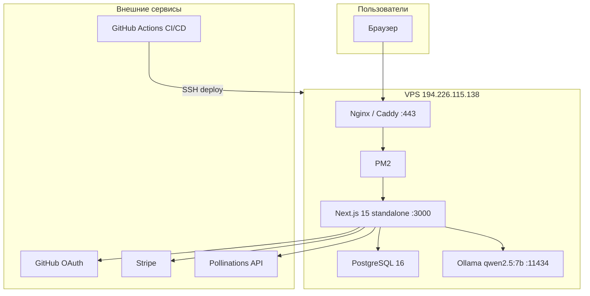
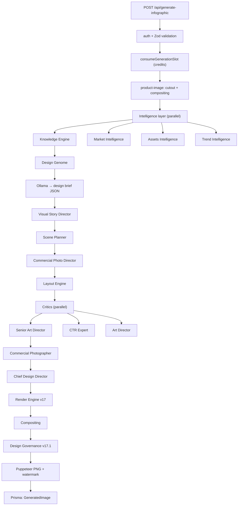

# DESIGN AI OPERATING SYSTEM

> Architecture Bible

Version: 1.0 (Draft)

Продакшен: **https://design-ai.shop**  
Обновлено: 2026-07-05

---

# TABLE OF CONTENTS

- [Part 1 — Canonical Specification](#part-1--canonical-specification)
  - [Preface](#preface)
  - [Design AI Manifesto](#design-ai-manifesto)
  - [Architecture Laws](#architecture-laws)
  - [System Overview](#system-overview)
  - [Core Design Goals](#core-design-goals)
  - [Non Goals](#non-goals)
  - [Design Philosophy](#design-philosophy)
  - [High Level Architecture](#high-level-architecture)
- [Part 2 — Current Architecture Audit](#part-2--current-architecture-audit)
  - [2.1 Purpose](#21-purpose)
  - [2.2 Executive Summary](#22-executive-summary)
  - [2.3 Root Cause](#23-root-cause)
  - [2.4 Main Architectural Problems](#24-main-architectural-problems)
  - [Category A — Information Loss](#category-a--information-loss)
  - [Category B — Legacy Architecture](#category-b--legacy-architecture)
  - [Category C — Platform Isolation](#category-c--platform-isolation)
  - [Category D — System Infrastructure](#category-d--system-infrastructure)
  - [Category E — Rendering](#category-e--rendering)
  - [Category F — Governance](#category-f--governance)
  - [Category G — Knowledge Platform](#category-g--knowledge-platform)
  - [Category H — Commercial Platform](#category-h--commercial-platform)
  - [Category I — Creative Platform](#category-i--creative-platform)
  - [Category J — Visual Intelligence Platform](#category-j--visual-intelligence-platform)
  - [Category K — Rendering Platform](#category-k--rendering-platform)
  - [Category L — Project State](#category-l--project-state)
  - [Category M — Specification Chain](#category-m--specification-chain)
- [Part 3 — Production Pipeline](#part-3--production-pipeline)
  - [3.1 Purpose](#31-purpose)
  - [3.2 Responsibilities](#32-responsibilities)
  - [3.3 Production Lifecycle](#33-production-lifecycle)
  - [3.4–3.17 Pipeline Stages](#34-stage-1--project-creation)
  - [3.18 Pipeline Rules](#318-pipeline-rules)
- [Appendix A — Repository Implementation Reference](#appendix-a--repository-implementation-reference)
  - [Current Architecture (codebase)](#current-architecture-codebase)
  - [Laws Compliance Matrix](#laws-compliance-matrix)
  - [Future Architecture (code map)](#future-architecture-code-map)
  - [Project State](#project-state)
  - [Production Pipeline](#production-pipeline)
  - [Platform Specifications](#platform-specifications)
  - [Governance](#governance)
  - [Rendering (modules)](#rendering-modules)
  - [Testing](#testing)
  - [Roadmap](#roadmap)

---

# PART 1 — CANONICAL SPECIFICATION

---

# PREFACE

## Purpose

This document is the canonical architecture specification of Design AI Operating System.

It defines:

- architecture
- platform responsibilities
- DTO contracts
- production pipeline
- rendering pipeline
- governance
- migration strategy
- implementation requirements

Any code must follow this document.

If implementation contradicts this document, implementation must be changed.

---

# DESIGN AI MANIFESTO

Modern image generators learned how to draw.

They still do not know how to design.

They do not understand:

- products
- buyers
- marketplaces
- psychology
- marketing
- commercial strategy
- information hierarchy
- visual communication

They convert text into pixels.

Design AI OS converts knowledge into decisions.

The generated image is not the goal.

The generated image is the consequence.

The goal is making the best possible commercial design decision.

Design AI OS is therefore not an AI Image Generator.

It is an Operating System for Commercial Design.

---

# ARCHITECTURE LAWS

## LAW-001

Prompt is NOT Source Of Truth.

Prompt is Provider Adapter output only.

---

## LAW-002

Every platform returns structured data.

Never Prompt.

Never HTML.

Never CSS.

---

## LAW-003

Every specification is immutable.

Platforms create new specifications.

Platforms never modify previous specifications.

---

## LAW-004

ProjectState is the only shared state.

Platforms never communicate directly.

---

## LAW-005

Every decision must be explainable.

Every decision stores:

- reason
- confidence
- evidence
- rejected alternatives

---

## LAW-006

Every generation creates Decision Trace.

Nothing is anonymous.

---

## LAW-007

Legacy modules are forbidden inside Production Pipeline.

Legacy is compatibility layer only.

---

## LAW-008

Rendering starts only after all mandatory specifications exist.

---

## LAW-009

Every PNG must pass Vision Platform.

Without Vision approval image is invalid.

---

## LAW-010

Provider models are interchangeable.

Changing Flux to GPT Image must require changing Provider Adapter only.

No other platform may depend on rendering provider.

---

# SYSTEM OVERVIEW

## Current generation pipeline

```
User
  ↓
Prompt
  ↓
LLM
  ↓
Image
  ↓
PNG
```

Problems:

- no memory
- no reasoning
- no explainability
- no replay
- no commercial thinking
- no structured knowledge

---

## Target pipeline

```
User
  ↓
Product Brief
  ↓
Research
  ↓
Knowledge
  ↓
Commercial
  ↓
Creative
  ↓
Visual
  ↓
Rendering
  ↓
Vision
  ↓
Final PNG
```

Each stage adds information.

No stage destroys information.

---

# CORE DESIGN GOALS

The system must:

- understand product
- understand category
- understand marketplace
- understand buyer
- understand competitors
- understand psychology
- understand design
- understand commercial value

Only after that may it render an image.

---

# NON GOALS

Design AI OS is NOT:

- Prompt collection
- Image generator wrapper
- HTML template engine
- Photoshop replacement
- Canva clone
- Flux wrapper

---

# DESIGN PHILOSOPHY

Images do not sell.

Commercial decisions sell.

Images communicate decisions.

Therefore Design AI OS optimizes decisions instead of prompts.

---

# HIGH LEVEL ARCHITECTURE

```
Project Intelligence
  ↓
Research Platform
  ↓
Knowledge Platform
  ↓
Commercial Platform
  ↓
Creative Platform
  ↓
Visual Platform
  ↓
Rendering Platform
  ↓
Vision Platform
  ↓
Learning Platform
  ↓
Final PNG
```

---

*END OF PART 1*

---

# PART 2 — CURRENT ARCHITECTURE AUDIT

# ============================================================================
# PART 2
# CURRENT ARCHITECTURE AUDIT
# ============================================================================

## 2.1 Purpose

The purpose of this chapter is to document every architectural limitation found during the complete audit of Design AI OS.

The goal of this audit is not to criticize the current implementation.

The goal is to identify architectural bottlenecks that prevent the system from reaching professional marketplace-quality generation.

All findings in this chapter are mandatory inputs for future migration.

---

## 2.2 Executive Summary

Current project already contains an unusually high amount of intelligence.

The project already has:

- Research
- Knowledge Engine
- Design Genome
- Market Intelligence
- Commercial Intelligence
- Creative Pipeline
- Visual Pipeline
- Layout Specification
- Constitution
- Governance
- Render Engine
- Critics
- Memory
- Registry
- Decision Trace

This means the project is NOT lacking intelligence.

Instead, the intelligence is fragmented.

The audit discovered that most quality losses happen while transferring information between modules.

The problem is therefore architectural.

Not algorithmic.

---

## 2.3 Root Cause

Current architecture can be simplified as:

```
Knowledge
  ↓
Decision
  ↓
Prompt
  ↓
Image
```

The Prompt becomes the carrier of all knowledge.

This is the fundamental architectural mistake.

A prompt is a lossy representation.

It cannot preserve:

- hierarchy
- reasoning
- relationships
- confidence
- alternatives
- constraints

Therefore every platform loses information before rendering starts.

---

## 2.4 Main Architectural Problems

The audit grouped every discovered issue into major categories.

| Category | Name |
|----------|------|
| **A** | Information Loss |
| **B** | Legacy Architecture |
| **C** | Platform Isolation |
| **D** | Weak Runtime / System Infrastructure |
| **E** | Rendering Bottlenecks |
| **F** | Governance Limitations |
| **G** | Knowledge Fragmentation |
| **H** | Commercial Intelligence Loss |
| **I** | Creative Compression |
| **J** | Missing System Infrastructure |

Every detailed issue belongs to one of these categories.

---

# CATEGORY A — INFORMATION LOSS

## A-001

Structured knowledge becomes plain text.

```
Knowledge Engine
  ↓
Prompt
  ↓
Flux
```

Knowledge should become Specification instead.

---

## A-002

Creative decisions become DesignBrief.

DesignBrief cannot preserve all commercial decisions.

---

## A-003

Commercial strategy disappears before rendering.

Rendering receives descriptions.

It does not receive business intent.

---

## A-004

Layout becomes Prompt instead of Layout Contract.

Coordinates become recommendations.

Not requirements.

---

## A-005

Visual hierarchy is recreated multiple times.

Every recreation introduces errors.

---

## A-006

Provider Prompt becomes the primary architecture.

Instead of being only Provider Adapter.

---

# CATEGORY B — LEGACY ARCHITECTURE

## B-001

Legacy Prompt Pipeline still participates in production.

---

## B-002

Legacy HTML Templates still influence layout.

---

## B-003

Old InfographicData model cannot represent modern platform decisions.

---

## B-004

Legacy modules are mixed with Production modules.

No clear separation exists.

---

## B-005

Backward compatibility influences architecture.

Instead of architecture defining compatibility.

---

# CATEGORY C — PLATFORM ISOLATION

## C-001

Knowledge Platform is not the mandatory source of knowledge.

Some agents bypass it.

---

## C-002

Commercial Platform is optional.

It should be mandatory.

---

## C-003

Creative Platform outputs DesignBrief instead of CreativeSpec.

---

## C-004

Visual Platform mixes planning and rendering.

Responsibilities overlap.

---

## C-005

Rendering Platform still performs architectural decisions.

Rendering should execute.

Not decide.

---

# CATEGORY D — SYSTEM INFRASTRUCTURE

## D-001

No unified ProjectState.

---

## D-002

No immutable DTO chain.

---

## D-003

No Platform API.

---

## D-004

No Event Bus.

---

## D-005

No Runtime Engine.

---

## D-006

No Dependency Injection layer.

---

## D-007

No Schema Registry.

---

## D-008

No Decision History.

---

## D-009

No Versioned Specifications.

---

## D-010

No Digital Twin.

---

# CATEGORY E — RENDERING

## E-001

Prompt Compiler is still Prompt Compiler.

It should become Specification Compiler.

---

## E-002

Render Blueprint loses information.

---

## E-003

Overlay generation is disconnected from Rendering Blueprint.

---

## E-004

Provider Adapter receives text instead of structured Render Instructions.

---

## E-005

Provider implementation affects architecture.

Architecture should affect Provider.

---

## E-006

Rendering does not consume immutable specifications.

---

# CATEGORY F — GOVERNANCE

## Overview

Governance is responsible for ensuring that every platform decision is consistent with the global project strategy.

Current implementation already contains:

- Constitution
- Resolver
- Decision Trace
- Validators
- Professional Score
- Blueprint Lock

This is a very strong foundation.

However Governance currently validates mostly local design decisions.

It does not govern the complete lifecycle of the project.

---

## F-001

Governance validates scenes.

It should validate projects.

Current:

```
Scene
  ↓
Composition
  ↓
Layout
```

Target:

```
Project Strategy
  ↓
Commercial Strategy
  ↓
Creative Strategy
  ↓
Visual Strategy
  ↓
Rendering Strategy
```

---

## F-002

Governance starts too late.

Today Governance begins after several architectural decisions have already been made.

Target:

Governance starts immediately after ProductBrief creation.

---

## F-003

Governance cannot reject business strategy.

It validates layout.

It does not validate commercial reasoning.

Future Governance must validate:

- buyer psychology
- commercial hierarchy
- category consistency
- marketplace strategy
- visual communication

---

## F-004

Professional Score is heuristic.

Professional Score must become composite.

Target score:

```
Commercial Score
  +
Creative Score
  +
Visual Score
  +
Vision Score
  +
Marketplace Score
  ↓
Final Score
```

---

## F-005

Current Constitution validates Blueprint.

Future Constitution validates:

```
Blueprint
  ↓
Rendering
  ↓
Overlay
  ↓
Final PNG
```

---

## F-006

Governance has no rollback.

Every rejected strategy should be restorable.

---

## Target Architecture

Governance becomes central authority.

Every platform reports into Governance.

No platform bypasses Governance.

---

# CATEGORY G — KNOWLEDGE PLATFORM

## Overview

Knowledge Platform already contains:

- Design Genome
- Knowledge Engine
- Market Intelligence
- Trend Intelligence
- Reference Analyzer

The audit confirmed that the problem is not lack of knowledge.

The problem is fragmentation.

---

## G-001

Knowledge exists in multiple isolated modules.

Target:

Single Design Knowledge Platform.

---

## G-002

Knowledge becomes Prompt.

Target:

Knowledge becomes KnowledgeSpec.

---

## G-003

Research is optional.

Research must become mandatory.

No rendering starts before research completion.

---

## G-004

Knowledge has no confidence propagation.

Every knowledge item must contain:

- confidence
- source
- freshness
- evidence

---

## G-005

Knowledge has no lifecycle.

Knowledge should evolve through:

```
Research
  ↓
Validation
  ↓
Commercial Evaluation
  ↓
Production
  ↓
Learning
```

---

## G-006

Knowledge retrieval is synchronous.

Future platform should support:

- cache
- priority
- background refresh
- monthly updates
- category snapshots

---

# CATEGORY H — COMMERCIAL PLATFORM

## Overview

Commercial Intelligence currently exists.

However it influences only a small part of the rendering pipeline.

Commercial Strategy should become one of the main architectural drivers of the project.

---

## H-001

Commercial Platform must produce CommercialSpec.

Never Prompt.

---

## H-002

Commercial Platform must know:

- Buyer
- Marketplace
- Category
- Competitors
- Price Segment
- Offer
- Brand
- USP
- Objections
- Trust Drivers

---

## H-003

Commercial decisions must survive until Final PNG.

---

## H-004

Rendering must never reinterpret commercial decisions.

It only executes them.

---

## H-005

Commercial hierarchy should define visual hierarchy.

Not vice versa.

---

## H-006

CTR prediction should become one module.

Not architecture.

---

## H-007

Commercial Platform becomes mandatory.

Every project must pass through it.

---

# CATEGORY I — CREATIVE PLATFORM

## Overview

Creative Platform already exists as Design Process.

Future architecture renames it to:

**Creative Intelligence Platform**

---

## I-001

Creative Platform returns CreativeSpec.

Not DesignBrief.

---

## I-002

Concept generation becomes deterministic pipeline.

```
Concept
  ↓
Evaluation
  ↓
Selection
  ↓
CreativeSpec
```

---

## I-003

Creative Platform stores rejected concepts.

Reasoning is preserved.

---

## I-004

Creative Platform never writes prompts.

---

## I-005

Creative Platform defines emotional direction.

Visual Platform executes it.

---

## I-006

Creative decisions remain immutable.

No downstream platform may modify them.

---

# CATEGORY J — VISUAL INTELLIGENCE PLATFORM

## Overview

Visual Intelligence Platform is responsible for transforming business decisions into visual decisions.

Visual Platform does NOT generate images.

Visual Platform generates visual specifications.

Rendering executes those specifications.

---

## Responsibilities

Visual Platform owns:

- Scene
- Composition
- Camera
- Lighting
- Materials
- Color System
- Product Position
- Visual Hierarchy
- Attention Flow
- Negative Space
- Safe Zones

Nothing else.

---

## Inputs

Visual Platform consumes:

- ProductBrief
- KnowledgeSpec
- CommercialSpec
- CreativeSpec

---

## Output

**VisualBlueprint** — only.

---

## J-001

Visual Platform never creates prompts.

---

## J-002

Visual Platform never creates HTML.

---

## J-003

Visual Platform never communicates with Flux.

---

## J-004

Visual Platform never renders.

---

## J-005

Visual Platform defines.

Rendering executes.

---

## Internal Pipeline

```
CommercialSpec
  ↓
CreativeSpec
  ↓
Scene Planner
  ↓
Composition Planner
  ↓
Lighting Planner
  ↓
Camera Planner
  ↓
Material Planner
  ↓
Visual Hierarchy Planner
  ↓
VisualBlueprint
```

---

## Required DTO

**VisualBlueprint** contains:

- Scene
- Composition
- Lighting
- Camera
- Materials
- Product Placement
- Overlay Safe Zones
- Attention Path
- Rendering Constraints
- Decision Trace

---

## Success Criteria

Visual Platform must be deterministic.

Given identical input specifications, VisualBlueprint should always be identical.

---

# CATEGORY K — RENDERING PLATFORM

## Overview

Rendering Platform is NOT responsible for design.

Rendering Platform executes RenderBlueprint.

Nothing else.

---

## Responsibilities

Rendering owns:

- Canvas
- Background Generation
- Provider Selection
- Shadow Integration
- Product Composition
- Overlay Rendering
- PNG Export

---

## Rendering Flow

```
RenderBlueprint
  ↓
Provider Adapter
  ↓
Generated Background
  ↓
Product Composer
  ↓
Overlay Renderer
  ↓
Vision Platform
  ↓
PNG
```

---

## K-001

Rendering never analyses products.

---

## K-002

Rendering never changes composition.

---

## K-003

Rendering never changes typography.

---

## K-004

Rendering never changes commercial hierarchy.

---

## K-005

Rendering never creates business decisions.

---

## Provider Independence

Rendering must support:

- Flux
- GPT Image
- Imagen
- Stable Diffusion
- Future Providers

without changing architecture.

---

## Provider Adapter

Every provider receives identical RenderBlueprint.

Provider Adapter converts RenderBlueprint into provider specific request.

Only Provider Adapter may generate Prompt.

---

## Provider Interface

```typescript
interface ProviderAdapter {
  supports(): boolean;
  compile(): RenderInstructions;
  render(): RenderResult;
  validate(): ValidationReport;
}
```

---

## Render Blueprint

RenderBlueprint becomes mandatory.

Rendering without RenderBlueprint is forbidden.

---

## Success Criteria

Changing provider must require changing one module only.

**Provider Adapter.**

---

# CATEGORY L — PROJECT STATE

## Overview

ProjectState becomes the central nervous system.

Every platform reads ProjectState.

Every platform writes new immutable specifications.

No platform communicates directly.

---

## Contains

- ProductBrief
- ResearchSpec
- KnowledgeSpec
- CommercialSpec
- CreativeSpec
- VisualBlueprint
- RenderBlueprint
- OverlayBlueprint
- VisionReport
- LearningReport
- DecisionTrace
- Events
- Metrics
- DebugArtifacts

---

## State Flow

```
Created
  ↓
Research
  ↓
Knowledge
  ↓
Commercial
  ↓
Creative
  ↓
Visual
  ↓
Render
  ↓
Vision
  ↓
Completed
```

---

## Rules

ProjectState cannot be partially mutated.

Every update creates a new immutable snapshot.

---

## Snapshot Example

```
ProjectState_v12
  ↓
ProjectState_v13
  ↓
ProjectState_v14
```

---

## Benefits

- Replay
- Rollback
- Debug
- Learning
- Analytics
- Reproducibility

---

# CATEGORY M — SPECIFICATION CHAIN

## Purpose

Specifications replace prompts.

Specifications preserve information.

Specifications explain decisions.

Specifications are immutable.

---

## Complete Chain

```
ProductBrief
  ↓
ResearchSpec
  ↓
KnowledgeSpec
  ↓
CommercialSpec
  ↓
CreativeSpec
  ↓
VisualBlueprint
  ↓
RenderBlueprint
  ↓
OverlayBlueprint
  ↓
VisionReport
  ↓
LearningReport
```

---

## Rules

Every specification:

- has unique id
- has version
- has author platform
- has timestamp
- has confidence
- has decision trace
- has evidence

---

## Forbidden

```
Prompt
  ↓
Prompt
  ↓
Prompt
```

architecture.

Only:

```
Specification
  ↓
Specification
  ↓
Specification
  ↓
Provider Adapter
  ↓
Prompt
```

---

*END OF PART 2 (Sections 2.1–2.6; Categories A–M)*

---

# PART 3 — PRODUCTION PIPELINE

# ============================================================================
# PART 3
# PRODUCTION PIPELINE
# ============================================================================

## 3.1 Purpose

Production Pipeline is the heart of Design AI Operating System.

Every project.

Every image.

Every render.

Every decision.

Must pass through Production Pipeline.

There are no alternative production paths.

No Legacy Pipeline.

No Debug Pipeline.

No Fast Pipeline.

Every production run starts here.

---

## 3.2 Responsibilities

Production Pipeline orchestrates all platforms.

Production Pipeline never makes business decisions.

Production Pipeline never generates prompts.

Production Pipeline coordinates execution.

Responsibilities include:

- lifecycle management
- state transitions
- dependency validation
- platform execution
- retry strategy
- error recovery
- logging
- metrics
- final artifact creation

---

## 3.3 Production Lifecycle

```
Project Created
  ↓
Product Brief
  ↓
Research Platform
  ↓
Knowledge Platform
  ↓
Commercial Platform
  ↓
Creative Platform
  ↓
Visual Platform
  ↓
Governance Validation
  ↓
Render Blueprint
  ↓
Provider Adapter
  ↓
Rendering
  ↓
Vision Platform
  ↓
Learning Platform
  ↓
Completed
```

No stage may be skipped.

---

## 3.4 Stage 1 — Project Creation

| | |
|---|---|
| **Input** | User Request |
| **Output** | ProjectState |

**Responsibilities:**

- create Project ID
- initialize Decision Trace
- initialize Events
- initialize Metrics
- initialize Debug

Nothing else.

---

## 3.5 Stage 2 — Product Brief

| | |
|---|---|
| **Input** | User Request |
| **Output** | ProductBrief |

**Responsibilities:** Understand Product, Marketplace, Audience, Goal, Restrictions, Brand, Expected Result.

ProductBrief becomes immutable.

---

## 3.6 Stage 3 — Research Platform

| | |
|---|---|
| **Input** | ProductBrief |
| **Output** | ResearchSpec |

**Responsibilities:**

- Research category
- Research competitors
- Research marketplace
- Research buyer
- Research trends
- Research references
- Research psychology
- Research pricing
- Research objections
- Research evidence

Nothing else.

---

## 3.7 Stage 4 — Knowledge Platform

| | |
|---|---|
| **Input** | ResearchSpec |
| **Output** | KnowledgeSpec |

**Responsibilities:**

- Merge Design Genome
- Merge Historical Knowledge
- Merge Category Knowledge
- Merge Marketplace Rules
- Merge References
- Merge Trends
- Assign confidence
- Store evidence
- Produce structured knowledge

---

## 3.8 Stage 5 — Commercial Platform

| | |
|---|---|
| **Input** | KnowledgeSpec |
| **Output** | CommercialSpec |

**Responsibilities:**

- Choose commercial strategy
- Determine buyer psychology
- Determine information hierarchy
- Determine trust strategy
- Determine emotional strategy
- Determine visual priorities

Commercial Platform defines **WHAT** should sell.

Never **HOW**.

---

## 3.9 Stage 6 — Creative Platform

| | |
|---|---|
| **Input** | CommercialSpec |
| **Output** | CreativeSpec |

**Responsibilities:**

- Generate concepts
- Evaluate concepts
- Reject concepts
- Select concept
- Generate emotional direction
- Generate visual hook
- Generate narrative

Creative Platform answers: **How should people FEEL?**

---

## 3.10 Stage 7 — Visual Platform

| | |
|---|---|
| **Input** | CreativeSpec |
| **Output** | VisualBlueprint |

**Responsibilities:**

- Scene
- Composition
- Camera
- Lighting
- Materials
- Negative Space
- Attention Flow
- Visual Hierarchy
- Safe Zones

Visual Platform answers: **How should people SEE?**

---

## 3.11 Stage 8 — Governance

| | |
|---|---|
| **Input** | VisualBlueprint |
| **Output** | Approved Blueprint |

**Responsibilities:**

- Validate consistency
- Validate Constitution
- Validate conflicts
- Validate commercial goals
- Validate design rules
- Validate architecture laws
- Approve
- Reject
- Retry

Nothing else.

---

## 3.12 Stage 9 — Rendering

| | |
|---|---|
| **Input** | Approved Blueprint |
| **Output** | RenderBlueprint |

**Responsibilities:**

- Prepare rendering
- Prepare provider
- Prepare composition
- Prepare assets
- Prepare shadows
- Prepare overlays

No rendering starts without approved blueprint.

---

## 3.13 Stage 10 — Provider Adapter

| | |
|---|---|
| **Input** | RenderBlueprint |
| **Output** | Provider Request |

**Responsibilities:**

- Compile provider request
- Compile Prompt
- Compile negative prompt
- Compile provider options
- Compile rendering parameters

**Provider Adapter is the ONLY place where Prompt exists.**

---

## 3.14 Stage 11 — Rendering Engine

| | |
|---|---|
| **Input** | Provider Request |
| **Output** | Rendered Background |

**Responsibilities:**

- Call provider
- Retry
- Cache
- Validate
- Return image

No business logic.

---

## 3.15 Stage 12 — Composition Engine

| | |
|---|---|
| **Input** | Rendered Background, Product Cutout, OverlayBlueprint |
| **Output** | Candidate PNG |

**Responsibilities:**

- Compose background
- Compose product
- Compose shadows
- Compose overlays
- Export candidate

Nothing else.

---

## 3.16 Stage 13 — Vision Platform

| | |
|---|---|
| **Input** | Candidate PNG |
| **Output** | Vision Report |

**Responsibilities:**

- Commercial Critic
- Typography Critic
- Composition Critic
- Marketplace Critic
- Product Integration Critic
- Quality Critic

Vision Platform determines whether image may exist.

---

## 3.17 Stage 14 — Learning Platform

| | |
|---|---|
| **Input** | Vision Report |
| **Output** | Learning Report |

**Responsibilities:**

- Store success
- Store failure
- Update knowledge
- Update confidence
- Update genome
- Update commercial memory
- Prepare future improvements

---

## 3.18 Pipeline Rules

Every stage has:

```
Input DTO
  ↓
Output DTO
  ↓
Validation
  ↓
Decision Trace
  ↓
Metrics
  ↓
Events
  ↓
Logs
  ↓
Debug Artifacts
```

No exceptions.

---

*END OF PART 3*

---

# APPENDIX A — REPOSITORY IMPLEMENTATION REFERENCE

> Практическая привязка Part 1 (канон) и Part 2 (аудит) к текущему коду репозитория `design-ai`.  
> Это **не** Part 2 — справочник по реализации, не дублирует аудит.

---

# CURRENT ARCHITECTURE (codebase)

## Миссия продукта

**Design AI** — SaaS для генерации инфографики товаров (900×1200 / 1200×1200) под маркетплейсы **Wildberries** и **Ozon**.

| Параметр | Значение |
|----------|----------|
| Домен | `design-ai.shop` |
| VPS | `194.226.115.138` |
| Бесплатный лимит | 5 генераций / день |
| Платный пакет | 20 генераций за 500 ₽ (Stripe) |

## Инфраструктура



## Технологический стек

| Слой | Технология |
|------|------------|
| Frontend | Next.js 15 (App Router), React 19, Tailwind CSS |
| Backend | Next.js API Routes, Server Components |
| Auth | NextAuth v5 (GitHub OAuth + email/password) |
| ORM | Prisma 6 + PostgreSQL |
| AI (структура) | Ollama `qwen2.5:7b` |
| AI (рендер фона) | Pollinations API (v17) |
| Рендер PNG | Puppeteer + Sharp |
| Cutout | @imgly/background-removal-node |
| Платежи | Stripe Checkout + Webhook |
| Валидация | Zod |
| Process manager | PM2 (fork, 2.5 GB limit) |
| CI | GitHub Actions (lint + specs) |

## Структура репозитория

```
design-ai/
├── marketplace-infographic/     # Основное приложение
│   ├── src/
│   │   ├── app/                 # Страницы + API routes
│   │   ├── components/          # UI-компоненты
│   │   └── lib/                 # Бизнес-логика (~500 файлов)
│   ├── prisma/                  # Схема + 15 миграций
│   ├── templates/               # HTML-шаблоны слайдов
│   ├── scripts/                 # Тесты и build-скрипты
│   └── docs/                    # Аудит, книга, архивы
├── scripts/                     # VPS setup / deploy
├── deploy/ssh/                  # SSH-ключи для CI/CD
├── ecosystem.config.cjs         # PM2 конфиг
├── .github/workflows/           # CI + Deploy
├── DEPLOY.md
└── docs/
    └── Architecture_Bible.md    # ← этот файл
```

---

# LAWS COMPLIANCE MATRIX

## Соответствие Architecture Laws

| Law | Канон (Part 1) | Текущая реализация | Статус |
|-----|----------------|-------------------|--------|
| LAW-001 | Prompt ≠ Source of Truth | Ollama prompt всё ещё центральный в v17 handler | ⚠️ частично |
| LAW-002 | Structured data only | Design brief JSON + blueprint types есть | ✅ v18 types |
| LAW-003 | Immutable specifications | RenderBlueprint sections immutable | ✅ v18 |
| LAW-004 | ProjectState only | Пока нет единого ProjectState DTO | ❌ gap |
| LAW-005 | Explainable decisions | Diagnostics JSON, governance trace | ⚠️ частично |
| LAW-006 | Decision Trace | Trace в design-governance | ⚠️ частично |
| LAW-007 | No legacy in prod pipeline | Legacy `/api/generate` существует | ⚠️ compat layer |
| LAW-008 | Render after specs | Governance gate перед PNG | ✅ v17.1 |
| LAW-009 | Vision Platform approval | Vision Critic agent есть, не в prod path | ❌ gap |
| LAW-010 | Swappable providers | render-engine provider registry | ✅ v17 |

## Известные разрывы (integration gaps)

| # | Проблема | Влияние | Приоритет |
|---|----------|---------|-----------|
| 1 | VPS недоступен (SSH/TLS reset) | design-ai.shop лежит | 🔴 критично |
| 2 | `RENDER_BLUEPRINT_V18` не подключён к handler | v18 только в тестах | 🟠 высокий |
| 3 | `runDesignAiBookPipeline()` не вызывается из API | Ch 8–11 вне prod | 🟠 высокий |
| 4 | Ch 8–10 — registry scaffold, не full engines | 61 секция без логики | 🟡 средний |
| 5 | Нет единого `ProjectState` (LAW-004) | Платформы связаны через handler | 🟠 высокий |
| 6 | Vision Platform не блокирует PNG (LAW-009) | Нет обязательного vision gate | 🟠 высокий |
| 7 | CI не гоняет 219 тестов | Регрессии не ловятся | 🟡 средний |
| 8 | `generate-infographic-handler.ts` монолит ~2200 строк | Сложно поддерживать | 🟢 низкий |

---

# FUTURE ARCHITECTURE (code map)

## Target pipeline → код

Маппинг канонического target pipeline (Part 1) на модули репозитория:

| Стадия (Target) | Модуль в коде | Зрелость |
|-----------------|---------------|----------|
| Product Brief | `design-brief/`, `design-process/` | partial |
| Research | `design/market-intelligence/` | partial |
| Knowledge | `design/knowledge-engine/`, `design-knowledge-platform/` | partial / registry |
| Commercial | `commercial-intelligence-platform/` | **full** (Ch11) |
| Creative | `design-process/`, `agents/` | partial |
| Visual | `layout-engine/`, `composition/` | partial |
| Rendering | `render-engine/`, `render-blueprint/` | v17 prod / v18 code |
| Vision | `agents/` (Vision Critic), `render-validator-agent` | code only |
| Learning | `feedback/`, `design/design-genome/`, Design Memory | partial |

## Render Blueprint (v18) — целевой пайплайн

Модуль: `src/lib/render-blueprint/` (416 TypeScript-файлов).

| Подсистема | Назначение |
|------------|------------|
| `types.ts` | RenderBlueprint, 14 секций |
| `lifecycle-manager.ts` | Жизненный цикл blueprint |
| `mutation-engine.ts` | Мутации секций (immutable create) |
| `validation-engine.ts` | Constitution v18 |
| `render-orchestrator-agent-engine.ts` | Оркестратор рендера |
| `render-adapter-agent-engine.ts` | Provider Adapter (LAW-010) |
| `render-validator-agent-engine.ts` | Валидатор результата |
| `knowledge-architecture-engine.ts` | Knowledge graph |
| `consensus-validation-stage-engine.ts` | Консенсус агентов |

Флаг: `RENDER_BLUEPRINT_V18=1` → `v18.0-render-blueprint` в `/api/health`.

> **Статус:** код и 120 тестов готовы; **не подключён** к `generate-infographic-handler.ts`.

---

# PROJECT STATE

## Версии пайплайна

Версия: `src/lib/pipeline-version.ts` → `/api/health`.

| Версия | Флаг | Статус |
|--------|------|--------|
| **v16.9** | — | legacy |
| **v17.0** | `RENDER_ENGINE_V17=1` | prod-ready |
| **v17.1** | `+ DESIGN_GOVERNANCE_V171=1` | **текущий prod** |
| **v18.0** | `RENDER_BLUEPRINT_V18=1` | code only |

```env
RENDER_ENGINE_V17=1
PIPELINE_V17=1
DESIGN_GOVERNANCE_V171=1
RENDER_PROVIDER=pollinations
POLLINATIONS_API_KEY="..."
AI_MOCK_MODE=false
```

## Prisma — слой данных

| Модель | Назначение |
|--------|------------|
| `User` | Аккаунт, credits, stripeCustomerId |
| `GeneratedImage` | Результат + diagnostics JSON |
| `TrainingSample` | Few-shot self-learning |
| `DesignExample` | Админские примеры |
| `ReferenceImage` | Референсы стиля |
| `LibraryAsset` | Шрифты, бейджи |
| `UserFeedback` | 👍/👎 |
| `SdBackgroundCache` | Кэш фонов |

---

# PRODUCTION PIPELINE

Главный оркестратор: `src/lib/generate-infographic-handler.ts` (~2200 строк).



Legacy: `POST /api/generate` — Ollama → HTML → Puppeteer (compat layer, LAW-007).

---

# PLATFORM SPECIFICATIONS

## Design AI Book — главы 1–11

Реестр: `src/lib/design-ai-book/book-registry.ts`

| Гл | Название | Модуль | Секций | Зрелость |
|----|----------|--------|--------|----------|
| 1 | Design Philosophy | `docs/DESIGN-AI-v18-PHILOSOPHY.md` | 1 | docs |
| 2 | Blueprint | `render-blueprint/types.ts` | 1 | types |
| 3–7 | Render Blueprint … Platform Arch | `render-blueprint/` | 115 | **full** |
| 8 | Design Knowledge Platform | `design-knowledge-platform/` | 27 | registry |
| 9 | Intelligent Orchestration | `intelligent-orchestration-platform/` | 19 | registry |
| 10 | Human AI Collaboration | `human-ai-collaboration/` | 15 | registry |
| 11 | Commercial Intelligence | `commercial-intelligence-platform/` | 20 | **full** |

Оркестратор платформ: `runDesignAiBookPipeline()` в `design-ai-book/pipeline.ts`.

## API Surface

| Method | Path | Описание |
|--------|------|----------|
| POST | `/api/generate-infographic` | **Главная генерация** (v17.1) |
| POST | `/api/generate` | Legacy (compat) |
| GET | `/api/health` | pipelineVersion + DB |
| GET | `/api/images/[id]/download` | Скачать PNG |
| GET | `/api/images/[id]/diagnostics` | Decision trace / diagnostics |
| POST | `/api/stripe/checkout` | Оплата |

Полный список: см. `src/app/api/`.

## Frontend

| Страница | Путь |
|----------|------|
| Главная + генерация | `/` |
| Dashboard | `/dashboard` |
| Pricing | `/pricing` |
| Admin | `/admin` |

---

# GOVERNANCE

Модуль: `src/lib/design-governance/`

| Компонент | Роль |
|-----------|------|
| `constitution/` | Законы дизайна (связь с Architecture Laws) |
| `validators/` | Проверка макета |
| `scores/` | Professional score |
| `conflicts/` | Разрешение конфликтов |
| `trace/` | Decision Trace (LAW-005, LAW-006) |

```env
GOVERNANCE_CONSTITUTION_THRESHOLD=80
GOVERNANCE_PROFESSIONAL_THRESHOLD=75
GOVERNANCE_PROFESSIONAL_NEAR_MISS=3
```

---

# RENDERING (modules)

Модуль: `src/lib/render-engine/`

```
render-planner.ts
  → model-selection.ts (Pollinations / HuggingFace)
  → pollinations/provider.ts      # Provider Adapter (LAW-010)
  → canvas-composer.ts
  → render-quality.ts
  → retry-engine.ts
```

Компилятор промптов (adapter output, не SOT): `adapters/pollinations-compiler.ts`.

Рендер PNG: Puppeteer + Sharp + watermark (`WATERMARK_TEXT`).

---

# TESTING

| Команда | Тестов | Покрытие |
|---------|--------|----------|
| `npm run lint` | ESLint | стиль |
| `npm run test:specs` | ~13 | governance + render + blueprint core |
| `bash scripts/run-v18-blueprint-tests.sh` | 120 | главы 3–7 |
| `bash scripts/run-platform-chapters-8-11-specs.sh` | 99 | главы 8–11 |
| `bash scripts/run-design-ai-book-audit.sh` | **219** | полный аудит |

```bash
cd marketplace-infographic
bash scripts/run-design-ai-book-audit.sh
curl -s http://localhost:3000/api/health | jq
```

---

# ROADMAP

## Фаза 1 — Продакшен

- [ ] Починить VPS `194.226.115.138`
- [ ] Production `.env` (Pollinations, Stripe, GitHub OAuth)
- [ ] `curl https://design-ai.shop/api/health` → `v17.1`

## Фаза 2 — OS Alignment (Part 1 → код)

- [ ] Ввести `ProjectState` DTO (LAW-004)
- [ ] Подключить `RENDER_BLUEPRINT_V18` к handler
- [ ] Vision Platform как обязательный gate (LAW-009)
- [ ] `runDesignAiBookPipeline()` за feature flag

## Фаза 3 — Platform Completion

- [ ] Engines для Ch 8–10 (61 секция)
- [ ] Разбить handler на platform stages
- [ ] CI: 219 тестов + `npm run build`

## Фаза 4 — Quality

- [ ] E2E Playwright
- [ ] Uptime monitoring `/api/health`
- [ ] Redis rate-limit

---

## Быстрые команды

```bash
cd marketplace-infographic && cp .env.example .env
npm ci && npx prisma migrate deploy && npm run dev

cd /opt/design-ai && ./scripts/deploy.sh   # VPS
pm2 logs marketplace-infographic --lines 50
```

## Связанные документы

| Документ | Путь |
|----------|------|
| Деплой | `DEPLOY.md` |
| Книга Design AI | `marketplace-infographic/docs/DESIGN-AI-BOOK-INDEX-CH1-11.md` |
| Аудит Chief Architect | `marketplace-infographic/docs/AUDIT-CHIEF-ARCHITECT-DESIGN-AI-CH1-11.md` |
| Философия v18 | `marketplace-infographic/docs/DESIGN-AI-v18-PHILOSOPHY.md` |

---

*Architecture Bible — living document. Part 1 is canonical law. Part 2 is the architecture audit. Part 3 is the production pipeline. Appendix A tracks repository implementation.*
