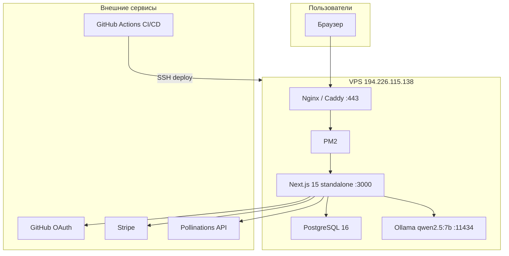
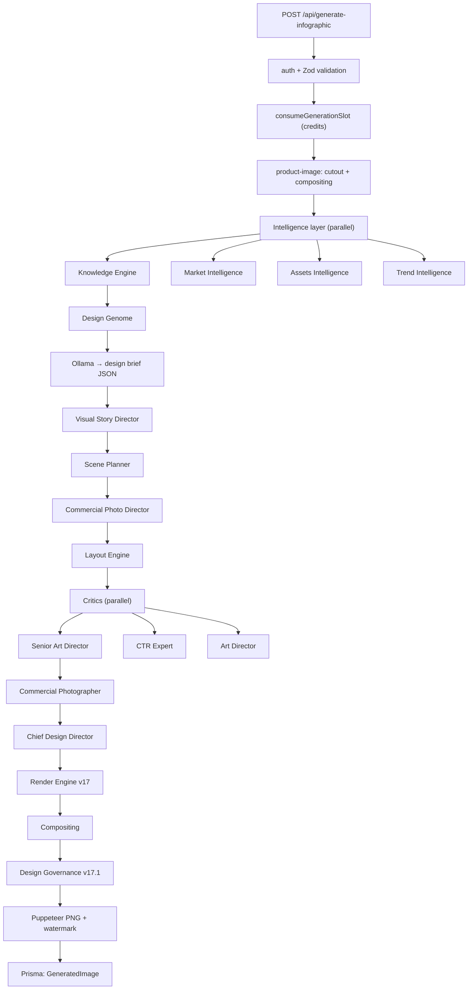

# DESIGN AI OPERATING SYSTEM

> Architecture Bible

Version: 1.0 (Draft)

Продакшен: **https://design-ai.shop**  
Обновлено: 2026-07-05

---

# TABLE OF CONTENTS

- [Part 1 — Canonical Specification](#part-1--canonical-specification)
  - [Preface](#preface)
  - [Design AI Manifesto](#design-ai-manifesto)
  - [Architecture Laws](#architecture-laws)
  - [System Overview](#system-overview)
  - [Core Design Goals](#core-design-goals)
  - [Non Goals](#non-goals)
  - [Design Philosophy](#design-philosophy)
  - [High Level Architecture](#high-level-architecture)
- [Part 2 — Implementation Reference](#part-2--implementation-reference)
  - [Current Architecture](#current-architecture)
  - [Architecture Audit](#architecture-audit)
  - [Future Architecture](#future-architecture)
  - [Project State](#project-state)
  - [Production Pipeline](#production-pipeline)
  - [Platform Specifications](#platform-specifications)
  - [Governance](#governance)
  - [Rendering](#rendering)
  - [Testing](#testing)
  - [Roadmap](#roadmap)

---

# PART 1 — CANONICAL SPECIFICATION

---

# PREFACE

## Purpose

This document is the canonical architecture specification of Design AI Operating System.

It defines:

- architecture
- platform responsibilities
- DTO contracts
- production pipeline
- rendering pipeline
- governance
- migration strategy
- implementation requirements

Any code must follow this document.

If implementation contradicts this document, implementation must be changed.

---

# DESIGN AI MANIFESTO

Modern image generators learned how to draw.

They still do not know how to design.

They do not understand:

- products
- buyers
- marketplaces
- psychology
- marketing
- commercial strategy
- information hierarchy
- visual communication

They convert text into pixels.

Design AI OS converts knowledge into decisions.

The generated image is not the goal.

The generated image is the consequence.

The goal is making the best possible commercial design decision.

Design AI OS is therefore not an AI Image Generator.

It is an Operating System for Commercial Design.

---

# ARCHITECTURE LAWS

## LAW-001

Prompt is NOT Source Of Truth.

Prompt is Provider Adapter output only.

---

## LAW-002

Every platform returns structured data.

Never Prompt.

Never HTML.

Never CSS.

---

## LAW-003

Every specification is immutable.

Platforms create new specifications.

Platforms never modify previous specifications.

---

## LAW-004

ProjectState is the only shared state.

Platforms never communicate directly.

---

## LAW-005

Every decision must be explainable.

Every decision stores:

- reason
- confidence
- evidence
- rejected alternatives

---

## LAW-006

Every generation creates Decision Trace.

Nothing is anonymous.

---

## LAW-007

Legacy modules are forbidden inside Production Pipeline.

Legacy is compatibility layer only.

---

## LAW-008

Rendering starts only after all mandatory specifications exist.

---

## LAW-009

Every PNG must pass Vision Platform.

Without Vision approval image is invalid.

---

## LAW-010

Provider models are interchangeable.

Changing Flux to GPT Image must require changing Provider Adapter only.

No other platform may depend on rendering provider.

---

# SYSTEM OVERVIEW

## Current generation pipeline

```
User
  ↓
Prompt
  ↓
LLM
  ↓
Image
  ↓
PNG
```

Problems:

- no memory
- no reasoning
- no explainability
- no replay
- no commercial thinking
- no structured knowledge

---

## Target pipeline

```
User
  ↓
Product Brief
  ↓
Research
  ↓
Knowledge
  ↓
Commercial
  ↓
Creative
  ↓
Visual
  ↓
Rendering
  ↓
Vision
  ↓
Final PNG
```

Each stage adds information.

No stage destroys information.

---

# CORE DESIGN GOALS

The system must:

- understand product
- understand category
- understand marketplace
- understand buyer
- understand competitors
- understand psychology
- understand design
- understand commercial value

Only after that may it render an image.

---

# NON GOALS

Design AI OS is NOT:

- Prompt collection
- Image generator wrapper
- HTML template engine
- Photoshop replacement
- Canva clone
- Flux wrapper

---

# DESIGN PHILOSOPHY

Images do not sell.

Commercial decisions sell.

Images communicate decisions.

Therefore Design AI OS optimizes decisions instead of prompts.

---

# HIGH LEVEL ARCHITECTURE

```
Project Intelligence
  ↓
Research Platform
  ↓
Knowledge Platform
  ↓
Commercial Platform
  ↓
Creative Platform
  ↓
Visual Platform
  ↓
Rendering Platform
  ↓
Vision Platform
  ↓
Learning Platform
  ↓
Final PNG
```

---

*END OF PART 1*

---

# PART 2 — IMPLEMENTATION REFERENCE

> Практическая привязка канонической спецификации (Part 1) к текущему коду репозитория `design-ai`.

---

# CURRENT ARCHITECTURE

## Миссия продукта

**Design AI** — SaaS для генерации инфографики товаров (900×1200 / 1200×1200) под маркетплейсы **Wildberries** и **Ozon**.

| Параметр | Значение |
|----------|----------|
| Домен | `design-ai.shop` |
| VPS | `194.226.115.138` |
| Бесплатный лимит | 5 генераций / день |
| Платный пакет | 20 генераций за 500 ₽ (Stripe) |

## Инфраструктура



## Технологический стек

| Слой | Технология |
|------|------------|
| Frontend | Next.js 15 (App Router), React 19, Tailwind CSS |
| Backend | Next.js API Routes, Server Components |
| Auth | NextAuth v5 (GitHub OAuth + email/password) |
| ORM | Prisma 6 + PostgreSQL |
| AI (структура) | Ollama `qwen2.5:7b` |
| AI (рендер фона) | Pollinations API (v17) |
| Рендер PNG | Puppeteer + Sharp |
| Cutout | @imgly/background-removal-node |
| Платежи | Stripe Checkout + Webhook |
| Валидация | Zod |
| Process manager | PM2 (fork, 2.5 GB limit) |
| CI | GitHub Actions (lint + specs) |

## Структура репозитория

```
design-ai/
├── marketplace-infographic/     # Основное приложение
│   ├── src/
│   │   ├── app/                 # Страницы + API routes
│   │   ├── components/          # UI-компоненты
│   │   └── lib/                 # Бизнес-логика (~500 файлов)
│   ├── prisma/                  # Схема + 15 миграций
│   ├── templates/               # HTML-шаблоны слайдов
│   ├── scripts/                 # Тесты и build-скрипты
│   └── docs/                    # Аудит, книга, архивы
├── scripts/                     # VPS setup / deploy
├── deploy/ssh/                  # SSH-ключи для CI/CD
├── ecosystem.config.cjs         # PM2 конфиг
├── .github/workflows/           # CI + Deploy
├── DEPLOY.md
└── docs/
    └── Architecture_Bible.md    # ← этот файл
```

---

# ARCHITECTURE AUDIT

## Соответствие Architecture Laws

| Law | Канон (Part 1) | Текущая реализация | Статус |
|-----|----------------|-------------------|--------|
| LAW-001 | Prompt ≠ Source of Truth | Ollama prompt всё ещё центральный в v17 handler | ⚠️ частично |
| LAW-002 | Structured data only | Design brief JSON + blueprint types есть | ✅ v18 types |
| LAW-003 | Immutable specifications | RenderBlueprint sections immutable | ✅ v18 |
| LAW-004 | ProjectState only | Пока нет единого ProjectState DTO | ❌ gap |
| LAW-005 | Explainable decisions | Diagnostics JSON, governance trace | ⚠️ частично |
| LAW-006 | Decision Trace | Trace в design-governance | ⚠️ частично |
| LAW-007 | No legacy in prod pipeline | Legacy `/api/generate` существует | ⚠️ compat layer |
| LAW-008 | Render after specs | Governance gate перед PNG | ✅ v17.1 |
| LAW-009 | Vision Platform approval | Vision Critic agent есть, не в prod path | ❌ gap |
| LAW-010 | Swappable providers | render-engine provider registry | ✅ v17 |

## Известные разрывы (integration gaps)

| # | Проблема | Влияние | Приоритет |
|---|----------|---------|-----------|
| 1 | VPS недоступен (SSH/TLS reset) | design-ai.shop лежит | 🔴 критично |
| 2 | `RENDER_BLUEPRINT_V18` не подключён к handler | v18 только в тестах | 🟠 высокий |
| 3 | `runDesignAiBookPipeline()` не вызывается из API | Ch 8–11 вне prod | 🟠 высокий |
| 4 | Ch 8–10 — registry scaffold, не full engines | 61 секция без логики | 🟡 средний |
| 5 | Нет единого `ProjectState` (LAW-004) | Платформы связаны через handler | 🟠 высокий |
| 6 | Vision Platform не блокирует PNG (LAW-009) | Нет обязательного vision gate | 🟠 высокий |
| 7 | CI не гоняет 219 тестов | Регрессии не ловятся | 🟡 средний |
| 8 | `generate-infographic-handler.ts` монолит ~2200 строк | Сложно поддерживать | 🟢 низкий |

---

# FUTURE ARCHITECTURE

## Target pipeline → код

Маппинг канонического target pipeline (Part 1) на модули репозитория:

| Стадия (Target) | Модуль в коде | Зрелость |
|-----------------|---------------|----------|
| Product Brief | `design-brief/`, `design-process/` | partial |
| Research | `design/market-intelligence/` | partial |
| Knowledge | `design/knowledge-engine/`, `design-knowledge-platform/` | partial / registry |
| Commercial | `commercial-intelligence-platform/` | **full** (Ch11) |
| Creative | `design-process/`, `agents/` | partial |
| Visual | `layout-engine/`, `composition/` | partial |
| Rendering | `render-engine/`, `render-blueprint/` | v17 prod / v18 code |
| Vision | `agents/` (Vision Critic), `render-validator-agent` | code only |
| Learning | `feedback/`, `design/design-genome/`, Design Memory | partial |

## Render Blueprint (v18) — целевой пайплайн

Модуль: `src/lib/render-blueprint/` (416 TypeScript-файлов).

| Подсистема | Назначение |
|------------|------------|
| `types.ts` | RenderBlueprint, 14 секций |
| `lifecycle-manager.ts` | Жизненный цикл blueprint |
| `mutation-engine.ts` | Мутации секций (immutable create) |
| `validation-engine.ts` | Constitution v18 |
| `render-orchestrator-agent-engine.ts` | Оркестратор рендера |
| `render-adapter-agent-engine.ts` | Provider Adapter (LAW-010) |
| `render-validator-agent-engine.ts` | Валидатор результата |
| `knowledge-architecture-engine.ts` | Knowledge graph |
| `consensus-validation-stage-engine.ts` | Консенсус агентов |

Флаг: `RENDER_BLUEPRINT_V18=1` → `v18.0-render-blueprint` в `/api/health`.

> **Статус:** код и 120 тестов готовы; **не подключён** к `generate-infographic-handler.ts`.

---

# PROJECT STATE

## Версии пайплайна

Версия: `src/lib/pipeline-version.ts` → `/api/health`.

| Версия | Флаг | Статус |
|--------|------|--------|
| **v16.9** | — | legacy |
| **v17.0** | `RENDER_ENGINE_V17=1` | prod-ready |
| **v17.1** | `+ DESIGN_GOVERNANCE_V171=1` | **текущий prod** |
| **v18.0** | `RENDER_BLUEPRINT_V18=1` | code only |

```env
RENDER_ENGINE_V17=1
PIPELINE_V17=1
DESIGN_GOVERNANCE_V171=1
RENDER_PROVIDER=pollinations
POLLINATIONS_API_KEY="..."
AI_MOCK_MODE=false
```

## Prisma — слой данных

| Модель | Назначение |
|--------|------------|
| `User` | Аккаунт, credits, stripeCustomerId |
| `GeneratedImage` | Результат + diagnostics JSON |
| `TrainingSample` | Few-shot self-learning |
| `DesignExample` | Админские примеры |
| `ReferenceImage` | Референсы стиля |
| `LibraryAsset` | Шрифты, бейджи |
| `UserFeedback` | 👍/👎 |
| `SdBackgroundCache` | Кэш фонов |

---

# PRODUCTION PIPELINE

Главный оркестратор: `src/lib/generate-infographic-handler.ts` (~2200 строк).



Legacy: `POST /api/generate` — Ollama → HTML → Puppeteer (compat layer, LAW-007).

---

# PLATFORM SPECIFICATIONS

## Design AI Book — главы 1–11

Реестр: `src/lib/design-ai-book/book-registry.ts`

| Гл | Название | Модуль | Секций | Зрелость |
|----|----------|--------|--------|----------|
| 1 | Design Philosophy | `docs/DESIGN-AI-v18-PHILOSOPHY.md` | 1 | docs |
| 2 | Blueprint | `render-blueprint/types.ts` | 1 | types |
| 3–7 | Render Blueprint … Platform Arch | `render-blueprint/` | 115 | **full** |
| 8 | Design Knowledge Platform | `design-knowledge-platform/` | 27 | registry |
| 9 | Intelligent Orchestration | `intelligent-orchestration-platform/` | 19 | registry |
| 10 | Human AI Collaboration | `human-ai-collaboration/` | 15 | registry |
| 11 | Commercial Intelligence | `commercial-intelligence-platform/` | 20 | **full** |

Оркестратор платформ: `runDesignAiBookPipeline()` в `design-ai-book/pipeline.ts`.

## API Surface

| Method | Path | Описание |
|--------|------|----------|
| POST | `/api/generate-infographic` | **Главная генерация** (v17.1) |
| POST | `/api/generate` | Legacy (compat) |
| GET | `/api/health` | pipelineVersion + DB |
| GET | `/api/images/[id]/download` | Скачать PNG |
| GET | `/api/images/[id]/diagnostics` | Decision trace / diagnostics |
| POST | `/api/stripe/checkout` | Оплата |

Полный список: см. `src/app/api/`.

## Frontend

| Страница | Путь |
|----------|------|
| Главная + генерация | `/` |
| Dashboard | `/dashboard` |
| Pricing | `/pricing` |
| Admin | `/admin` |

---

# GOVERNANCE

Модуль: `src/lib/design-governance/`

| Компонент | Роль |
|-----------|------|
| `constitution/` | Законы дизайна (связь с Architecture Laws) |
| `validators/` | Проверка макета |
| `scores/` | Professional score |
| `conflicts/` | Разрешение конфликтов |
| `trace/` | Decision Trace (LAW-005, LAW-006) |

```env
GOVERNANCE_CONSTITUTION_THRESHOLD=80
GOVERNANCE_PROFESSIONAL_THRESHOLD=75
GOVERNANCE_PROFESSIONAL_NEAR_MISS=3
```

---

# RENDERING

Модуль: `src/lib/render-engine/`

```
render-planner.ts
  → model-selection.ts (Pollinations / HuggingFace)
  → pollinations/provider.ts      # Provider Adapter (LAW-010)
  → canvas-composer.ts
  → render-quality.ts
  → retry-engine.ts
```

Компилятор промптов (adapter output, не SOT): `adapters/pollinations-compiler.ts`.

Рендер PNG: Puppeteer + Sharp + watermark (`WATERMARK_TEXT`).

---

# TESTING

| Команда | Тестов | Покрытие |
|---------|--------|----------|
| `npm run lint` | ESLint | стиль |
| `npm run test:specs` | ~13 | governance + render + blueprint core |
| `bash scripts/run-v18-blueprint-tests.sh` | 120 | главы 3–7 |
| `bash scripts/run-platform-chapters-8-11-specs.sh` | 99 | главы 8–11 |
| `bash scripts/run-design-ai-book-audit.sh` | **219** | полный аудит |

```bash
cd marketplace-infographic
bash scripts/run-design-ai-book-audit.sh
curl -s http://localhost:3000/api/health | jq
```

---

# ROADMAP

## Фаза 1 — Продакшен

- [ ] Починить VPS `194.226.115.138`
- [ ] Production `.env` (Pollinations, Stripe, GitHub OAuth)
- [ ] `curl https://design-ai.shop/api/health` → `v17.1`

## Фаза 2 — OS Alignment (Part 1 → код)

- [ ] Ввести `ProjectState` DTO (LAW-004)
- [ ] Подключить `RENDER_BLUEPRINT_V18` к handler
- [ ] Vision Platform как обязательный gate (LAW-009)
- [ ] `runDesignAiBookPipeline()` за feature flag

## Фаза 3 — Platform Completion

- [ ] Engines для Ch 8–10 (61 секция)
- [ ] Разбить handler на platform stages
- [ ] CI: 219 тестов + `npm run build`

## Фаза 4 — Quality

- [ ] E2E Playwright
- [ ] Uptime monitoring `/api/health`
- [ ] Redis rate-limit

---

## Быстрые команды

```bash
cd marketplace-infographic && cp .env.example .env
npm ci && npx prisma migrate deploy && npm run dev

cd /opt/design-ai && ./scripts/deploy.sh   # VPS
pm2 logs marketplace-infographic --lines 50
```

## Связанные документы

| Документ | Путь |
|----------|------|
| Деплой | `DEPLOY.md` |
| Книга Design AI | `marketplace-infographic/docs/DESIGN-AI-BOOK-INDEX-CH1-11.md` |
| Аудит Chief Architect | `marketplace-infographic/docs/AUDIT-CHIEF-ARCHITECT-DESIGN-AI-CH1-11.md` |
| Философия v18 | `marketplace-infographic/docs/DESIGN-AI-v18-PHILOSOPHY.md` |

---

*Architecture Bible — living document. Part 1 is canonical law. Part 2 tracks implementation reality.*
