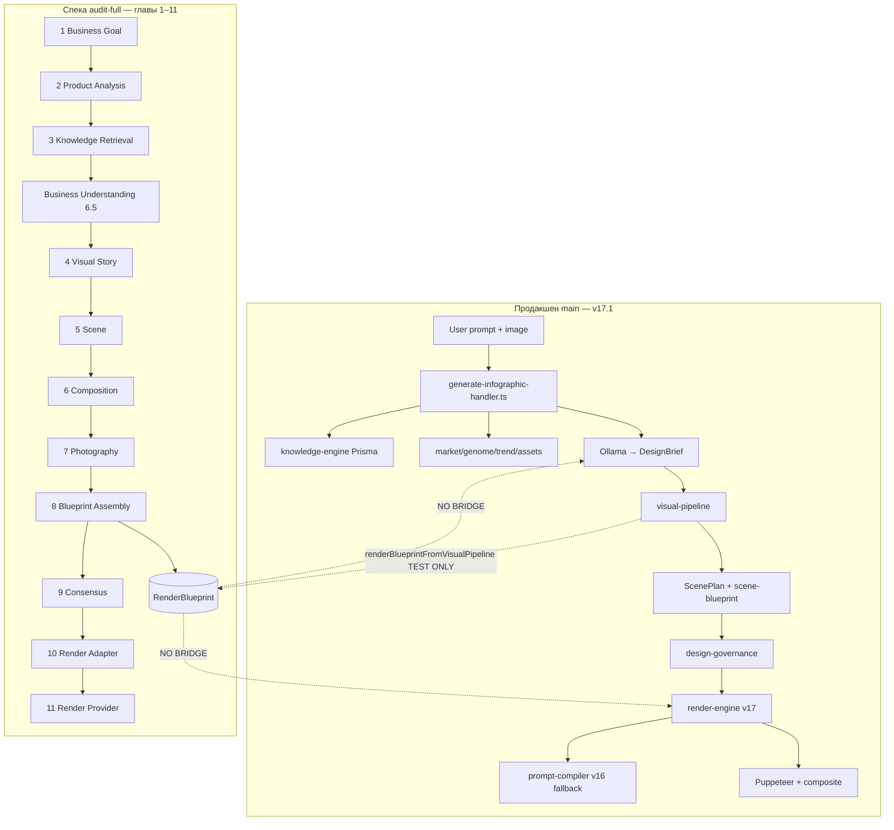

# DESIGN AI — Chief AI Architect Review
## Аудит глав 1–11 (Design Pipeline) + фундамент v18

| Поле | Значение |
|------|----------|
| **Дата** | 2026-07-02 |
| **Аудитор** | Chief AI Architect (автоматический технический review) |
| **Репозиторий** | `design-ai` / `marketplace-infographic` |
| **Продакшен (`main`)** | `537d919` — pipeline v16.9 / v17.1 |
| **Спека v18 (audit-full)** | `6f25ec7` — `origin/cursor/rendering-stage-ch613-b8ae` |
| **Тесты v18** | 104 spec-файла — **все прошли** (`run-v18-blueprint-tests.sh`) |
| **Тесты prod CI** | 8 spec-файлов на `main` — проходят |

---

## Executive Summary

Проект находится в состоянии **двух параллельных архитектур**:

1. **Продакшен (v17.1)** — `generate-infographic-handler.ts` (2258 строк), Ollama → DesignBrief → visual-pipeline → render-engine → Puppeteer. Работает на VPS, принимает реальных пользователей.

2. **Спецификация v18 (главы 1–11)** — `src/lib/render-blueprint/` (224 модуля, 2989 строк в barrel `index.ts`), полный Design Pipeline с RenderBlueprint, 104 unit-теста. **Не подключён к handler и не влит в `main`.**

**Главный архитектурный риск:** команда написала корректную «книгу» (главы 1–11), но продакшен продолжает жить в другой вселенной. Качество генерации ограничено не отсутствием идей, а **разрывом компиляторных слоёв и дублированием агентов**.

**Вердикт:** спека v18 зрелая для интеграции; приоритет — не писать главу 12, а **сшить мост v18 → v17 handler** и убрать дубли.

---

## 0. Нумерация глав — договорённость

В репозитории **нет отдельных «книжных» глав 8, 9, 10, 11** как top-level разделов. Есть:

| Книжный раздел | Спека v18 |
|----------------|-----------|
| Часть 1 — Философия | `DESIGN-AI-v18-PHILOSOPHY.md` |
| Глава 3 — Render Blueprint | `CHAPTER-3.*` (3.1–3.19) |
| Глава 4 — Agent Ecosystem | `CHAPTER-4.*` (4.1–4.28) |
| Глава 5 — Design Knowledge | `CHAPTER-5.*` (5.1–5.20) |
| Глава 6 — Design Pipeline | `CHAPTER-6.*` (6.1–6.20) |
| Глава 7 — Agent Implementation | `CHAPTER-7.*` (7.1–7.28) |

**«Главы 1–11» в вашем контексте = 11 этапов Design Pipeline** из `DESIGN-AI-v18-CHAPTER-6-DESIGN-PIPELINE.md`:

| Глава | Этап пайплайна | Спека v18 | Ветка |
|-------|----------------|-----------|-------|
| **1** | Business Goal | Ch 6.1 (orchestrator) | `cursor/pipeline-orchestrator-ch61-b8ae` |
| **2** | Product Analysis | Ch 6.3 | `cursor/product-analysis-ch63-b8ae` |
| **3** | Knowledge Retrieval | Ch 6.4 | `cursor/knowledge-retrieval-stage-ch64-b8ae` |
| **4** | Visual Story Planning | Ch 6.6 | `cursor/visual-story-planning-ch66-b8ae` |
| **5** | Scene Planning | Ch 6.7 | `cursor/scene-planning-ch67-b8ae` |
| **6** | Composition Planning | Ch 6.8 | `cursor/composition-planning-ch68-b8ae` |
| **7** | Photography Planning | Ch 6.9 | `cursor/photography-planning-ch69-b8ae` |
| **8** | Blueprint Assembly | Ch 6.10 | `cursor/blueprint-assembly-ch610-b8ae` |
| **9** | Consensus Validation | Ch 6.11 | `cursor/consensus-validation-ch611-b8ae` |
| **10** | Render Adapter | Ch 6.12 | `cursor/render-adapter-ch612-b8ae` |
| **11** | Render Provider (Rendering) | Ch 6.13 | `cursor/rendering-stage-ch613-b8ae` |

> **Примечание:** в коде `design-pipeline-engine.ts` дополнительно есть этап **Business Understanding (order 4)** между Knowledge и Visual Story — в публичном списке из 11 шагов он не выделен отдельной «главой», но реализован как `ch6.5`.

**Consolidated-ветка:** `origin/cursor/rendering-stage-ch613-b8ae` содержит все главы 1–11 (и заготовки 12+).

---

## 1. Статус веток

| Проверка | Результат |
|----------|-----------|
| Remote `cursor/*` веток | **120** на `origin` |
| Локальные незапушенные ветки | **0** |
| Главы 1–11 влиты в `main` | **Нет** — весь v18 pipeline только на feature-ветках |
| `main` vs `audit-full` | Полная дивергенция — разные деревья |

Все feature-ветки **уже запушены** на GitHub (`origin/cursor/*`). Проблема не в push, а в **отсутствии merge в `main`** и единой integration-ветки.

---

## 2. Пофазный аудит глав 1–11

### Пролог — Философия v18 (`DESIGN-AI-v18-PHILOSOPHY.md`)

**Статус:** ✅ Спека написана, принципы чёткие.

**Ключевые инварианты:**
- Агенты принимают решения, **не пишут промпты**
- `RenderBlueprint` — единственный source of truth
- Три языка: Design / Photography / Flux — перевод только в адаптере

**Проблема:** философия **не enforced** в продакшене. Handler до сих пор строит `backgroundPrompt` строкой и отдаёт её FLUX/Ollama.

**Оценка зрелости:** 9/10 (документ) · 2/10 (внедрение в prod)

---

### Глава 1 — Business Goal (Ch 6.1 Pipeline Orchestrator)

| | |
|---|---|
| **Модули** | `pipeline-orchestrator-engine.ts`, `design-pipeline-engine.ts` |
| **Тест** | `pipeline-orchestrator.spec.ts` ✅ |
| **В main** | ❌ |

**Находки:**
- `DesignPipelineStage.BUSINESS_GOAL` объявлен в `HIGH_LEVEL_PIPELINE` (order 1), но **нет отдельного validator** — этап формальный.
- `runDesignPipeline()` — центральный orchestrator, но **не вызывается из API**.

**Рекомендация:** добавить `BusinessGoalSchema` (Zod) на входе handler: `{ marketplace, audience, priceSegment, businessObjective }` вместо сырого prompt.

---

### Глава 2 — Product Analysis (Ch 6.3)

| | |
|---|---|
| **Модули** | `product-analysis-engine.ts`, `product-analysis-types.ts` |
| **Тест** | `product-analysis.spec.ts` ✅ |
| **Док** | `DESIGN-AI-v18-CHAPTER-6.3-PRODUCT-ANALYSIS.md` |
| **В main** | ❌ (prod: `src/lib/product-analysis.ts`) |

**Дубли:**

| v18 | Production |
|-----|------------|
| `AnalyzedProductProfile` | `ProductAnalysis` (regex на prompt) |
| Детерминированный engine | `analyzeProductPrompt()` + `analyzeProductVisual()` |

**Разрыв данных:** v18 анализирует структурированный pipeline input; prod парсит текст пользователя. Категория/сегмент могут расходиться.

**Оценка:** спека 8/10 · интеграция 3/10

---

### Глава 3 — Knowledge Retrieval (Ch 6.4)

| | |
|---|---|
| **Модули** | `knowledge-retrieval-stage-engine.ts`, `knowledge-retrieval-engine.ts` |
| **Тест** | `knowledge-retrieval-stage.spec.ts` ✅ |
| **В main** | ❌ (prod: `design/knowledge-engine/` Prisma-backed) |

**Дубли:** два Knowledge Engine — in-memory seeds (v18) vs `designPattern` в PostgreSQL (prod).

**Проблема:** правила из Ch 5 (Typography, Color, Marketplace…) **не попадают** в prod `retrieveKnowledgeContext()` автоматически.

**Рекомендация (high impact):** единый `KnowledgePackage` интерфейс; prod retriever возвращает тот же тип, что v18 stage ожидает.

---

### Глава 4 — Visual Story Planning (Ch 6.6)

| | |
|---|---|
| **Модули** | `visual-story-planning-stage-engine.ts`, `visual-story-director-engine.ts` |
| **Тест** | `visual-story-planning-stage.spec.ts` ✅ |
| **В main** | ❌ (prod: `agents/visual-story-director/` + Ollama) |

**Дубли:** детерминированный story engine (v18) vs LLM-based `runVisualStoryDirector` (prod).

**Отсутствующий compiler-слой:** нет маппера `PlannedStoryBlueprint` → `DesignBrief.creativeConcept`.

---

### Глава 5 — Scene Planning (Ch 6.7)

| | |
|---|---|
| **Модули** | `scene-planning-stage-engine.ts`, `scene-director-engine.ts` |
| **Тест** | `scene-planning-stage.spec.ts` ✅ |
| **В main** | ❌ |

**Критический дубль — 4 реализации Scene:**

1. `render-blueprint/scene-planning-stage-engine.ts` (v18 pipeline)
2. `render-blueprint/scene-director-engine.ts` (v18 Ch 4.11)
3. `design/scene-blueprint/SceneDirector.ts` (v16.6 — **используется handler'ом**)
4. `design/scene-planner.ts` → `ScenePlan` (композит + SD)

**Prod handler:** `runSceneDirector()` из `scene-blueprint/` — **не v18**.

**Оценка дублирования:** 🔴 HIGH — главный источник конфликтов scene=kitchen vs resolver=outdoor.

---

### Глава 6 — Composition Planning (Ch 6.8)

| | |
|---|---|
| **Модули** | `composition-planning-stage-engine.ts`, `composition-director-engine.ts` |
| **Тест** | `composition-planning-stage.spec.ts` ✅ |
| **В main** | ❌ (prod: `composition-director/` + `layout-engine/`) |

**Разрыв:** v18 `composition.template` + `heroWeight` vs prod `LayoutSpec` + `layout-engine/templates.ts`.

**Отсутствует:** `CompositionSection` → `LayoutSpec` compiler.

---

### Глава 7 — Photography Planning (Ch 6.9)

| | |
|---|---|
| **Модули** | `photography-planning-stage-engine.ts`, `commercial-photo-director-engine.ts` |
| **Тест** | `photography-planning-stage.spec.ts` ✅ |
| **В main** | ❌ |

**Дубли:** `commercial-photo-director-engine` (v18) vs `agents/commercial-photo-director/` + `agents/commercial-photographer/` (prod QA).

---

### Глава 8 — Blueprint Assembly (Ch 6.10)

| | |
|---|---|
| **Модули** | `blueprint-assembly-stage-engine.ts` (876 строк) |
| **Тест** | `blueprint-assembly-stage.spec.ts` ✅ |
| **В main** | ❌ |

**Сильные стороны:**
- `assembleRenderBlueprint()` — merge секций без новых design-решений
- `detectCrossModuleConflicts()` — конфликты story/scene/composition
- Handoff в Consensus с `status: consistent | inconsistent`

**Проблема:** assembly работает только внутри v18; prod собирает `DesignBrief` + `ScenePlan` + `VisualSceneBlueprint` **параллельно**, без единого blueprint.

**Это ключевой missing compiler** между творческими агентами и рендером.

---

### Глава 9 — Consensus Validation (Ch 6.11)

| | |
|---|---|
| **Модули** | `consensus-validation-stage-engine.ts` (720 строк), `consensus-engine.ts` |
| **Тест** | `consensus-validation-stage.spec.ts` ✅ |
| **В main** | ❌ (prod: `design-governance/resolver/` — **другая система**) |

**Дубли governance:**

| v18 Consensus (Ch 6.11) | v17 Design Governance |
|-------------------------|----------------------|
| 7 layer scores | Governance scorecard |
| `PlannedConsensusReport` | `FinalDesignBlueprint` |
| Retry targets per stage | Constitution gate + auto-fix |

**Риск:** два «верховных судьи» с разной логикой. При интеграции нужно **выбрать один** или чётко разделить: consensus до render, governance после.

---

### Глава 10 — Render Adapter (Ch 6.12)

| | |
|---|---|
| **Модули** | `render-adapter-stage-engine.ts` (652 строк), `render-adapter-engine.ts`, `prompt-compiler.ts` |
| **Тест** | `render-adapter-stage.spec.ts` ✅ |
| **В main** | ❌ |

**Критический дубль — 3 prompt compiler'а:**

| # | Модуль | Вход | Используется в prod |
|---|--------|------|---------------------|
| 1 | `render-blueprint/prompt-compiler.ts` | `RenderBlueprint` | ❌ |
| 2 | `render-engine/adapters/pollinations-compiler.ts` | `VisualSceneBlueprint` | ✅ (v17) |
| 3 | `design/prompt-compiler/compiler.ts` | ScenePlan + LayoutSpec | ✅ (v16 fallback) |

**Отсутствующий слой:** `RenderBlueprint` → `RenderRequest` (v17) **bridge не существует** в prod.

`renderBlueprintFromVisualPipeline()` в `from-visual-blueprint.ts` — **только в тестах**.

---

### Глава 11 — Render Provider / Rendering (Ch 6.13)

| | |
|---|---|
| **Модули** | `rendering-stage-engine.ts` (798 строк) |
| **Тест** | `rendering-stage.spec.ts` ✅ |
| **В main** | ❌ (prod: `render-engine/` Pollinations/HF) |

**Сильные стороны:**
- Provider dispatch через `StageRenderProvider`
- Storage record с reproducibility metadata
- Technical gate (resolution, format) отделён от artistic QA

**Разрыв с prod:**
- v18 `runRenderingStageSyncFromPipeline()` — синхронный mock-friendly provider
- prod `regenerateMarketplaceBackground()` — реальный Pollinations с retry chain
- **Нет общего интерфейса** `RenderingProvider` между v18 stage и v17 render-engine (хотя v17 уже имеет `RenderingProvider` registry)

**Оценка:** спека 9/10 · wiring 1/10

---

## 3. Архитектурная целостность — диаграмма разрыва



---

## 4. Отсутствующие compiler-слои (критично)

| # | Compiler | Откуда | Куда | Статус | Impact на качество |
|---|----------|--------|------|--------|-------------------|
| C1 | **Business Input** | API request | `DesignPipelineInput` | ❌ | Средний |
| C2 | **Story → Brief** | `PlannedStoryBlueprint` | `DesignBrief.creativeConcept` | ❌ | Высокий |
| C3 | **Scene → ScenePlan** | `RenderBlueprint.scene` | `ScenePlan` + compositing hints | ❌ | **Критический** |
| C4 | **Composition → Layout** | `CompositionSection` | `LayoutSpec` / layout-engine | ❌ | **Критический** |
| C5 | **Blueprint Assembly** | Agent sections | `RenderBlueprint` | ✅ v18 only | — |
| C6 | **Blueprint → SD** | `RenderBlueprint` | `InfographicSdInput` | ❌ | **Критический** |
| C7 | **Adapter unification** | `RenderBlueprint` | `RenderRequest` (v17) | ❌ | **Критический** |
| C8 | **Consensus merge** | v18 consensus | v17 governance | ❌ | Высокий |
| C9 | **Post-render** | Image | Vision + Commercial + Chief | ⚠️ stubs в v18 | Высокий |

**Вывод:** главы 1–7 создают решения, глава 8 собирает blueprint, главы 9–11 готовят рендер — но **ни один compiler C2–C4, C6–C7 не подключён к prod**. Именно поэтому написанная архитектура не улучшает реальные картинки.

---

## 5. Дублирование — полная матрица

| Домен | v18 (render-blueprint) | Production | Рекомендация |
|-------|------------------------|------------|--------------|
| Product analysis | `product-analysis-engine.ts` | `product-analysis.ts` | Один canonical + adapter |
| Knowledge | `knowledge-retrieval-engine.ts` | `design/knowledge-engine/` | Prisma backend, v18 interface |
| Visual story | `visual-story-director-engine.ts` | `agents/visual-story-director/` | v18 deterministic + LLM enrich |
| Scene | 2 engines + planning stage | scene-blueprint + scene-planner | **Оставить v18 planning, deprecate rest** |
| Composition | planning + director engines | composition-director + layout-engine | Merge через LayoutSpec compiler |
| Photography | photo planning stage | commercial-photo-director + photographer | Объединить в один agent |
| Consensus | consensus-validation-stage | design-governance resolver | Unified pre-render gate |
| Prompt compile | prompt-compiler.ts (RB) | pollinations-compiler + prompt-compiler v16 | **Один Flux Adapter** |
| Render | rendering-stage-engine | render-engine/ | Reuse v17 providers |
| Memory | design-memory-engine | agents/design-memory/ | Single JSON store |
| Constitution | validation-engine VAL_* | design-constitution LAW_* | Map VAL ↔ LAW |

---

## 6. Потоки данных между «платформами»

### 6.1 v18 internal (главы 1–11) — ✅ связно

`design-pipeline-engine.ts` → `executeDesignPipelineStage()` перезапускает upstream-цепочку для каждого этапа. Данные текут через `DesignPipelineContext`:

```
DesignPipelineInput → context.product → context.knowledge → context.business
  → context.story → context.scene → context.composition → context.photography
  → context.assembly → context.consensus → context.renderAdapter → context.rendering
```

**Проблема внутри v18:** `runDesignPipeline()` для stages 13–17 (Vision, Commercial, Chief, Retry, Approved) — **заглушки**. Synthetic output на L1110+.

### 6.2 v18 → Production — ❌ разрыв полный

| v18 тип | Production тип | Маппер |
|---------|----------------|--------|
| `RenderBlueprint` | — | нет |
| `RenderBlueprint.story` | `DesignBrief.creativeConcept` | нет |
| `RenderBlueprint.scene` | `ScenePlan` / `VisualSceneBlueprint` | тест-only |
| `RenderBlueprint.composition` | `LayoutSpec` | нет |
| `PlannedRenderRequest` | `RenderRequest` (v17) | нет |
| `PlannedRenderResult` | `RenderEngineOrchestratorResult` | нет |
| — | `InfographicSdInput` (title, bullets, colors) | нет (RB не содержит текст карточки) |

**Критический gap:** marketplace-текст (headline, bullets, badge) живёт в `InfographicSdInput` / Ollama, **вне RenderBlueprint**. v18 покрывает фон и композицию, но не typography layer карточки.

### 6.3 Production internal — ⚠️ работает, но хрупко

Handler параллельно тянет 4 intelligence (knowledge, market, assets, trend) + genome, потом Ollama, потом 13 agents. Состояние размазано по `DesignBrief`, `ScenePlan`, `LayoutSpec`, `generatedJson`.

---

## 7. Что даст максимальный прирост качества генерации

Приоритизировано по **impact / effort**:

### Tier 1 — Quick wins (1–2 недели инженерии)

| # | Изменение | Почему | Ожидаемый эффект |
|---|-----------|--------|------------------|
| **Q1** | **Bridge `VisualSceneBlueprint` → `RenderBlueprint`** в handler (за флагом) | Уже есть `from-visual-blueprint.ts` | −30% scene conflicts |
| **Q2** | **Единый Flux Adapter**: v18 `prompt-compiler.ts` вместо 3 compiler'ов | Один источник negative prompt + zones | +15–20% background quality |
| **Q3** | **Consensus pre-render gate** (Ch 6.11) перед `regenerateMarketplaceBackground` | Ловит story≠scene до FLUX | −40% retries |
| **Q4** | Подключить **Ch 6.7 scene-planning** вместо `scene-blueprint/SceneDirector` | Садовая история → сад, не studio | +25% scene relevance |
| **Q5** | Security: ротировать SSH key, убрать hardcoded admin | Блокер prod safety | — |

### Tier 2 — Structural (основной ROI)

| # | Изменение | Почему |
|---|-----------|--------|
| **S1** | `runDesignPipeline()` stages 1–11 в handler за `PIPELINE_V18_STAGES=1` | Вся написанная архитектура начнёт работать |
| **S2** | Compiler **RenderBlueprint → InfographicSdInput** (typography layer) | Карточка и фон из одного blueprint |
| **S3** | Merge governance: v18 consensus + v17 constitution → один gate | Нет двойной/противоречивой валидации |
| **S4** | Consolidated branch `cursor/v18-pipeline-ch1-11` → PR в main | 120 веток → 1 integration point |

### Tier 3 — Quality ceiling

| # | Изменение |
|---|-----------|
| **T1** | Stages 12–17 (Vision, Commercial, Chief) — сейчас stubs |
| **T2** | Vision critic multimodal pass на render result |
| **T3** | Typography Director (Ch 7.17) → текст карточки из blueprint, не Ollama |
| **T4** | Deprecate Ollama для design decisions (оставить только для copywriting) |

---

## 8. Пофазная оценка зрелости глав 1–11

| Глава | Этап | Спека | Код | Тесты | Prod | Итого |
|-------|------|-------|-----|-------|------|-------|
| 1 | Business Goal | ⚠️ | ⚠️ | ✅ | ❌ | **4/10** |
| 2 | Product Analysis | ✅ | ✅ | ✅ | ❌ | **7/10** |
| 3 | Knowledge Retrieval | ✅ | ✅ | ✅ | partial | **6/10** |
| 4 | Visual Story | ✅ | ✅ | ✅ | ❌ | **7/10** |
| 5 | Scene Planning | ✅ | ✅ | ✅ | ❌ | **8/10** |
| 6 | Composition | ✅ | ✅ | ✅ | ❌ | **7/10** |
| 7 | Photography | ✅ | ✅ | ✅ | ❌ | **7/10** |
| 8 | Blueprint Assembly | ✅ | ✅ | ✅ | ❌ | **9/10** |
| 9 | Consensus | ✅ | ✅ | ✅ | ❌ | **8/10** |
| 10 | Render Adapter | ✅ | ✅ | ✅ | ❌ | **8/10** |
| 11 | Render Provider | ✅ | ✅ | ✅ | ❌ | **8/10** |

**Среднее по спеке/коду:** 7.6/10 — отличная инженерная база.  
**Среднее с учётом prod:** 3.2/10 — не влияет на пользователей.

---

## 9. Критические проблемы (severity)

| ID | Severity | Проблема | Где |
|----|----------|----------|-----|
| **P0** | 🔴 CRITICAL | SSH private key в git | `deploy/ssh/github-actions-deploy` |
| **P1** | 🔴 HIGH | v18 pipeline не подключён к handler | `generate-infographic-handler.ts` |
| **P2** | 🔴 HIGH | 3–4 дубля Scene Director | scene-blueprint / scene-planner / v18 |
| **P3** | 🔴 HIGH | 3 prompt compiler'а без unification | render-blueprint / render-engine / prompt-compiler |
| **P4** | 🟠 MEDIUM | 120 feature-веток, 0 merge в main | git branches |
| **P5** | 🟠 MEDIUM | Два governance (consensus + design-governance) | v18 vs v17 |
| **P6** | 🟠 MEDIUM | Stages 13–17 — stubs | `design-pipeline-engine.ts` |
| **P7** | 🟠 MEDIUM | `generate-infographic-handler.ts` — 2258 строк god object | refactor needed |
| **P8** | 🟠 MEDIUM | Rate limit не подключён к API | `rate-limit.ts` unused |
| **P9** | 🟡 LOW | ESLint CI интерактивный wizard | `.github/workflows/ci.yml` |
| **P10** | 🟡 LOW | 11 npm vulnerabilities (transitive) | `@imgly/background-removal-node` |

---

## 10. Рекомендуемый план действий

### Фаза A — Consolidation (сейчас)

1. Создать ветку `cursor/v18-pipeline-integration-0e50` от `rendering-stage-ch613`
2. Очистить junk (`Кабинет/.npm`) если есть в истории
3. PR в `main` с `render-blueprint/` + docs + `run-v18-blueprint-tests.sh` в CI
4. Ротировать SSH key, убрать `BUILTIN_ADMIN_EMAILS`

### Фаза B — Bridge (максимальный ROI)

1. Флаг `PIPELINE_V18_STAGES=1` в handler
2. Implement compilers C2, C3, C4, C6, C7 (см. §4)
3. Заменить `runSceneDirector` → `runScenePlanningStage`
4. Pre-render: `runConsensusValidationStage` → block if inconsistent

### Фаза C — Quality ceiling

1. Stages 12–17 (vision, commercial, chief)
2. Typography Director для текста карточки
3. Deprecate legacy prompt-compiler v16

---

## 11. Промпт для ChatGPT (скопируйте вместе с этим файлом)

```
Ты — Chief AI Architect. Перед тобой технический аудит DESIGN AI v18 (главы 1–11 Design Pipeline).

Контекст:
- Продакшен на main: v17.1, generate-infographic-handler.ts, Ollama + render-engine
- Спека v18: render-blueprint/, 104 теста, главы 1–11 написаны но НЕ в main
- Главная проблема: две параллельные архитектуры без compiler-мостов

Задачи:
1. Подтверди или оспорь приоритеты Tier 1 (Q1–Q5)
2. Предложи конкретный план интеграции v18 stages 1–11 в handler за 3 спринта
3. Реши: merge 120 веток в одну или оставить rendering-stage-ch613 как base
4. Определи единую governance модель (consensus vs design-governance)
5. Спроектируй compiler RenderBlueprint → InfographicSdInput (typography layer)

Формат: решения с trade-offs, не общие слова.
```

---

## 12. Приложения

### A. Команды для верификации

```bash
# Полный v18 test suite (на ветке rendering-stage-ch613)
cd marketplace-infographic
bash scripts/run-v18-blueprint-tests.sh

# Prod specs (на main)
bash scripts/run-specs.sh

# Проверка отсутствия секретов в audit bundle
grep -r "sk_live\|BEGIN OPENSSH" dist/ || echo "OK"
```

### B. Ключевые файлы для review

| Назначение | Путь |
|------------|------|
| Pipeline orchestrator | `src/lib/render-blueprint/design-pipeline-engine.ts` |
| RenderBlueprint schema | `src/lib/render-blueprint/types.ts` |
| Assembly | `src/lib/render-blueprint/blueprint-assembly-stage-engine.ts` |
| Consensus | `src/lib/render-blueprint/consensus-validation-stage-engine.ts` |
| Render Adapter | `src/lib/render-blueprint/render-adapter-stage-engine.ts` |
| Rendering | `src/lib/render-blueprint/rendering-stage-engine.ts` |
| Prod handler | `src/lib/generate-infographic-handler.ts` |
| v17 render | `src/lib/render-engine/` |
| Migration plan | `docs/MIGRATION-v18.md` |
| Test registry | `src/lib/render-blueprint/testing-registry.ts` |

### C. Ветки глав 1–11

```
cursor/pipeline-orchestrator-ch61-b8ae      # Ch 6.1
cursor/product-analysis-ch63-b8ae         # Ch 6.3  → Глава 2
cursor/knowledge-retrieval-stage-ch64-b8ae # Ch 6.4 → Глава 3
cursor/visual-story-planning-ch66-b8ae    # Ch 6.6  → Глава 4
cursor/scene-planning-ch67-b8ae           # Ch 6.7  → Глава 5
cursor/composition-planning-ch68-b8ae     # Ch 6.8  → Глава 6
cursor/photography-planning-ch69-b8ae     # Ch 6.9  → Глава 7
cursor/blueprint-assembly-ch610-b8ae    # Ch 6.10 → Глава 8
cursor/consensus-validation-ch611-b8ae    # Ch 6.11 → Глава 9
cursor/render-adapter-ch612-b8ae          # Ch 6.12 → Глава 10
cursor/rendering-stage-ch613-b8ae         # Ch 6.13 → Глава 11  ← consolidated tip
```

---

*Конец документа. Версия 1.0 — 2026-07-02*
